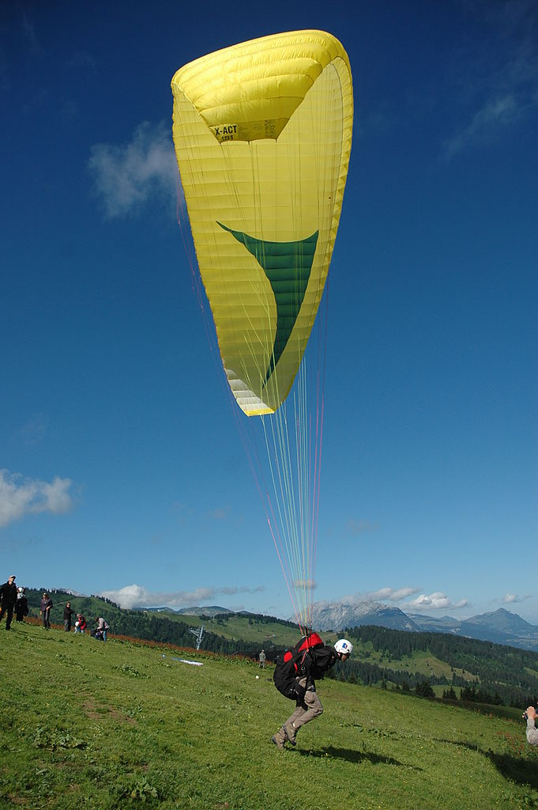

***************
Canopy Geometry
***************

.. This chapter creates a parametric geometry that can approximate parafoil
   canopies using only basic technical specs. There isn't enough information
   in the specs, so they are augmented with educated guesses for the missing
   structure. The assumed structure is encoded in parametric functions that
   define the variables of a generalized geometry model based on wing sections
   (airfoils provide the section profiles, *design curves* provide the scale,
   position, and orientation).

.. What is a parafoil canopy?

The essential component of any flying object is the lifting surface.
A *lifting surface* is the part of an aircraft that produces *lift* by
interacting with the air. A parafoil canopy is a lifting surface created by
a partially-open nylon casing which is inflated through air intakes along its
front. Although a small amount of air does flow through the canopy's surface,
the majority of the air flows around the canopy's volume. By redirecting the
airflow downward, the canopy exchanges momentum with the air and produces the
lifting force that allows the glider to fly.

   Paraglider side view.

   `Photograph <https://www.flickr.com/photos/69401216@N00/2820146477/>`__ by
   Pascal Vuylsteker, distributed under a CC-BY-SA 2.0 license.

.. Why does this project need to model the canopy geometry?

A paraglider dynamics model needs the inertial properties and aerodynamics of
the canopy, which can be estimated from the canopy's shape.

[[The user manual for a wing usually includes basic properties such as the
total mass of the wing, the areal densities of its surface materials, etc, but
not the mass and volume distributions, aerodynamics, etc.]]

.. Why not use existing wing modeling tools?

Most wing modelling programs assume that a complete specification of the wing
geometry is available, which is not true for commercial paraglider wings. User
manuals provide valuable summary information, but the majority of the wing
structure is unspecified. Generating an approximate canopy geometry from basic
technical specs requires making educated assumptions about the unknown
structure. Those assumptions are encoded in parametric functions that combine
domain expertise with the technical data to produce a fully specified model.

Some existing tools do accept parametric functions for specific design
parameters, but those tools present yet another difficulty: they not only
assume the structure is known, they also impose unnecessary constraints on how
the geometry is specified. Constraining how the geometry is specified means
unnecessary complexity is forced into the design curves.

This chapter develops a wing specification model that greatly simplifies
creating paraglider canopy models from basic technical specs. It develops the
geometry as a two-part process:

1. Develop a novel, generalized wing model that eliminates the constraints of
   existing tools, enabling simpler design curves.

2. Develop a set of parametric equations that encode the structural knowledge
   necessary to approximate a canopy geometry model from the basic technical
   specs.

The result is a novel geometry based on wing sections that is both flexible
and particularly intuitive for designing non-linear wing geometries such as
paraglider canopies.

.. Roadmap

   1. Discuss the physical system being modeled and its important details

   2. Review the incomplete geometry information from the readily available
      sources like technical specs, physical wing measurements, and pictures

   3. Consider how to create a complete geometry from the incomplete
      information by encoding domain expertise in parametric functions.

   4. Introduce parametric modeling using *wing sections*.

   5. Review the limitations of existing wing modeling tools (stemming from
      how they specify position and orientation), and develop the generalized
      equation that mitigates those limitations (the extra flexibility will
      make it a lot easier to produce the design curves).

   6. Develop the *design curves*: parametric functions that capture the general
      structure of parafoil canopies using basic parameters that can be estimated
      from the available information (or from reasonable assumptions).

   7. Show some examples using the design curves

   8. Discussion

Paraglider canopies
===================

.. Describe the physical system (geometry, structure, materials, etc), and the
   most common technical specifications (span, area, etc). The specs are
   structural summaries that can guide the choice of model parametrization.

* [[**FIXME**: this section needs a LOT of work.]]

* What are the important aspects of a canopy geometry?

  * [[These details are important because they are the basis for recognizing
    the underlying structure of the wing, and thus they are the basis for
    parametric representations. The goal of a "good" parametrization is to let
    you use these "aspects" to produce a mathematical model.]]

  * [[What details of a canopy's shape are required (or at least useful) for
    defining a model that satisfies the needs of this project?

    These are not necessarily the variables you would choose to parametrize
    the geometry; they might simply be helpful for discussing/understanding
    the shape of a canopy. For example, anhedral is ambiguous, so I'm using
    Euler roll angles for section "anhedral". These are here to establish the
    details of the shape and thus the flexibility required by the
    parametrization.

    Related: "General aviation aircraft design" (Gudmundsson; 2013),
    chapter 9: "Anatomy of a wing"]]

  * *flat* versus *projected* values

  * *flat span*, *flat area*, *flat aspect ratio*

  * *projected span*, *projected area*, *projected aspect ratio*

  * There are also a variety of standard terms I will avoid due to ambiguity:
    *planform*, *mean aerodynamic chord*, maybe more? For *planform*, most
    texts assume the wing is flat and so the projected area is essentially
    equal to the flat area, and thus differentiating the two is largely
    neglected in standard aerodynamic works. The mean aerodynamic chord is
    a convenient metric for comparing flat wings and for simplifying some
    equations, but for wings with significant arc anhedral I'm not sure how
    beneficial this term really is; it's a mistake to compare wings based on
    the MAC alone, so I'd rather avoid any mistaken comparisons.

  * *dihedral*, *anhedral*: not sure how to define this for a wing. It's
    traditionally defined for flat wings, as `arctan(z/y)` of the section
    position, but that's pretty unhelpful for a paraglider. It also doesn't
    differentiate between `arctan(z/y)` and `arctan(dz/dy)` of a section. Still,
    discussing curvature leads nicely into a discussion of the *arc*, so
    whatever.

  * *arc* :cite:`lolies2019NumericalMethodsEfficient` (also known as the
    "lobe" :cite:`casellasParagliderDesignHandbook`)

  * *geometric torsion*: relative pitch angle of a section

    .. figure:: figures/paraglider/geometry/airfoil/geometric_torsion.*

       Geometric torsion.

       Note that this refers to the angle, and is the same regardless of any
       particular rotation point.

* [[Highlight why canopy geometries are tricky to model?]]

Modeling considerations
=======================

.. Functionality

* A geometry model is necessary to estimate the inertial properties and
  aerodynamics of the wing.

* The inertial properties depend on the distribution of mass. For a parafoil,
  the masses are the *solid mass*, from the structural materials, the *air
  mass*, from the air enclosed in the wing, and the *apparent mass*, from the
  acceleration of the wing relative to the surrounding air.

  This chapter does not deal with how to compute the masses and their
  inertias, but to support their calculation the model must return points on
  the profile surface.

  [[**FIXME**: I haven't defined the *surface* yet.]]

* Different aerodynamic codes use different aspects of the shape, but in
  general they all use points from either the chord surface, the camber
  surface, or the profile surface.

  To support the variety of aerodynamic methods, the model should return
  points on any of the three surfaces.

.. Parametrization

* [[**The choice to use a "parametric" model should be a result of the
  requirement to be easy to use and able to use technical specs. Not an
  explicit requirement.**]]

* The model is intended to assist in reconstructing flights recoded by real
  wings. The model must be able to represent existing wings with reasonable
  accuracy. [[The primary purpose of the model is "useable accuracy with
  minimal effort"; it's not intended as a detailed wing design tool, so no
  ribs, distortions, etc.]]

* Parafoil canopies are relatively complex shapes, and can be time consuming
  to describe in detail. To reduce design effort, the model should provide
  a concise set of *design parameters* that directly capture the fundamental
  structure of the wing.

  One goal of this geometry is to make it as easy as possible to produce
  models of existing wings, which means the choice of parameters should allow
  a designer to use existing available data (technical specifications,
  pictures, and physical measurements) as directly as possible. [[This
  includes supporting mixed flat/inflated design; it can be more convenient to
  specify some structure in terms of the non-inflated wing.]]

  [[Secondary reason for minimizing the number of parameters: a lower
  dimensional representation of the wing has advantages for mathematical wing
  optimization and statistical parameter estimation.]]

* [[Nice to have: flexible enough to handle deformations (cell billowing,
  braking, weight shifting, accelerator flattening, C-riser piloting, etc)]]

Parametric modeling
===================

.. Parameters are how you specify the design. Motivate parametric models (as
   opposed to explicit geometries), define "parametrization", and establish
   the importance of choosing a good parametrization.

* [[To define a geometry, you can either use an explicit set of points or
  a set of parametric functions that generate the points.]]

* [[Define *explicit geometry*: specifying variable values directly]]

* [[Modeling with explicit geometries is too expensive (time consuming to
  specify, require too much information about the wing, difficult to analyze
  with simple aerodynamics, etc)]]

* [[Define *parametric geometry*: specifying variables values using parametric
  functions which are defined in terms of *design parameters*]]

* [[Advantages of parametric geometries]]

  * Parametric equations are designed to capture the structural knowledge of
    the shape. If a complex shape can be represented with parametric
    equations, then the parameters "summarize" the structure. Each parameter
    communicates more information than an explicit coordinate, so fewer
    parameters are required, and less work is required to specify a design.

    Parametric designs try to balance simplicity and expressibility. A good
    parametrization lets you focus on high-level design without forcing you
    into simplistic designs. **The goal is to find a set of simple parametric
    functions that combine to capture the complex structure of the wing.**
    [[I'm interested in "easy to create, good enough" approximations of real
    wings, not physically-realistic simulations.]]

  * Parametric models let you standardize so you can compare models.

  * Parametric models use are low-dimensional representations, which makes
    them more amenable to mathematical optimization methods. This is helpful
    for statistical parameter estimation, or wing performance optimization.

  * Parametric models make it much easier to place priors over model
    configurations. (You can probably build a metric for comparing explicit
    geometries, but it would be tough.)

    It's important that I reduce the effort to model existing wings because
    I need a representative set of models to deal with model uncertainty.

    Flight reconstruction requires a model of the wing that produced the
    flight, but due to model uncertainty the estimate must use an entire
    distribution over possible wing configurations. [[You'll still probably
    need to use a "representative set" of models (parameter estimation is
    likely a pipedream given the available data), but at least parametric
    models make it MUCH easier to *create* that representative set from the
    limited available data on existing wings.]]

  * Building a wing from 2D cross-sections also provides computational
    benefits for estimating the aerodynamic performance of the 3D wing, as
    discussed in :ref:`canopy_aerodynamics:Section Coefficients`.

    [[Maybe link forward to :ref:`canopy_aerodynamics:Case Study`, where
    I implement Belloc's wing using this parametric geometry.]]

.. Define the functional goals of the canopy model parametrization

* [[The choice of parametrization affects how useable it is. What would make
  a good parametrization?]]

  * Some goals of a parametrization:

    * Capable of capturing the most important details (as simple as possible,
      but no simpler)

    * Intuitive

    * Preferably map easily onto the most readily-available summary values
      (like span). It needs to make it easy to work with available wing data
      (technical specs, measurable quantities like flat span, etc).

  * When I say a good parametrization should be *intuitive*, I mean that it
    should match what you notice when you glance at a wing. The arc, the
    width, and the way the leading edge sweeps backwards are probably the most
    obvious. Or maybe you notice the trailing edge more; whatever you notice
    is what I mean by "intuitive".

  * The choice of parametrization is influence by what details you want to be
    able to represent / capture. The final model will be an approximation of
    the real wing, so you need to decide up from what details you want to
    capture (and thus what details you're happy to lose).

  * You should be able to specify the design target directly. If you want
    to position a particular part of the wing at a particular position, you
    should be able to say that explicitly without needing to translate (eg, if
    you want to position the trailing edge you shouldn't be required to
    describe it in terms of the chord length, orientation, and leading edge
    position).

  * Design parameters should be independent. You shouldn't need to change one
    to satisfy another. This is directly related to the idea of "specifying
    each target directly". How you position a section should be independent of
    the chord length or how you orient that section.

Wing design using sections
==========================

.. Introduce designing a wing using "wing sections". They're the conventional
   starting point for parametrizing a wing geometry (airfoil curves capture the
   structure of the section profiles). Choosing to define the surfaces using
   points in the wing sections establishes the general form of the parametric
   model.

.. See `notes-2020w47:Canopy parametrizations` for a discussion

A canopy geometry model defines the shape of a canopy as a collection of
surfaces: the chord surface, the mean camber surface, and the profile surface.
[[FIXME: not sure I agree with this statement. Unclear. A shape is just
a shape. Granted, a canopy geometry must PROVIDE those surfaces.]]

* [[We should have already established that we want a parametric model.]]

* [[There is already a standard parametric method for wings: *wing sections*]]

* Instead of designing the 3D shape directly, the wing is sliced into 2D
  cross-sections and the wing design process is decomposed into two steps:

  1. Specify the scale, position, and orientation of each section

  2. Specify the profile at each section, which defines the upper and lower
     surfaces.

  [[**Why are these just two steps? Why not four? Why not one?** They're all
  linked together, after all. If I'm not defining a "chord surface" then it's
  not clear that "scale, position, orientation" are fundamentally a group.
  **Counterpoint**: Gudmundsson says wing design is about designing two 2D
  components: the *planform* and the *profile*, so I guess his idea of
  "planform" sort of matches my idea of a chord surface, except that the chord
  surface is more like a 2D manifold in 3D (it's not restricted to a plane).]]

.. figure:: figures/paraglider/geometry/wing_sections2.svg

   Wing section profiles.

   Note that section profiles are not the same thing as the ribs of a parafoil.
   Parafoil ribs are the internal structure that produce the desired section
   profile at specific points along the span.

Section profiles
----------------

[[I feel like I should discuss these first since they define some of the
terminology I need, like *chord*. **FIXME**: can you define the geometry
without defining airfoils yet? Is it better that way?]]

[[Should I write a separate chapter about airfoils? Their purpose, geometry,
coefficients, behavior, etc. I don't like separating those topics, but I also
don't want to discuss section coefficients in this chapter. I do need some
geometry terminology here though, like *chord*, *camber line*, etc.]]

[[**Key terms and concepts to define in this section**: upper surface, lower
surface, leading edge, trailing edge, chord line, mean camber line, thickness,
thickness convention, 2D aerodynamic coefficients.]]

Related work:

* :cite:`abbott1959TheoryWingSections`

* :cite:`bertin2014AerodynamicsEngineers`, Sec:5.2

.. Outline

   * Define *section profile* (airfoil)

   * Show how airfoils generate the upper and lower surfaces.

   * Discuss how the choice of airfoil effects wing performance

   * Discuss how the profile can vary along the span

   * Discuss how the profile behaves/changes in-flight

     Distortions due to billowing, braking, etc. (We will be ignoring these,
     but you can use the section indices to deal with them.)

.. figure:: figures/paraglider/geometry/airfoil/airfoil_examples.*

   Airfoils examples.

An airfoil is defined by a camber line, a thickness function, and a thickness
convention. [[FIXME: This is just one specific way to defining the profile
curve; you could just as easily provide an explicit set of points.]]

Here's a diagram of the basic airfoil geometric properties:

.. figure:: figures/paraglider/geometry/airfoil/airfoil_diagram.*
   :name: airfoil_diagram

   Components of an airfoil.

There are two conventions measuring the airfoil thickness; this convention
also determines what point is designated the *leading edge*. The leading and
trailing edge of a wing section are arbitrary points that define the *chord*;
the chord is used to nondimensionalize the airfoil geometry and define the
local *angle of attack*.

.. figure:: figures/paraglider/geometry/airfoil/NACA-6412-thickness-conventions.*
   :name: airfoil_thickness

   Airfoil thickness conventions.

General equation
----------------

Choosing to model a wing using wing sections means that the wing surfaces are
defined by airfoils, which are 2D curves that lie in the section coordinate
systems. By convention, points in the wing sections are defined relative to
the section leading edges, so all of the canopy surfaces are naturally defined
in terms of points relative to the section leading edges. [[FIXME: wording.]]

Let :math:`\mathrm{P}` represent any point in a wing section, and
:math:`\mathrm{LE}` be the leading edge of that section. In the `notation
<_common_notation>`_ of this paper, a general equation for the position of
that point :math:`\mathrm{P}` with respect to the canopy origin
:math:`\mathrm{O}`, written in terms of the canopy coordinate system
:math:`c`, is:

.. Unparametrized (explicit geometry?) equation

.. math::

   \vec{r}_{\mathrm{P}/\mathrm{O}}^c = \vec{r}_{P/LE}^c + \vec{r}_{LE/O}^c

In this paper, the canopy coordinate system is defined by the canopy *root*
(the central section). Points in section (local) coordinate systems
:math:`s` must be rotated into the canopy (global) coordinate system. Given
the *direction cosine matrix* :math:`\mat{C}_{c/s}` between the section and
canopy coordinate systems, the general equation for points relative to the
canopy origin can be written in terms of points in section coordinates:

.. math::

   \vec{r}_{P/LE}^c = \mat{C}_{c/s} \vec{r}_{P/LE}^s

Furthermore, because an airfoil is defined in a 2D airfoil coordinate system,
another transformation is required, from airfoil coordinates to section
coordinates. The convention for airfoil coordinates places the origin at the
leading edge, with the x-axis pointing from the leading edge to the trailing
edge, and the y-axis oriented towards the upper surface. This paper uses
a front-right-down convention for the 3D section coordinates, so the 2D
airfoil coordinates can be transformed into 3D section coordinates with
a matrix transformation:

.. math::

   \mat{T}_{s/a} \defas \begin{bmatrix}
      -1 & 0 \\
      0 & 0\\
      0 & -1
   \end{bmatrix}

Lastly, by convention, airfoil geometries are normalized to a unit chord, so
the section geometry defined by the airfoil must be scaled by the section
chord :math:`c`. Writing the points in terms of scaled airfoil coordinates:

.. math::

   \vec{r}_{P/LE}^c = \mat{C}_{c/s} \mat{T}_{s/a} \, c \, \vec{r}_{P/LE}^a

.. This is the suboptimal "general" parametrization

The complete general equation is then:

.. math::

   \vec{r}_{\mathrm{P}/\mathrm{O}}^c =
     \mat{C}_{c/s} \mat{T}_{s/a} \, c \, \vec{r}_{P/LE}^a
     + \vec{r}_{LE/O}^c

In this form it is clear that a complete geometry definition requires
definitions of four variables:

1. Scale: :math:`c`

2. Position: :math:`\vec{r}_{LE/O}^c`

3. Orientation: :math:`\mat{C}_{c/s}`

4. Profile: :math:`\vec{r}_{P/LE}^a`

This general equation is very expressive, but a bit of a pain to work with
directly. It's often more convenient to define the variables in terms of
functions of simple *design parameters* that encode the significant structure
of the wing.

[[This "general equation" is an explicit, mathematical representation of the
basic/standard approach to wing modeling used by most tools. It's general, but
unwieldy. The real magic happens when I decompose `r_LE/O`; that's the part
that introduces the flexibility that enables simplified parametric functions.

Important to recognize that my parametrization is simply a convenient way to
define these general variables; you could use my parametrization in existing
tools.]]

Parametric design
-----------------

.. Introduces a novel parametrization of the general equation that makes it
   easier to design parafoil canopies. Start by describing an "ideal" design
   workflow, and demonstrate how this result makes that possible.

   Chooses a definition of the section index; defines independent reference
   points for x, y, and z; sets `r_y = r_z`; defines the section DCM using
   `dz/dy` and `\theta` (so you design `theta(s)` and `yz(s)` instead of
   specifying the section DCM directly).

[[By this point I've introduced wing sections (the conventional starting point
for parametrizing a wing geometry) which naturally resulted in a general
equation that specifies the points on the wing surfaces (chords, camber lines,
or profiles) in terms of points in the section coordinate systems. The general
equation is defined in terms of four variables: scale, position, orientation,
and points. Each variable must be defined. Defining each variable explicitly
is a pain, so we want parametric functions of simple *design parameters* that
define the variables. The airfoil geometry already parametrized the points,
now I need to parametrize the others.]]

.. Introduce my simplified parametrization for parafoils

It's annoying to design the section leading edges directly. Instead, decompose
it into two separate vectors: one from the section origin (the section leading
edge) to some arbitrary *reference point* :math:`RP`, and one from the
reference point to the canopy origin:

.. math::

   \vec{r}_{LE/O}^c = \vec{r}_{LE/RP}^c + \vec{r}_{RP/O}^c

Where `RP` are as-yet nebulous "reference points" and :math:`\vec{r}_{RP/O}^c`
is defined by the *design curves* (`x(s)` and `yz(s)`, in my case). This lets
you choose reference points other than the leading edges, and position those
points explicitly in the wing coordinate system. (Note that the leading edges
remain the origin of the section coordinate systems.)

In my case I chose to define the reference points using positions on the
section chords:

.. math::

   \vec{r}_{LE/RP}^c = \mat{R} \mat{C}_{c/s} c\, \hat{x}^s_s

.. math::

   \mat{R} \defas \begin{bmatrix}
      r_x & 0 & 0\\
      0 & r_{yz} & 0\\
      0 & 0 & r_{yz}
   \end{bmatrix}

* Some advantages of this parametrization:

  1. It makes it particularly easy to capture the important details of
     a parafoil canopy

  2. It makes it easier to design in mixed flat and inflated geometries

  3. It's compatible with aerodynamic analysis via section coefficient data
     (partly by keeping the y-axes in the yz-plane).

* **Oh hey, I just figured out how my choice of reference point works!** Think
  of `c * C_c/s @ xhat` as a vector of derivatives: how much you would change
  in x, y, and z as you moved one chord length from the LE to the TE. The
  vector `c * C_c/s @ xhat` is essentially `<dx/dr, dy/dr, dz/dr>` (where `0
  <= r <= 1` is the parameter for choosing points along the chord). Applying
  `diag(r_x, r_y, r_z)` just scales them.

  Another way to get the intuition: imagine the trailing edge. You know that
  by definition it is `c * xhat` from the leading edge. Now imagine a point at
  `0.5 * c * xhat`. It's some delta-x, delta-y, delta-z away from the LE.
  These `r_x` etc are just scaling those deltas.

EXTRA
-----

* Problems with the general surface equation

  * It's too flexible: it doesn't impose any restrictions on the values of the
    variables, meaning it allows design layouts that can't be (reasonably)
    analyzed using section coefficient data. It forces all the responsibility
    on the designer to produce a useable wing definition.

  * It's not flexible enough: it requires the designer to use the section
    leading edges to position the sections. In many cases it is more
    convenient to position with other points, such as the quarter-chord,
    trailing edge, etc. [[If a designer wants to define a wing using some
    other reference point they cannot do it directly; they must specify the
    shape indirectly by manually calculating the corresponding leading edge
    position.]]

* [[The general equation is the result of designing via wing sections. The
  whole point is that you start by defining the section profiles, then
  position them relative to the canopy origin to produce the final wing.
  Splitting `r_P/O` into `r_P/LE` and `r_LE/O` is the natural (general) result
  of designing with wing sections; I suppose it's sort of a parametrization of
  the surfaces, but that's not the "parametrization" I'll be talking about
  later. **I need to give a more complete definition of the airfoil geometry
  in terms of `r_P/LE` before I introduce the general equation to make it more
  obvious what those two components mean.**]]

* Should I introduce scale, position, etc **before** the general equation, or
  should I define the general equation as part of the "design with wing
  sections" section, and naturally segue from "what the math produced" into
  a discussion of those four parameters?

  That'd work nicely if I can **clearly** motivate each step of the derivation
  of the general equation.

Examples of chord surfaces
==========================

.. This section highlights the elegance of the "optimized" parametrization.

These examples are composed from a small collection of simple design curves,
such as constant functions, polynomials, and parametric functions. For example:

* :math:`r_x(s) = 1`

* :math:`x(s) = 0.5 \cdot \left(1 - \lvert s \rvert \right)`

* :math:`c(s) = elliptical\_chord(root=2, tip=0.5)`

* :math:`yz(s) = elliptical\_arc(anhedral=30, wingtip\_roll=75)`

See :ref:`derivations:Parametric design curves` for the derivation of the
parametric curves, or the `glidersim` :py:class:`documentation
<glidersim:pfh.glidersim.foil.EllipticalArc>`.

[[**FIXME**: should I include the parameters of the examples? Or is the point
to show that simple curves produce complex geometries?]]

[[**FIXME**: embed the video?]]

[[**FIXME**: rename this section. It's about the ease and flexibility of the
parametrization; the chord surface is just the way I'm visualizing it.]]

Example 1
---------

[[This example should be a complete description, explaining the design curves
and the plots. The other examples can be less detailed; the curves and result
should suffice.]]

[[FIXME: describe the "anhedral" correctly]]

An elliptical arc with a mean anhedral of 30 degrees and a wingtip anhedral of
89 degrees:

.. math::

   \begin{aligned}
   c(s) &= \mathrm{elliptical\_chord}(root=0.5, tip=0.2)\\
   \theta(s) &= 0\\
   r_x(s) &= 0.75\\
   x(s) &= 0\\
   r_{yz}(s) &= 1\\
   yz(s) &= \mathrm{elliptical\_arc}(mean\_anhedral=30, tip\_roll=89)\\
   \end{aligned}

.. figure:: figures/paraglider/geometry/canopy/examples/build/elliptical3_curves.*

.. figure:: figures/paraglider/geometry/canopy/examples/build/elliptical3_canopy_chords.*

[[**FIXME**: need to explain the diagrams. The dashed green and red lines in
particular.]]

[[**FIXME**: good time to explain that if `x` is constant then it's
irrelevant. One of the more confusing aspects of this geometry is that no
matter what you define, the central leading edge is always at the origin. Is
it accurate to say that the `x` and `yz` curves are all about **RELATIVE**
positioning? They're not exactly displacement vectors, because the final
positions depend on all the other variables. On the bright side, you don't
have to care.]]

The code does have the option of letting the design curves use absolute
positioning, but I'm not sure I want to discuss that here.]]

Example 2
---------

Words here.

.. figure:: figures/paraglider/geometry/canopy/examples/build/flat2_curves.*

.. figure:: figures/paraglider/geometry/canopy/examples/build/flat2_canopy_chords.*

Example 3
---------

Words here.

.. figure:: figures/paraglider/geometry/canopy/examples/build/flat3_curves.*

.. figure:: figures/paraglider/geometry/canopy/examples/build/flat3_canopy_chords.*

Example 4
---------

Words here.

.. figure:: figures/paraglider/geometry/canopy/examples/build/flat4_curves.*

.. figure:: figures/paraglider/geometry/canopy/examples/build/flat4_canopy_chords.*

Example 5
---------

[[FIXME: describe the "anhedral" correctly]]

A circular arc with a mean anhedral of 33 degrees:

.. figure:: figures/paraglider/geometry/canopy/examples/build/elliptical1_curves.*

.. figure:: figures/paraglider/geometry/canopy/examples/build/elliptical1_canopy_chords.*

Example 6
---------

[[FIXME: describe the "anhedral" correctly]]

A circular arc with a mean anhedral of 44 degrees:

.. figure:: figures/paraglider/geometry/canopy/examples/build/elliptical2_curves.*

.. figure:: figures/paraglider/geometry/canopy/examples/build/elliptical2_canopy_chords.*

Example: The Manta
------------------

The "manta ray" is a great demo for `r_x`.

.. figure:: figures/paraglider/geometry/canopy/examples/build/manta1_curves.*

.. figure:: figures/paraglider/geometry/canopy/examples/build/manta1_canopy_chords.*

   "Manta ray" with :math:`r_x = 0`

.. figure:: figures/paraglider/geometry/canopy/examples/build/manta2_curves.*

.. figure:: figures/paraglider/geometry/canopy/examples/build/manta2_canopy_chords.*

   "Manta ray" with :math:`r_x = 0.5`

.. figure:: figures/paraglider/geometry/canopy/examples/build/manta3_curves.*

.. figure:: figures/paraglider/geometry/canopy/examples/build/manta3_canopy_chords.*

   "Manta ray" with :math:`r_x = 1.0`

Examples of completed wings
===========================

.. The chord surfaces specified the scale, position, and orientation. Now
   assign the section profiles.

Assigning a NACA 23015 airfoil to some of the example chord surfaces:

.. figure:: figures/paraglider/geometry/canopy/examples/build/flat4_canopy_airfoils.*

.. figure:: figures/paraglider/geometry/canopy/examples/build/elliptical1_canopy_airfoils.*

Discussion
==========

* This project requires a parametric geometry that could model complex wing
  shapes using simple design parameters. The parametrization must make it
  convenient to approximate existing paraglider canopies using the limited
  available data.

  [[If you had highly detailed geometry data you could use that, but since we
  don't we need to use simple functional forms to approximate that detail.]]

* There are two aspects to a geometry model:

  1. The choice of variables that combine to describe the wing. The choice of
     variables is the language the designer must use to describe the wing.

  2. Assigning values to those variables

* This chapter started with *wing sections* to derive a general equation
  typical of existing geometry models. It decompose the position variable to
  allow positioning via an arbitrary reference point. The decomposition
  decoupled all the variables, making it easier to design parametric functions
  for each of them. I concluded with my choice of parametrization, and some
  examples of canopies using that parametrization.

Advantages
----------

[[Is this a discussion of my parametrization of the chord surface, or of
parametric functions, or...?]]

* Using arbitrary reference points is great because (1) they decouple the
  parameters (so you can change one without needing to modify the others) and
  (2) they allow the designer to directly target the aspects of the design
  they're interested in (eg, you don't have to specify rotation points)

* The equations are simple, so implementation is simple.

* No constraints on the form of the design parameters. You can use (mostly)
  arbitrary functions for the curves, like linear interpolators or Bezier
  curves. This makes it easy to design custom curve shapes, and it makes it
  easy to recreate a geometry that was specified in points (like in Belloc).
  You can use Bezier curves if you want. [[This probably isn't unique to this
  parametrization.]]

* As a generative model, it's easy to integrate into a CAD or 3D modeling
  program that can choose how to sample from the surface. [[Again, this isn't
  unique to this parametrization.]]

* Parametric design functions have significant advantages over explicit
  functions (ie, specifying a set of points and using linear interpolation):

  * Parametric functions are amenable to mathematical optimization routines,
    such as exploring performance behaviors or performing statistical parameter
    estimation (fitting a model to flight data).

  * Explicit (as opposed to parametric) representations make it difficult to
    incorporate deformations. There are a variety of interesting situations that
    deform a paraglider wing: trailing edge deflections due to braking, C-riser
    piloting, accelerator flattening, weight shift, cell billowing, etc.

  * [[These statements are true, but again: not unique to this
    parametrization?]]

* Parametric design parameters can be parametrized to produce cells,
  billowing, weight shift deformations, etc? [[Again: not unique.]]

Limitations
-----------

* This geometry does not impose any constraints on self-intersections.
  Self-intersections can occur if the chord surface is excessively curved (so
  the surface intersects itself), or if the thickness of an airfoil causes the
  inner surface of a radius to overlap. [[These are limitations of the general
  equation that are inherited by this parametrization. If I allowed section
  yaw then you'd have this issue for that too.]]

  I've accepted this limitation with the understanding that the equations are
  intended to be as simple as possible, and reasonable wing designs are
  unlikely to be impacted. If these geometric constraints are important for
  a design then the geometry can be validated as an additional post-processing
  step instead of polluting these equations.

* I'm explicitly disallowing section-yaw (so no wedge-shaped segments), and
  assume that the section y-axes are all parallel to the body y-axis when the
  wing is flat. I'm not sure how accurate that is.

* I haven't described how to implement cells using parametric functions.

* Doesn't model structure like internal ribs

EXTRA
=====

* Using a chord surface to define a wing:

  * Do I like using "O" for the wing origin? It's basically the origin for the
    entire wing; my only gripe is that I don't like using "O" in math since it
    looks like a zero. Also, do I need a name for the origin of the chord
    surface?

  * Wing origin offset: the chord surface uses it's own coordinate system,
    with its origin defined by the origins of the reference position curves.
    For the wing I'm defining origin as the leading edge of the central
    section. Thus, the chord surface positions an extra translation to get the
    coordinates in the wing's coordinate system. (If the central section has
    no geometric torsion then it's simply an x-offset `x(0) + r_x(0) * c(0)`,
    right?)
