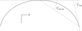

Goals of this chapter:

1. Establish why this project needs a canopy geometry

#. Discuss design by wing sections (as opposed to designing the surfaces
   directly).

#. Chord Surfaces

   * Establish the idea of a chord surface: a function that returns points on
     the section chords.

   * Discuss parametrizations of the surface (the choice of design curves), and
     the limitations of conventional choices.

   * Introduce my new chord surface parametrization

   * Design curves

     * Discuss explicit vs parametric design curves (expressiveness versus number
       of parameters, essentially), and introduce my choices.

     * Show some examples of parametric design curves (scalar constants,
       elliptical functions, etc).

   * Show some example chord surfaces (mostly using my parametric curves, and
     maybe a few abstract curves to show off the flexibility)

#. Canopy surfaces

   * Show how assigning section profiles to a chord surface generates the upper
     and lower surfaces.

   * Derive the function that returns points on the upper and lower surfaces?

   * Show some examples of completed canopies.

#. Discuss advantages/limitations here?

   * Pros/cons of my chord surface parametrization

     * The big advantage of my parametrization is (tautologically) the choice
       of parameters. Parametrizations with fixed `r_x` and `r_yz` force the
       designer to communicate their design indirectly instead of position the
       points they want. Requiring rotation points are a waste of time; they're
       not inherently interesting. I let you choose different `r_x` and `r_yz`,
       which decouples the parameters.

   * Design curves

     * Parametric functions can be parametrized to produce cells, billowing,
       weight shift deformations, etc?

EXTRA:

* Wouldn't it be reasonable to say that the chord is actually "owned" by the
  chord surface, not the airfoil? The leading and trailing edges define the
  chord; the airfoil is just the profile you layer on top. The chord serves to
  scale and position the airfoil onto the section. Put another way, **the chord
  is not a fundamental quantity for the purposes of defining an airfoil
  geometry**; an airfoil is the profile defined by the camber and thickness
  functions, nothing more. You scale the airfoil until the endpoints of the
  camber line lie on the leading and trailing edge of the section, but the
  airfoil doesn't define those points, the chord surface does.

  So should I go ahead and define the *chord* up front, before I ever get to
  the airfoil geometry? I really like this viewpoint.

* Point out that although the "leading edge" and "trailing edge" of the airfoil
  is defined by the camber line (which in turn defines the chord line), the
  chord line of the airfoil is ultimately just a way of positioning the profile
  onto the chord surface. You could choose any arbitrary line, you just need to
  make sure that whatever line you use to generate the coefficients matches the
  orientation and scale of the profile you assign to the final wing.

* I didn't the invent this notion of a chord surface: I merely gave it a name.
  And my contribution isn't a "new parametric geometry": it's a new
  **parametrization** of the surface . The surface already existed, and can be
  described in a variety of ways; I am providing a more convenient way.

* The idea of a "chord surface" is not a new creation, it's simply an
  observation of what they chords **are**. The old methods designed the chord
  surfaces, they just don't typically call them that; I gave it a name because
  I like things to be explicit.]]

* You can specify chords as either a position and length, or as two positions
  (typically the leading and trailing edges). `FreeCAD` and `SingleSkin` do it
  that way; probably more?

  I suspect that the position+length representation lends itself to simpler
  equations, but it'd be interesting to check. For example, suppose a straight
  `0.7c` with an elliptical chord; what do the leading and trailing edge
  functions look like? Do they lose that nice, analytical-function look?

  Of course, the difference is a bit moot: if you have `LE(s)` and `TE(s)`,
  just set `r_x = 0` and `c(s) = norm(LE(s) - TE(s))`.

***************
Canopy Geometry
***************

* What is a canopy?

  * The essential component of gliding flight is the lifting surface.

  * [[Examples of lifting surfaces. Typically symmetric, etc. In this case,
    we're interested in parafoils, which are simply a way of producing
    a lifting surface by inflating nylon through the intakes.]]

* Why is an explicit canopy geometry necessary for **this** project?

  * Paraglider dynamics depend on canopy aerodynamics. If the aerodynamics and
    inertial properties of a canopy are unknown, they must be estimated from
    the geometry itself. For straight wings there are elegant theories that
    work well for small angles of attack, but those simple methods are based on
    linear relationships that do not hold for the highly non-linear geometry of
    a typical parafoil.

    [[Discuss how the discrepancy between linear theories and actual
    performance becomes more pronounced as alpha/beta increase. They also can't
    handle asymmetric wind, such as when the wing is turning.]]

    [[This isn't highlighting why an explicit geometry is necessary. It should
    establish **why this project needs an ability to design new canopy
    geometries**.]]

    Example side view:

    .. figure:: figures/paraglider/geometry/Wikimedia_Nova_X-Act.jpg
       :width: 75%

       Paraglider side view.

       `Photograph <https://www.flickr.com/photos/69401216@N00/2820146477/>`_ by
       Pascal Vuylsteker, distributed under a CC-BY-SA 2.0 license.

* What are the noteworthy details when designing a parafoil?

  * [[Review the picture of a paraglider canopy and highlight the most important
    details.

    This is what I'll use to discuss the limitations of existing
    parametrizations which motivate my new design. There are a variety of
    details that are difficult to describe using the common parametrizations.]]

* What are *wing sections* and how to you use them to define a wing?

  * Instead of designing the 3D shape of a wing directly, simple wings are
    traditionally decomposed into 2D wing *sections*
    :cite:`abbott1959TheoryWingSections` distributed along the span.

    [[I don't like this phrasing: what does "directly" mean? Probably better to
    talk in terms of **structure**, since I'm thinking in terms of structured
    vs unstructured shapes; maybe use those terms?]]

  * [[What the advantages of designing with wing sections as opposed to
    designing arbitrary wing geometries? ie, what are the benefits of the
    structured approach of "design by wing sections"?]]

  * Designing the wing is then broken into two steps:

    1. Specify the scale, position, and orientation of each section.

    2. Assign a 2D profile to each section, called an *airfoil*, which defines
       the upper and lower surfaces of the section.

  * There are a variety of conventions for the first step. [[This is where you
    specify the chord surface. By "variety of conventions" what I mean is
    "variety of parametrizations", but they're all relatively similar.]]

.. figure:: figures/paraglider/geometry/wing_sections2.svg

   Wing sections.

   Note that section profiles are not the same thing as the ribs of a parafoil.
   Parafoil ribs are the internal structure that produce the desired section
   profile at specific points along the span.

* What are the limitations of conventional chord surface parametrizations when
  defining a parafoil? (What are the motivations for the new parametrization?)

  1. They typically dictate which points on the foil the user must specify; for
     example, they might require the section positions defined in terms of the
     leading edge. Using fixed reference points on the sections means that if
     a user wishes to design aspects of the wing other than the leading edge
     (eg, a straight quarter-chord or an elliptical trailing edge) they must
     first design their target then calculate the section leading edges by hand
     instead of specifying their target directly. Requiring the user to work on
     their design indirectly instead of directly makes it unnecessarily
     difficult.

  2. Unnecessary couplings between parameters (ie, between design curves).
     Changing the chord length shouldn't affect anything else, but it usually
     does with most parametrizations.

* What are the design goals for the new parametrization?

  * **[[A lot of these are not unique to my new parametrization! The
    parametrization is the choice of the design curves, but that's a different
    topic that using parametric design curves.]]**

  * The parametrization should map directly to the quantities of interest (ie,
    you can say explicitly where a point on the chord goes, etc). The design
    parameters must be intuitive: when you look at a wing you tend to notice
    particular details; those details should drive the choice of parameters.
    There shouldn't be intermediate translations between what you the details
    you'd like to describe and how you specify the design.

  * There should be as few parameters as possible. For example, I shouldn't
    have to specify a rotation point for geometric torsion; the rotation point
    is merely a means to an end, the real goal is the position and orientation
    of the sections.

  * Decouple the design curves so each component can be defined
    **independently**: if I want to define a particular trailing edge, then
    I should be able to define it explicitly, and not have to work backwards
    from the leading edge + chord length + torsion + rotation point.

  * Enable mixed-design between the flattened and inflated geometries. (eg, the
    section index makes it easy to measure things like chord length and `x(s)`
    by simply laying the wing on the ground.) This relates to the "let me input
    the design in whatever is the most convenient form" goal.

  * Closely related to the above: make it as easy as possible to utilize data
    that describe existing wings. That is, **the new definition should be
    "backwards compatible" with existing wing definitions.** It should be easy
    to translate existing wing data into the new geometry.

    There are typically three main sources of information for the geometry of
    a paragliding wing:

    1. Technical specifications from a designer (researchers or a manufacturer)

    2. Pictures

    3. The wing itself

    For example, if I have the actual wing I can spread it out on the grass and
    simply **measure** the chord length distribution and `x` offset of an edge.
    I then need to say which sections on the wing correspond to the sections on
    the ground. They're the same section, so it is preferable to use a common
    section index that applies equally well to both.

  * Easy to query relevant quantities and positions. Surface areas and volumes
    for inertial calculations, quarter-chord lines for lifting-line theories,
    line geometry positioning, etc.

  * Extensible to allow parametric deformations. Although my current models
    assume a rigid geometry, I don't want to assume that will always be the
    case.

  * Amenable to statistical parameter estimation. This implies that as few
    parameters as possible should be used (to reduce the dimensionality). Also
    advantageous to decompose the parameters to maximize the variance of each
    parameter (ala principal component analysis); the choice of parameterization
    determines the parameter distributions, and it might be helpful to
    "eliminate" some of the variance by using stronger priors over some of the
    parameters. (like, instead of some complicated `X` you decompose into
    simpler `Y` and `Z`, then place a strong prior over `Z` or even treat `Z` as
    constant, so the only variance remaining is that in `Y`, which makes the
    parameter estimation easier.)

This chapter develops an intuitive parametrization for wing section layouts
which has been optimized for non-linear wing geometries. Examples demonstrate
how it can be used and highlight its advantages over conventional
parametrizations. The chapter closes with a discussion of its limitations.
[[Particularly limitations with respect to defining parafoils?]]

Related Work
============

* What are some examples of chord surface parametrizations?

  * **My design is very closely related** to the one in "Paraglider Design
    Handbook", except he requires explicit rotation points for some reason and
    he doesn't appear to allow difference reference points for `x` and `yz`.

  * Benedetti 2012, :cite:`benedetti2012ParaglidersFlightDynamics`

* What are some examples of design curves?

  * "Paraglider Design Handbook", :cite:`casellasParagliderDesignHandbook`

  * :cite:`lingard1995RamairParachuteDesign` [[Is this correct? Where/what are
    the design curves?]]

[[Also, "design by wing sections" is closely related to common 3D modelling
methods. It is similar to *lofting* in the sense that you are generating
a solid by interpolating between profiles at each section. It is similar to
*sweeping* a profile along a curve, except that the profile can change size (if
the wing uses a non-constant chord), shape (if the wing uses a non-uniform
profile), and orientation (rotation of the profile about the curve if there is
geometric twist). The big difference is the use of separate curves for
designing in the `x` and `yz` planes, but you could probably convert this
definition into a single curve (eg, compute the final leading edge) and scaling
factor (the chord lengths scale the profiles). **This geometry should be
straightforward to use as an input to a 3D modeling program.** In fact, FreeCAD
and Blender already have Python API's, so this should be pretty easy to use
this as a backend for parametric geometries in those programs.]]

Fundamental Definitions
=======================

* *flat* versus *projected*

* *flat span*, *flat area*, *flat aspect ratio*

* *projected span*, *projected area*, *projected aspect ratio*

* *section index* (not sure how to define this; it works for any reference
  line through the sections, regardless of their length, but it involves the
  **total** line length, doesn't it? I seem to recall frustration trying to
  decide how to handle the fact that the lengths of `x(s)` and `yz(s)` can
  change, and thus the position that was correct for one pair might be wrong
  for another. For example, suppose you set `yz(0.1) = A` for some given
  `x(s)`, but then you change `x(s)` to include a bump in the middle: the
  `x(0.1)` will no longer correspond to the original `x(0.1)`, even if that
  part of the original curve was unchanged.)

.. math::

   s \defas \frac{y_\mathrm{flat}}{\frac{b_\mathrm{flat}}{2}}

[[...where :math:`b_\mathrm{flat}` is later defined as the length of
:math:`yz(s)`. Note that **this definition assumes the semispan lengths are
equal.**]]

* *section torsion*

.. math::

   \Theta \defas
      \arccos \left( \frac
         {\vec{\hat{x}}_\mathrm{section} \cdot \vec{\hat{x}}_\mathrm{wing}}
         {\left\| \vec{\hat{x}}_\mathrm{section} \right\| \left\| \vec{\hat{x}}_\mathrm{wing} \right\|}
      \right)

* *section anhedral*

.. math::

   \Gamma \defas
      \arccos \left( \frac
         {\vec{\hat{y}}_\mathrm{section} \cdot \vec{\hat{y}}_\mathrm{wing}}
         {\left\| \vec{\hat{y}}_\mathrm{section} \right\| \left\| \vec{\hat{y}}_\mathrm{wing} \right\|}
      \right)

* There are also a variety of standard terms I will avoid: *planform*, *mean
  aerodynamic chord*, maybe more? The term *planform*; most texts assume the
  wing is flat and so the projected area is essentially the flat area, and
  thus differentiating the two is largely neglected in standard aerodynamic
  works. The mean aerodynamic chord is a convenient metric for comparing flat
  wings and for some simplifying equations, but for wings with significant arc
  anhedral I'm not sure how beneficial this term really is.

Chord Surface
=============

[[This section develops a novel parametric model of the chord surface. Discuss
previous methods of defining the chords, and the limitations of those old
methods. Then describe what "would" be a convenient workflow, and announce
that this parametric form enables that more convenient workflow.]]

The first step of designing a wing using sections is to specify the scale,
position, and orientation of the sections. The scale of a section is the length
from the leading edge to the trailing edge. The position of a section is the
vector from the wing origin to some reference point in the section-local
coordinate system. The orientation of a section is the orientation of
the section's local coordinate system relative to the wing's.

* How do you specify scale?

  The scale of a wing section is the length of the line connecting the leading
  edge to the trailing edge.

* How do you specify position?

  * The leading edge of a wing section is the most common section-local origin
    because airfoils are traditionally defined with the leading edge as the
    origin. This choice is convenient since the wing section and the airfoil can
    share a coordinate system.

  * The most common reference point for the position is the leading edge, but
    other choices are possible.

    Conventional definitions of a wing use predetermined reference points for
    positioning the sections. The leading edge is the most common, but other
    choices are possible.

    The problem with fixed reference points is that [[it makes it difficult to
    produce some details of curved geometries, particularly when geometric
    torsion is applied. You should be able to modify the scale, position, and
    orientation independently; they shouldn't be coupled! Some designs let the
    user specify a rotation point for geometric torsion, but if you're locked
    into a fixed reference point then parametric rotation points don't solve the
    problem of a designer that wants to design something other than that fixed
    reference point!]]

* How do you specify orientation?

  * Can do it explicitly using angles, or implicitly by specifying the shape of
    the curve.

  * Talk about incorporating geometric torsion into section orientation. Most
    designs assume a fixed reference point or allow a user to specify
    a rotation point.

    I don't like rotation points at all: the angle is what it is, I shouldn't
    need to care about a rotation point. If I want to make my position point be
    the same as the rotation point, fine, but I shouldn't have to, and if
    I choose not to I shouldn't have to recalculate my positions to accommodate
    the rotation.

Design Curves
-------------

[[Don't just pop these out of thin air; **motivate them** by considering the
natural approach to designing a parafoil. They arise rather naturally out of
the "natural" workflow of designing a wing. Maybe don't introduce them all at
once?

* Should I develop the equations by designing a wing? Start by designing the
  chord distribution, then twisting the tips, then shifting in `x`, etc.]]

* Design curves are functions; that's it. They can can be parametric functions,
  linear interpolators, Bezier curves, whatever.

The surface can be defined using six functions of the section index:

1. Chord length :math:`c(s)`

#. Geometric torsion :math:`\theta(s)`

#. Chord reference point for the x-coordinates :math:`r_{x}(s)`

#. Chord reference point for the y- and z-coordinates :math:`r_{yz}(s)`

#. Position of the reference point in the xs-plane :math:`x(s)`

#. Position of the reference point in the yz-plane :math:`\left< y(s),
   z(s)\right>`

These six functions define the scale, position, and orientation of each foil
section.

Section position is determined by the `x` and `yz` curves, which shift the
section reference points into place. Section orientation is controlled by the
position curves. [[What about :math:`\theta(s)`?"]] Geometric torsion rotates
section profile chords relative to their immediate neighboring sections.

[[**FIXME**: this paragraph is bad.]]

.. TODO:: I should explicitly mention that with this set of definitions,
   section profiles will always "point" towards the +x-axis (mathematically,
   this means the plane containing each section will also contain the
   wing +x-axis). I'm pretty sure this is a reasonable constraint for most wing
   designs? Related: https://www.youtube.com/watch?v=w1AuPn_oBnU. I suspect
   that they aren't reorienting the profiles but are simply reorienting
   the ribs to minimize cross-flow. Simple concept, you just need to compute
   the "typical" airflow for a point on the wing and slice the wing along that
   airfoil (so the ribs won't match the section profiles anymore).

Chord length
^^^^^^^^^^^^

Section scale is controlled by chord length; each section profile is scaled
such that it's leading and trailing edge lie at the ends of the section chord.

[[Discuss wing taper?]]

Geometric Torsion
^^^^^^^^^^^^^^^^^

[[I'm defining *geometric torsion* :math:`\theta` as the rotation angle about
the section :math:`y`-axis **before** applying section anhedral. I think I did
this because it seemed the most natural to apply twist first, since it's
easier to reason about the twist angle when the wing is flat.

If you apply twist before anhedral you also guarantee the section y-axes all
lie in the yz-plane; they have zero x-component.

It wasn't immediately obvious whether to apply torsion or dihedral first, but
consider this: imagine the wing tip ends up with an anhedral of 90 degrees; if
you apply torsion first (rotating the section about the body y-axis) when the
wing is flat, then apply anhedral (rotate the section about the body x-axis),
then the section x-axis still makes the same torsion angle relative to the
body x-axis; this is intuitive. Conversely, imagine first rotating the section
about the body x-axis by 90 degrees; trying to apply torsion by rotating the
sections about the body y-axis will "squish" the leading edge of the sections,
meaning **if you tried to flatten the wing then the trailing edge will be
longer than the leading edge**. I suppose this might be useful to a wing
designer, but it makes analyzing the section profiles considerably more
complicated.

Note to self: applying rotation about body-y then body-x is equivalent to
rotating about body-x then section-y. One advantage of the "torsion then
anhedral" definition is that you can define torsion as the angle between the
section x-axis and the body x-axis, and anhedral is the angle between the
section y-axis and the body y-axis.]]

Is that beneficial? Does it match Belloc? He shows a twist about the section
y-axes, which seems to imply anhedral and *then* torsion.]]

One advantage of this geometry definition is that you don't need to
specify a rotation point. The airfoil angle is independent of the rotation
point, so it's unnecessary work to require a user to calculate positions
relative to rotation points.)

.. figure:: figures/paraglider/geometry/airfoil/geometric_torsion.*

   Geometric torsion.

[[Highlight the fact that the rotation is not about some chosen pivot point.
The choice pivot would only add a translation, but we're fixing the
translation explicitly later anyway, so the choice of pivot never even comes
into play.]]

[[I don't like referring to designing in "planes". It is the projection of the
flattened wing onto x/y_lat or the projection of the arched wing onto y/z, but
you're saying your "designing in a plane" has never felt intuitive.]]

Design in the xs-plane
^^^^^^^^^^^^^^^^^^^^^^

"xy-plane"? More like the "x/y_flat plane"

Design in the yz-plane
^^^^^^^^^^^^^^^^^^^^^^

* The gist of this idea: for each section of the wing, pick the point at
  :math:`r_{yz} \, c` back from the leading edge. Project that point onto the
  yz-plane. Do this for all sections to produce a curve. The :math:`s` is the
  normalized length along that curve. The length of that curve also defines
  :math:`b_\mathrm{flat}`, since it would be the span of the reference line if
  you "unrolled" the wing so all the z-coordinates are zero.

* A cool thing about this is it doesn't prevent you from designing the y- and
  z-coordinates explicitly. You could still do that and simply compute the
  length from each point to determine :math:`s`. That's effectively what I do
  in `belloc.py`.

Here's one simple parametrization that uses an elliptical function
parametrized by the mean and tip anhedral values:

   Elliptical arc anhedral.

Derivation
----------

Okay, new idea: this derivation is too hard to follow, so maybe start with
a better motivation. You need a way to position and orient the wing sections.
Traditionally, that meant specifying either points on the leading edge or
points on the quarter-chord. Those have several limitations that make them
frustrating to use when designing curved foils.

[[List the limitations.]]

There is a better way. The traditional specification goes something like:

.. math::

   LE = \langle x, y, z \rangle

Where the coordinates are predetermined as either the leading edge or the
quarter-chord. But if we add another term, they can specify arbitrary points
on the chord:

.. math::

   LE = \langle x, y, z \rangle + p \cdot c \cdot \vec{\hat{x}}_w

Where the :math:`c` are the section chord lengths and :math:`\vec{\hat{x}}_w`
are the section :math:`x`-axes of the 3D wing. The scalar :math:`0 \le p \le
1` specifies what position on the chord corresponds to :math:`\langle x, y,
z \rangle`:
0 for the leading edge, 0.25 for the quarter chord, 1 for the trailing edge,
etc. This extra term effectively allows the designer to slide the sections
along their local :math:`x`-axes.

The downside of this simplistic adjustment is that the positions are still
dependent on the chord lengths, and the designer is constrained to manipulate
the x, y, and z coordinate simultaneously. It would be much easier to decouple
the coordinates and allow them to be manipulated independently.

That can be accomplished by introducing two scalars instead of just one. Call
these :math:`r_x` and :math:`r_{yz}`, which function as :math:`p` did before,
but now they manipulate the x-coordinates independently from the
yz-coordinates.

.. math::

   LE = \langle x, y, z \rangle + (r_x - r_{yz}) \cdot c \cdot \vec{\hat{x}}_p + r_{yz} \cdot c \cdot \vec{\hat{x}}_a

With this formulation you can easily specify a design as convoluted as "the
trailing edges should lie in a plane parallel to the yz-plane, the
quarter-chord points follow an elliptical arc in the yz-plane, and the chords
follow an exponential distribution".

The :math:`\vec{\hat{x}}_p` and :math:`\vec{\hat{x}}_a` are :math:`x`-axes for
the flattened planform and the fully-specified arc.

[[xxxxxxxxxxxxxxxxxxxxxxxxxxxxxxxxxxxxxxxxxxxxxxxxxxxxxxxxx]]

For the following derivation, functions of the section index :math:`s` are
implicit, so :math:`LE(s) \to LE`, :math:`r_x(s) \to r_x`, etc.

First, consider the chord distribution as defining a flat surface lying in the
:math:`xs`-plane, with all the leading edges lying on the :math:`s`-axis. The
chord lengths can be interpreted as the :math:`x`-coordinates of the leading
edges:

.. math::

   \overline{LE} = \left\langle
      c,
      s,
      0
   \right\rangle

Next define the planform reference curve :math:`r_x(s)`. This function selects
points on the section chord

[[Show a plot of the chords with a reference line through them.]]

These reference points can be considered as defining which points on each
chord should lie on the :math:`s`:-axis:

.. math::

   \overline{LE} = \left\langle
      r_x c,
      s,
      0
   \right\rangle

[[Show the chords with their reference points shift to s=0]].

Because the reference points are constrained to lie between 0 and 1 (so they
select points on each chord), this means they cannot shift the chord surface
further than the chord lengths. To generalize the positioning, define the
planform curve :math:`x(s)`. Instead of shifting the reference points to zero,
the reference points x-coordinates are shifted to :math:`x(s)`:

.. math::

   \overline{LE} = \left\langle
      r_x c + x,
      s,
      0
   \right\rangle

[[Show the chords with their reference points shifted to x(s).]]

The next step is to apply any geometric torsion. Geometric torsion is defined
as a right-handed rotation of a section about its :math:`y`-axis. After
rotation the leading edges become:

.. math::

   \overline{LE} = \left\langle
      (r_x c + x) \cos(\theta),
      s,
      -(r_x c + x) \sin(\theta)
   \right\rangle

[[more stuff]]

In the same fashion, the :math:`r_{yz}(s)` curve selects points on each chord,
:math:`y(s)` defines the section :math:`y`-coordinate, and :math:`z(s)`
defines the z-coordinate offset. These curves do not change the 

[[more stuff]]

Rotation matrices for geometric torsion:

.. math::
   :label: section_torsion

   \mat{\Theta} &\defas \begin{bmatrix}
      \cos(\theta) & 0 & \sin(\theta)\\
      0 & 1 & 0\\
      -\sin(\theta) & 0 & \cos(\theta)
   \end{bmatrix}

[[We need to specify the section dihedral somehow. The **definition** of
section dihedral is the angle made by the section y-axes; it does not say how
to **produce** the section orientations in the first place. For my geometry
I am merely **constraining** the section y-axes to equal the derivatives of
the yz curve. I do this because it ensures that building finite-length
segments from the arched wing will produce linear wing segments that are
oriented roughly the same as the arched wing. Technically, you could define
a yz-curve but keep the section dihedral zero everywhere, which would produce
a slanted wing with vertical sections (sort of shearing the wing sections),
but I think you would be hard pressed to use airfoil coefficient data to
analyze such a sloped wing. **The airfoil data is for air flow perpendicular
to the y-axis, so you want the section y-axes to at least be CLOSE to parallel
to the lifting-line**; Phillips' at least computes the air flow perpendicular
to the lifting-line, so make sure the sections are oriented that way as
well.]]

.. math::
   :label: section_dihedral

   \Gamma = \arctan \left( \frac{dz}{dy} \right)

Rotation matrices for section dihedral:

.. math::
   :label: section_dihedral_matrix

   \mat{\Gamma} &\defas \begin{bmatrix}
      1 & 0 & 0\\
      0 & \cos(\Gamma) & -\sin(\Gamma)\\
      0 & \sin(\Gamma) & \cos(\Gamma)
   \end{bmatrix}

The disadvantage of :eq:`section_dihedral_matrix` is its dependence on
:eq:`section_dihedral` which is undefined for wing sections that achieve a 90°
section dihedral. To avoid the divide by zero, the matrix can be computed
using the derivatives of the arc reference curves:

.. math::

   \begin{aligned}
   K &= \frac{1}{\sqrt{\left(dy/ds\right)^2 + \left(dz/ds\right)^2}}\\
   \\
   \mat{\Gamma} &= \frac{1}{K} \begin{bmatrix}
      K & 0 & 0\\
      0 & dy/ds & -dz/ds\\
      0 & dz/ds & dy/ds
   \end{bmatrix}
   \end{aligned}

The section :math:`x`-axes for the arched wing are then:

.. math::

   \vec{\hat{x}} = \mat{\Gamma} \mat{\Theta} \begin{bmatrix}1\\0\\0\end{bmatrix}

The leading edge then becomes:

.. math::

   LE = \overline{LE} + c \, r_{yz} \vec{\hat{x}}

[[more stuff]]

Now, change your perspective and consider the reference curves in terms of
relative positions instead of worrying about the absolute coordinates produced
by the current equations. Once you do that, then the whole shebang can be
simplified by assuming that the reference points all lie on the :math:`y`-axis
by default, and the :math:`x`, :math:`y`, and :math:`z` curves are simply
shifting their positions along the section :math:`x`-axis. The final equation
for the leading edge then becomes:

.. math::

   \mat{R} = \begin{bmatrix}
      r_x & 0 & 0\\
      0 & r_{yz} & 0\\
      0 & 0 & r_{yz}
   \end{bmatrix}

.. math::

   LE = \left\langle x, y, z \right\rangle + c \, \mat{R} \vec{\hat{x}}

And to compute the coordinates of a point :math:`P` at a position :math:`0 \le
p \le 1` along a section chord:

.. math::

   \vec{r}_{P/O}^c = LE - (p\, c) \vec{\hat{x}} - \vec{r}_{O_c/O}

Where :math:`O` is the origin of the chord surface and :math:`O_c` is the
origin of the canopy. This is used when the leading edge of the central
section is defined as the origin of the canopy.

This non-zero "canopy origin" is the price you pay for that "assume relative
positions" perspective mentioned earlier, but it's simple enough to start by
assuming the offset is zero, then computing :math:`LE(0)` and using that as
the offset for all future calculations.

Notes
-----

What are the advantages of this parametrization?

* It decouples design in the xy and yz planes, so as you design a shape
  towards a target, adjust one parameter doesn't break the previous work (eg,
  if you set the quarter-chord the way you want it you don't have to worry
  about changes to geometric torsion messing that up). [[**This is really the
  only true benefit of this new parametrization?** The rest here I'm leaving
  because they're useful properties of this geometry, but not unique to it.]]

* It's easy to query arbitrary points on the chord surface and foil surface,
  making it easy to integrate with existing aerodynamic methods (eg, Phillips).
  [[Well, no: you could do this with conventional parametrizations too.]]

* You can use (mostly) arbitrary functions for the curves, like linear
  interpolators or Bezier curves. This makes it easy to design custom curve
  shapes, and it makes it easy to recreate a geometry that was specified in
  points (like in Belloc). You can use Bezier curves if you want. [[Again, this
  isn't unique to this parametrization.]]

* As a generative model, it's easy to integrate into a CAD or 3D modeling
  program that can choose how to sample from the surface. [[Again, this isn't
  unique to this parametrization.]]

* Parametric design curves have significant advantages over explicit functions
  (ie, specifying a set of points and using linear interpolation):

  * Parametric functions are amenable to mathematical optimization routines,
    such as exploring performance behaviors or performing statistical parameter
    estimation (fitting a model to flight data).

  * Explicit (as opposed to parametric) representations make it difficult to
    incorporate deformations. There are a variety of interesting situations that
    deform a paraglider wing: trailing edge deflections due to braking, C-riser
    piloting, accelerator flattening, weight shift, cell billowing, etc.

Examples
--------

Example 1
^^^^^^^^^

.. figure:: figures/paraglider/geometry/canopy/examples/build/flat1_curves.*

.. figure:: figures/paraglider/geometry/canopy/examples/build/flat1_canopy_chords.*

Example 2
^^^^^^^^^

Words here.

.. figure:: figures/paraglider/geometry/canopy/examples/build/flat2_curves.*

.. figure:: figures/paraglider/geometry/canopy/examples/build/flat2_canopy_chords.*

Example 3
^^^^^^^^^

Words here.

.. figure:: figures/paraglider/geometry/canopy/examples/build/flat3_curves.*

.. figure:: figures/paraglider/geometry/canopy/examples/build/flat3_canopy_chords.*

Example 4
^^^^^^^^^

Words here.

.. figure:: figures/paraglider/geometry/canopy/examples/build/flat4_curves.*

.. figure:: figures/paraglider/geometry/canopy/examples/build/flat4_canopy_chords.*

Example 5
^^^^^^^^^

A circular arc with a mean anhedral of 33 degrees:

.. figure:: figures/paraglider/geometry/canopy/examples/build/elliptical1_curves.*

.. figure:: figures/paraglider/geometry/canopy/examples/build/elliptical1_canopy_chords.*

Example 6
^^^^^^^^^

A circular arc with a mean anhedral of 44 degrees:

.. figure:: figures/paraglider/geometry/canopy/examples/build/elliptical2_curves.*

.. figure:: figures/paraglider/geometry/canopy/examples/build/elliptical2_canopy_chords.*

Example 7
^^^^^^^^^

An elliptical arc with a mean anhedral of 30 degrees and a wingtip anhedral of
89 degrees:

.. figure:: figures/paraglider/geometry/canopy/examples/build/elliptical3_curves.*

.. figure:: figures/paraglider/geometry/canopy/examples/build/elliptical3_canopy_chords.*

Example: The Manta
^^^^^^^^^^^^^^^^^^

The "manta ray" is a great demo for `r_x`.

.. figure:: figures/paraglider/geometry/canopy/examples/build/manta1_curves.*

.. figure:: figures/paraglider/geometry/canopy/examples/build/manta1_canopy_chords.*

   "Manta ray" with :math:`r_x = 0`

.. figure:: figures/paraglider/geometry/canopy/examples/build/manta2_curves.*

.. figure:: figures/paraglider/geometry/canopy/examples/build/manta2_canopy_chords.*

   "Manta ray" with :math:`r_x = 0.5`

.. figure:: figures/paraglider/geometry/canopy/examples/build/manta3_curves.*

.. figure:: figures/paraglider/geometry/canopy/examples/build/manta3_canopy_chords.*

   "Manta ray" with :math:`r_x = 1.0`

Foil Surface
============

The chord surface is the flat surface produced by all the section chord. To
produce the 3D canopy, each section must be assigned an airfoil.

Airfoils
--------

Related work:

* :cite:`abbott1959TheoryWingSections`

[[**Key terms and concepts to define in this section**: upper surface, lower
surface, leading edge, trailing edge, chord line, mean camber line, thickness,
thickness convention, 2D aerodynamic coefficients.]]

After designing the section chords, the chord surface will produce a 3D wing
by assigning each section a cross-sectional geometry called an *airfoil*.

.. figure:: figures/paraglider/geometry/airfoil/airfoil_examples.*

   Airfoils examples.

An airfoil is a 2D profile defined by a camber line, a thickness function, and
a thickness convention.

Here's a diagram of the basic airfoil geometric properties:

.. figure:: figures/paraglider/geometry/airfoil/airfoil_diagram.*
   :name: airfoil_diagram

   Components of an airfoil.

There are two conventions measuring the airfoil thickness; this convention
also determines what point is designated the *leading edge*. The leading and
trailing edge of a wing section are arbitrary points that define the *chord*;
the chord is used to nondimensionalize the airfoil geometry and define the
*angle of attack*.

.. figure:: figures/paraglider/geometry/airfoil/NACA-6412-thickness-conventions.*
   :name: airfoil_thickness

   Airfoil thickness conventions.

Examples
--------

Assigning a NACA 23015 airfoil to some of the previous examples:

.. figure:: figures/paraglider/geometry/canopy/examples/build/flat4_canopy_airfoils.*

.. figure:: figures/paraglider/geometry/canopy/examples/build/elliptical1_canopy_airfoils.*

Building a wing from 2D cross-sections also provides computational benefits
for estimating the aerodynamic performance of the 3D wing, as discussed in
:ref:`canopy_aerodynamics:Section Coefficients`.

[[Maybe link forward to :ref:`canopy_aerodynamics:Case Study`, where
I implement Belloc's wing using this geometry.]]

Distortions
-----------

**FIXME**: should I discuss cells, billowing, distortion, etc? I'm not working
on / implementing these, so they can probably go in the "Limitations" section
(whatever that turns out to be)

References:

* Babinksy (:cite:`babinsky1999AerodynamicPerformanceParagliders`) discusses
  the effect of billowing on flow separation, and
  :cite:`babinsky1999AerodynamicImprovementsParaglider` discusses using
  stiffeners to reduce the impact

* Kulhanek (:cite:`kulhanek2019IdentificationDegradationAerodynamic`) has
  brief discussion of these impacts

* Belloc (:cite:`belloc2016InfluenceAirInlet`) discusses the effects of air
  intakes, and suggests some modeling choices

* There are a bunch of papers on *fluid-structure interaction* modelling.

* Altmann (:cite:`altmann2009NumericalSimulationParafoil`) discusses the
  overall impact of cell billowing on glide performance, and has a great
  discussion of how design choices (cell structure, ribs, etc) can mitigate
  the problem; in future papers
  (:cite:`altmann2015FluidStructureInteractionAnalysis`,
  :cite:`altmann2019FluidStructureInteractionAnalysis`) he discusses
  implementation details. Fogell
  (:cite:`fogell2014FluidstructureInteractionSimulations`,
  :cite:`fogell2017FluidStructureInteractionSimulation`,
  :cite:`fogell2017FluidStructureInteractionSimulations`) has a lot to say
  on FSI, including some critique of the applicability of Altmann's method
  to parachutes.

  Another recent paper well worth reviewing (good discussions and great
  references list) is :cite:`lolies2019NumericalMethodsEfficient`, which is
  co-authored by Bruce Goldsmith! Neat. One of their big ideas seems to be
  using "mass-spring systems" from computer animation applications for
  paraglider cloth simulations.

Limitations
-----------

* This geometry does not impose any constraints on self-intersections.
  Self-intersections can occur if the chord surface is excessively curved (so
  the surface intersects itself), or if the thickness of an airfoil causes the
  inner surface of a radius to overlap. The equations are intended to be as
  simple as possible, and validating the geometry can be performed as an
  additional post-processing step instead of polluting the equations.
