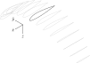

***************
Canopy Geometry
***************

.. Meta:

   A paraglider dynamics model requires the aerodynamics and inertial
   properties of the canopy, which can be estimated from the canopy geometry.

   This chapter discusses how to design a wing geometry using wing sections.
   First you specify the position, scale, and orientation of each section,
   then you assign each section a profile.

   This chapter introduces the general equation for selecting points on
   section surfaces (chords, camber lines, or profiles), discusses why the
   general equation is unwieldy/inconvenient, then introduces
   a reparametrization that's more convenient for designing parafoil canopies.

* What is a canopy?

  * The essential component of gliding flight is the lifting surface.

  * [[Examples of lifting surfaces. Typically symmetric, etc. In this case,
    we're interested in parafoils, which are simply a way of producing
    a lifting surface by inflating nylon through the intakes.]]

    .. figure:: figures/paraglider/geometry/Wikimedia_Nova_X-Act.jpg
       :width: 75%

       Paraglider side view.

       `Photograph <https://www.flickr.com/photos/69401216@N00/2820146477/>`__ by
       Pascal Vuylsteker, distributed under a CC-BY-SA 2.0 license.

* Why does this project need a mathematical model of the canopy geometry?

  * Flight reconstruction requires a dynamics model of the paraglider that
    produced the flight data.

  * Paraglider dynamics depend on the aerodynamics and inertial properties of
    the canopy.

  * The aerodynamics and inertial properties of a canopy can be estimated from
    a mathematical model of the canopy geometry. [[In particular I plan to
    utilize the section coefficient data, but you could also use CFD, etc.]]

  * For straight wings there are elegant aerodynamics models that work well
    for small angles of attack, but those simple methods are based on linear
    relationships that do not hold for the highly non-linear geometry of
    a typical parafoil. Also, those simple theories are only applicable to
    longitudinal models, whereas flight reconstruction requires a dynamics
    model that can handle turns.

    [[Discuss the deficiencies of linear theories: discrepancies as alpha and
    beta increase, inability to handle turns, etc.]]

* [[Ultimately, this project requires a model that returns points on the
  section surfaces (chords, camber lines, and profiles).]]

.. Roadmap

This chapter will proceed as follows:

* Discuss the geometry and some of the modeling considerations.

* Briefly consider explicit geometries, highlight their limitations, and
  respond with the advantages of parametric geometries.

* Introduce the standard parametric approach for wing designs: *wing sections*

* Introduce the general equation for points on section surfaces

  [[Leaves the choice of section index undefined, uses the section leading
  edges as both the section origins and as the section reference points,
  doesn't specify how you produce the DCMs, etc.]]

* Establish why it is inconvenient to design a parafoil canopy by defining the
  variables directly. It's more convenient to define them in terms of *design
  parameters* that capture the structure of the canopy.

* Briefly consider existing parametrizations and highlight their limitations.

  [[Using the section y-coordinate for the section index, etc.]]

* Introduce my novel parametrization for specifying the position and
  orientation of the sections.

  [[Chooses a definition of the section index, sets `r_y = r_z`, defines the
  section DCM using `dz/dy` and `\theta` (so you design `theta(s)` and `yz(s)`
  instead of specifying the section DCM directly).]]

* Provide examples using my parametrization for parafoils.

* Discussion

Paraglider Canopies
===================

.. Describe the physical system (geometry, structure, materials, etc)

* What are the important aspects of a canopy geometry?

  * [[What details of a canopy's shape are required (or at least useful) for
    defining a model that satisfies the needs of this project?

    These are not necessarily the variables you would choose to parametrize
    the geometry; they might simply be helpful for discussing/understanding
    the shape of a canopy. For example, anhedral is ambiguous, so I'm using
    Euler roll angles for section "anhedral". These are here to establish the
    details of the shape and thus the flexibility required by the
    parametrization.

    Related: "General aviation aircraft design" (Gudmundsson; 2013),
    chapter 9: "Anatomy of a wing"]]

  * *flat* versus *projected* values

  * *flat span*, *flat area*, *flat aspect ratio*

  * *projected span*, *projected area*, *projected aspect ratio*

  * There are also a variety of standard terms I will avoid due to ambiguity:
    *planform*, *mean aerodynamic chord*, maybe more? For *planform*, most
    texts assume the wing is flat and so the projected area is essentially
    equal to the flat area, and thus differentiating the two is largely
    neglected in standard aerodynamic works. The mean aerodynamic chord is
    a convenient metric for comparing flat wings and for simplifying some
    equations, but for wings with significant arc anhedral I'm not sure how
    beneficial this term really is; it's a mistake to compare wings based on
    the MAC alone, so I'd rather avoid any mistaken comparisons.

  * *dihedral*, *anhedral*: not sure how to define this for a wing. It's
    traditionally defined for flat wings, as `arctan(z/y)` of the section
    position, but that's pretty unhelpful for a paraglider. It also doesn't
    differentiate between `arctan(z/y)` and `arctan(dz/dy)` of a section. Still,
    discussing curvature leads nicely into a discussion of the *arc*, so
    whatever.

  * *arc* (Bruce Goldsmith calls it the "arc", the "Paraglider Design
    Handbook" calls it the "lobe")

  * *geometric torsion*: relative pitch angle of a section

    .. figure:: figures/paraglider/geometry/airfoil/geometric_torsion.*

       Geometric torsion.

       Note that this refers to the angle, and is the same regardless of any
       particular rotation point.

* [[Highlight why canopy geometries are tricky to model?]]

Canopy Geometry Modeling
========================

Functionality
-------------

.. Define the functional goals of the canopy model

* [[Model objectives v1]]:

  1. Be capable of capturing the relevant details of existing wings.

  2. Make it easy for users to describe existing wings.

  3. Support the queries necessary to use the geometry in aerodynamic methods.

     [[It should not lock the user into one specific method, like LLT, but
     don't focus on that here. I want to avoid any discussion of aerodynamics
     if possible.]]

* [[Model objectives v2]]:

  * [[The general requirement is that it enables estimating the inertial
    properties and aerodynamics, but the additional goals are that it should
    be: expressive, intuitive, able to use existing data, minimize the number
    of parameters (when reasonable), general enough to accommodate
    deformations (billowing, braking, accelerator, etc.

    There are existing parametrizations I could have used, so this is really
    about my extra demands that made the existing choices come up short.
    Driving that home will require some careful examples to establish the
    limitations of existing parametrizations.

    I think the biggest difference is that I chose to increase the complexity
    by adding the "reference point" parameters. I decided to pay the
    "simplicity" cost because of the "intuitive" gain; for elliptical chord
    lengths it was easier to adjust `r_x` than to find a parametric `x(s)`
    that shifted the chords into a reasonable approximation of real wings. In
    particular, most wings have a mostly-straight trailing edge that were
    a pain to encode using leading-edge reference points.]]

  * Makes it easy to specify a target design

    * Each design parameter should be intuitive and capture the target
      property directly (avoiding intermediate translations)

    * Makes it easy to incorporate existing design data. There are three main
      sources of information for the geometry of a paragliding canopy:

      1. Technical specifications (from researchers or a manufacturer)

      2. Pictures

      3. The wing itself

    * Support mixed-design between the flattened and inflated geometries.

      Parafoils only produce an arched geometry when they are inflated. It
      can be convenient to specify some values in terms of the non-inflated
      wing.

      [[A good choice of section index is key here. I should be able to
      define `c(s)` and `x(s)` by spreading a wing out on the grass and
      simply **measuring** the chord lengths and `x` positions of an edge.]]

    * Able to express continuous deformations [[from braking, C-riser
      piloting, accelerator flattening, weight shift, cell billowing, etc.]]

  * Minimizes the number of design parameters

    [[Should this be in the list of general goals? I already list "easy to
    use", but this goal is specifically targeted at simplifying statistical
    analysis. The structural knowledge of each parameter also tends to make
    them more amenable to statistical summarization.

    One long-term goal of this geometry is to allow people to encode
    approximations of existing wings. Once you've built up a database of
    models of physical wings you can generate a distribution over the wing
    parameters.

    Another "blue skies" goal is to produce a model that is amenable to
    statistical parameter estimation. This implies that as few parameters
    as possible should be used (to reduce the dimensionality). Also
    advantageous to decompose the parameters to maximize the variance of
    each parameter (ala principal component analysis); the choice of
    parameterization determines the parameter distributions, and it might
    be helpful to "eliminate" some of the variance by using stronger priors
    over some of the parameters. Like, instead of some complicated `X` you
    decompose into simpler `Y` and `Z`, then place a strong prior over `Z` or
    even treat `Z` as constant, so the only variance remaining is that in
    `Y`, which makes the parameter estimation easier.]]

  * [[Segue into "you can simplify both the specification and the analysis of
    a wing by decomposing it into a set of design parameters. The traditional
    way to do that is *wing sections*.]]

  * Supports the most common [broad-strokes] design parameters of
    a paraglider: airfoil, chord length, taper, geometric torsion, etc. (air
    intakes?)

  * Flexible enough that users can approximate existing designs (the choice of
    parametrization factors into this)

  * As simple as possible (intuitive to use, "frugal" in number of parameters)

Parametrization
---------------

.. Parametric models (motivation, importance of choosing a good
   parametrization, existing parametrizations and their limitations)

* [[Define *explicit geometry*]]

  [[In a sense, explicit geometries are "infinite parametric" since you can
  add as much detail to the mesh as you want. Individual "parameters" (the
  points) don't capture any structure by themselves.]]

* [[Modeling with explicit geometries is too expensive (time consuming to
  produce, require too much information about the wing, difficult to analyze
  with simple aerodynamics, etc)]]

* [[Define *parametric geometry*]]

* [[Advantages of parametric geometries]]

  * Parametric designs try to balance simplicity and flexibility. A good
    parametrization lets you focus on high-level design without forcing you
    into simplistic designs. [[I'm interested in "easy to create, good
    enough" approximations of real wings, not physically-realistic
    simulations.]]

  * It's much easier to place a prior for parameters than for explicit
    geometries. (You'd have to invent parameters you can compute for an
    explicit geometry just so you can compare two canopies.)

.. Define the functional goals of the canopy model parametrization

* [[The choice of parametrization affects how useable it is. What would make
  a good parametrization?]]

* [[Briefly discuss existing parametrizations, and why they're not ideal]]

Wing Sections
=============

.. Introduce designing a wing using "wing sections", conclude with the general
   equation for points on the section surfaces

* [[There is already a standard parametric method for wings: *wing sections*]]

* When designing with wing sections, you decompose the design phase into two
  steps:

  1. Specify the scale, position, and orientation of each section

  2. Specify the *profile* of each section, which defines the upper and lower
     surfaces.

   Wing section profiles.

   Note that section profiles are not the same thing as the ribs of a parafoil.
   Parafoil ribs are the internal structure that produce the desired section
   profile at specific points along the span.

Designing with wing sections
----------------------------

The first step of designing a wing using sections is to specify the scale,
position, and orientation of the sections.

* What is a *section index*?

* How do you specify scale?

  * What is a chord?

    The *chord* of a section is the line connecting the leading edge to the
    trailing edge. The scale of a wing section is determined by the length of
    the chord.

  * The section profiles are scaled such that the camber line starts at the
    leading edge and terminates at the trailing edge of the section. (In other
    words, section profiles are normalized by the chord length. An airfoil is
    the profile determined by the camber line, thickness function, and
    thickness convention; nothing more.)

* How do you specify position?

  * The position of a section is the vector from the wing origin to some
    reference point in the section-local coordinate system.

  * The leading edge of a wing section is the most common section-local origin
    because airfoils are traditionally defined with the leading edge as the
    origin. This choice is convenient since the wing section and the airfoil can
    share a coordinate system.

  * The most common reference point for the position is the leading edge, but
    other choices are possible.

* How do you specify orientation?

  * The orientation of a section is the orientation of the section's local
    coordinate system relative to the wing's.

  * Can specify it explicitly using angles, or implicitly by specifying the
    shape of the position curves.

.. Introduce the general equation of points on the section surfaces

The general equation for points `P` on the section surfaces:

.. math::

   \begin{aligned}
   \vec{r}_{P/O}^w
     &= \vec{r}_{LE/O}^w + \vec{r}_{P/LE}^w\\
     &= \vec{r}_{LE/O}^w + \mat{C}_{w/s} \mat{C}_{s/a} \vec{r}_{P/LE}^a
   \end{aligned}

Where

.. math::

   \mat{C}_{s/a} \defas \begin{bmatrix}
      -1 & 0 \\
      0 & 0\\
      0 & -1
   \end{bmatrix}

A simplified parametrization for parafoil canopies
==================================================

[[This section introduces a novel parametrization of the general equation that makes it easier to design parafoil
canopies. Discuss conventional parametrizations, and the limitations of those
old methods. Then describe what "would" be a convenient workflow, and
demonstrate the convenience of this choice.]]

* What do I mean by "parametrize the general equation"?

  [[I'm essentially saying "that set of design parameters is awkward, I want
  to choose a better set."]]

  The general parameters are able to represent any structure, but they don't
  encode enough structure. This is a problem because it pushes the work onto
  the designer. If you can assume more underlying structure you can save the
  designer from needing to provide that structure themselves. A good choice of
  parameters lets them focus on the important details.

  The purpose of a parametric surface is to decompose a complicated surface
  geometry into a set of simple design functions. The purpose of "parametric"
  functions (like an elliptical arc) is the **capture the structure** of the
  function, preferably with as few parameters as possible.

  (I feel like "parametric function" is poorly named, unless that's
  a conventional way to say "specify the values of a function through
  functions of some parameters instead of specifying the values directly".)

* What are the conventional parametrizations of the general equation?

  * [[Section profiles and scale already have a standardized parametrization,
    but there are a variety of ways to specify position and orientation.]]

  * They typically use the projected section `y` coordinate for the section
    index, define fixed reference points, fixed  rotation points, etc

* What are the limitations of conventional parametrizations?

  * [[The mathematical model is supposed to be flexible and easy to use. I'm
    developing a new parametrization which suggests the conventional choices
    fail somehow.]]

  * Fixed reference points dictate design specification.

    For example, a designer may want to design the trailing edge but the
    parametrization requires the design to be specified in terms of the
    leading edge. Forcing the user to specify their design using leading edge
    coordinates requires the designer to manually convert their design target
    into leading edge coordinates.

  * Tight coupling between the different dimensions of the design.

    Explicit rotation points are an indirect way of producing a desired
    design. The design goal is to specify two independent parameters, position
    and orientation, but because the choice of rotation point affects the
    final position of points on the chords it means that position is coupled
    to rotation.

    Similarly, if the reference points are at fixed locations on the chord,
    and the goal is to position some other point on the chord, then position
    is coupled to the chord length. Scale should not be coupled to position.

.. Introduce my simplified parametrization for parafoils

It's annoying to design the section leading edges directly. Instead, define it
using more convenient design parameters:

.. math::

   \vec{r}_{LE/O}^w = \vec{r}_{RP/O}^w + \vec{r}_{LE/RP}^w

Where `RP` are as-yet nebulous "reference points" and :math:`\vec{r}_{RP/O}^w`
are the design curves (`x(s)` and `yz(s)`, in my case). This lets you choose
reference points other than the leading edges, and position those points
explicitly in the wing coordinate system. (Note that the leading edges remain
the origin of the section coordinate systems.)

In my case I chose to define the reference points using positions on the
section chords:

.. math::

   \vec{r}_{LE/RP}^w = \mat{R} \mat{C}_{w/s} c\, \hat{x}^s_s

.. math::

   \mat{R} \defas \begin{bmatrix}
      r_x & 0 & 0\\
      0 & r_{yz} & 0\\
      0 & 0 & r_{yz}
   \end{bmatrix}

Examples
--------

Example 1
^^^^^^^^^

.. figure:: figures/paraglider/geometry/canopy/examples/build/flat1_curves.*

.. figure:: figures/paraglider/geometry/canopy/examples/build/flat1_canopy_chords.*

Example 2
^^^^^^^^^

Words here.

.. figure:: figures/paraglider/geometry/canopy/examples/build/flat2_curves.*

.. figure:: figures/paraglider/geometry/canopy/examples/build/flat2_canopy_chords.*

Example 3
^^^^^^^^^

Words here.

.. figure:: figures/paraglider/geometry/canopy/examples/build/flat3_curves.*

.. figure:: figures/paraglider/geometry/canopy/examples/build/flat3_canopy_chords.*

Example 4
^^^^^^^^^

Words here.

.. figure:: figures/paraglider/geometry/canopy/examples/build/flat4_curves.*

.. figure:: figures/paraglider/geometry/canopy/examples/build/flat4_canopy_chords.*

Example 5
^^^^^^^^^

A circular arc with a mean anhedral of 33 degrees:

.. figure:: figures/paraglider/geometry/canopy/examples/build/elliptical1_curves.*

.. figure:: figures/paraglider/geometry/canopy/examples/build/elliptical1_canopy_chords.*

Example 6
^^^^^^^^^

A circular arc with a mean anhedral of 44 degrees:

.. figure:: figures/paraglider/geometry/canopy/examples/build/elliptical2_curves.*

.. figure:: figures/paraglider/geometry/canopy/examples/build/elliptical2_canopy_chords.*

Example 7
^^^^^^^^^

An elliptical arc with a mean anhedral of 30 degrees and a wingtip anhedral of
89 degrees:

.. figure:: figures/paraglider/geometry/canopy/examples/build/elliptical3_curves.*

.. figure:: figures/paraglider/geometry/canopy/examples/build/elliptical3_canopy_chords.*

Example: The Manta
^^^^^^^^^^^^^^^^^^

The "manta ray" is a great demo for `r_x`.

.. figure:: figures/paraglider/geometry/canopy/examples/build/manta1_curves.*

.. figure:: figures/paraglider/geometry/canopy/examples/build/manta1_canopy_chords.*

   "Manta ray" with :math:`r_x = 0`

.. figure:: figures/paraglider/geometry/canopy/examples/build/manta2_curves.*

.. figure:: figures/paraglider/geometry/canopy/examples/build/manta2_canopy_chords.*

   "Manta ray" with :math:`r_x = 0.5`

.. figure:: figures/paraglider/geometry/canopy/examples/build/manta3_curves.*

.. figure:: figures/paraglider/geometry/canopy/examples/build/manta3_canopy_chords.*

   "Manta ray" with :math:`r_x = 1.0`

Foil Surface
============

The chord surface is the flat surface produced by all the section chord. To
produce the 3D canopy, each section must be assigned an airfoil.

Outline:

* Define *section profile* (airfoil)

* Show how assigning section profiles to a chord surface generates the upper
  and lower surfaces.

* Derive (or simply present) the function that returns points on the upper and
  lower surfaces given a chord surface and section profiles

* Discuss how the choice of airfoil effects wing performance

* Discuss how the profile can vary along the span

* Discuss how the profile behaves in-flight

  Distortions due to billowing, braking, etc. (We're ignoring these, but you
  can use the section indices to deal with them.)

* Show some examples of completed canopies.

Airfoils
--------

[[Should probably write a separate chapter about airfoils: their purpose,
geometry, coefficients, behavior, etc. I don't like separating those topics,
but I also want to discuss section coefficients in this chapter. I do need
some terminology here though, like *chord*, *camber line*, etc.]]

Related work:

* :cite:`abbott1959TheoryWingSections`

* :cite:`bertin2014AerodynamicsEngineers`, Sec:5.2

[[**Key terms and concepts to define in this section**: upper surface, lower
surface, leading edge, trailing edge, chord line, mean camber line, thickness,
thickness convention, 2D aerodynamic coefficients.]]

After designing the section chords, the chord surface will produce a 3D wing
by assigning each section a cross-sectional geometry called an *airfoil*.

.. figure:: figures/paraglider/geometry/airfoil/airfoil_examples.*

   Airfoils examples.

An airfoil is a 2D profile defined by a camber line, a thickness function, and
a thickness convention. [[FIXME: This is just one specific way to defining the
profile curve; you could just as easily provide an explicit set of points.]]

Here's a diagram of the basic airfoil geometric properties:

.. figure:: figures/paraglider/geometry/airfoil/airfoil_diagram.*
   :name: airfoil_diagram

   Components of an airfoil.

There are two conventions measuring the airfoil thickness; this convention
also determines what point is designated the *leading edge*. The leading and
trailing edge of a wing section are arbitrary points that define the *chord*;
the chord is used to nondimensionalize the airfoil geometry and define the
*angle of attack*.

.. figure:: figures/paraglider/geometry/airfoil/NACA-6412-thickness-conventions.*
   :name: airfoil_thickness

   Airfoil thickness conventions.

Examples
--------

Assigning a NACA 23015 airfoil to some of the previous examples:

.. figure:: figures/paraglider/geometry/canopy/examples/build/flat4_canopy_airfoils.*

.. figure:: figures/paraglider/geometry/canopy/examples/build/elliptical1_canopy_airfoils.*

Building a wing from 2D cross-sections also provides computational benefits
for estimating the aerodynamic performance of the 3D wing, as discussed in
:ref:`canopy_aerodynamics:Section Coefficients`.

[[Maybe link forward to :ref:`canopy_aerodynamics:Case Study`, where
I implement Belloc's wing using this geometry.]]

Discussion
==========

Advantages
----------

[[Is this a discussion of my parametrization of the chord surface, or of
parametric functions, or...?]]

* Using arbitrary reference points is great because (1) they decouple the
  parameters (so you can change one without needing to modify the others) and
  (2) they allow the designer to directly target the aspects of the design
  they're interested in (eg, you don't have to specify rotation points)

* The equations are simple, so implementation is simple.

* No constraints on the form of the design parameters. You can use (mostly)
  arbitrary functions for the curves, like linear interpolators or Bezier
  curves. This makes it easy to design custom curve shapes, and it makes it
  easy to recreate a geometry that was specified in points (like in Belloc).
  You can use Bezier curves if you want. [[This probably isn't unique to this
  parametrization.]]

* As a generative model, it's easy to integrate into a CAD or 3D modeling
  program that can choose how to sample from the surface. [[Again, this isn't
  unique to this parametrization.]]

* Parametric design functions have significant advantages over explicit
  functions (ie, specifying a set of points and using linear interpolation):

  * Parametric functions are amenable to mathematical optimization routines,
    such as exploring performance behaviors or performing statistical parameter
    estimation (fitting a model to flight data).

  * Explicit (as opposed to parametric) representations make it difficult to
    incorporate deformations. There are a variety of interesting situations that
    deform a paraglider wing: trailing edge deflections due to braking, C-riser
    piloting, accelerator flattening, weight shift, cell billowing, etc.

  * [[These statements are true, but again: not unique to this
    parametrization?]]

* Parametric design parameters can be parametrized to produce cells,
  billowing, weight shift deformations, etc? [[Again: not unique.]]

Limitations
-----------

* This geometry does not impose any constraints on self-intersections.
  Self-intersections can occur if the chord surface is excessively curved (so
  the surface intersects itself), or if the thickness of an airfoil causes the
  inner surface of a radius to overlap. [[These are limitations of the general
  equation that are inherited by this parametrization. If I allowed section
  yaw then you'd have this issue for that too.]]

  I've accepted this limitation with the understanding that the equations are
  intended to be as simple as possible, and reasonable wing designs are
  unlikely to be impacted. If these geometric constraints are important for
  a design then the geometry can be validated as an additional post-processing
  step instead of polluting these equations.

* I'm explicitly disallowing section-yaw (so no wedge-shaped segments), and
  assume that the section y-axes are all parallel to the body y-axis when the
  wing is flat. I'm not sure how accurate that is.

* I haven't described how to implement cells using parametric functions.

* Doesn't model structure like internal ribs

EXTRA
=====

* Using a chord surface to define a wing:

  * Do I like using "O" for the wing origin? It's basically the origin for the
    entire wing; my only gripe is that I don't like using "O" in math since it
    looks like a zero. Also, do I need a name for the origin of the chord
    surface?

  * Wing origin offset: the chord surface uses it's own coordinate system,
    with its origin defined by the origins of the reference position curves.
    For the wing I'm defining origin as the leading edge of the central
    section. Thus, the chord surface positions an extra translation to get the
    coordinates in the wing's coordinate system. (If the central section has
    no geometric torsion then it's simply an x-offset `x(0) + r_x(0) * c(0)`,
    right?)
