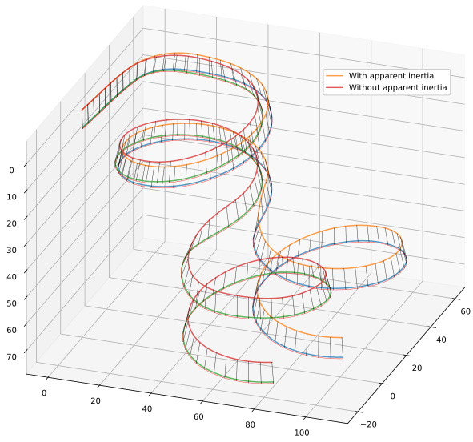

**********
Conclusion
**********

.. What are the results of this project?

   Assume an impatient reader will jump here. This is your last chance to
   convince them the paper is worth reading.

Applications
============

[[Discuss how can people use these sorts of models: statistical filtering,
control modeling, and studying wing behavior. This section is one of payoffs
for the paper In the introduction to the paper I claimed that one of the
applications of dynamic simulations is to study the behavior of a system.
Having concluded the model is usably accurate, demonstrate how the model can be
used to learn about the behavior of the physical system.]]

Study: drag breakdown
---------------------

A common question for curious pilots is how to reduce the drag of their glider
so they can improve the glide ratio or top speed of their wing. The natural
progression of this curiosity is wonder where all the drag comes from in the
first place. One way to answer that question is to plot the drag contributions
from each component :cite:`babinsky1999AerodynamicImprovementsParaglider`.

.. figure:: figures/paraglider/demonstration/drag_breakdown.*

   Drag breakdown for Niviuk Hook 3 23 with a pod harness.

Viscous drag includes effects such as the sheer forces produced by the
viscosity of the air, and the pressure drag due to flow separation (the
"vacuum" that can occur on the downwind side of an object); these forms of drag
occur on every surface of the glider, including the lines and payload. Inviscid
drag is less intuitive: commonly referred to as "lift-induced drag", it is the
energy lost in the vorticity that the wing sheds into its wake as a side-effect
of producing lift.

This diagram provides a satisfying look into the behavior of a wing across the
range of speeds. At the low end, pilots understand that the "brakes" will slow
the wing by increasing its drag, but may be surprised to discover that the
increase in drag is dominated by how the wing produces lift. At the high end,
it can be surprising to learn what proportion of the total system drag is
produced by the seemingly-negligible suspension lines. Although drag is just
one piece of the lift/drag ratio, this sort of breakdown is valuable for
estimating how much improvement is possible by (for example) reducing the drag
of the payload.

This decomposition is also educational because it offers another perspective of
how each component of the wing affects the overall design. Consider the general
guideline that paraglider wings are designed to achieve their maximum glide
ratio at "trim" (zero controls), which usually coincides with the speed that
minimizes the total system drag (as seen here). Now suppose the design was
changed; for example, increasing the aspect ratio of the canopy will tend to
decrease its lift-induced drag, which in turn requires repositioning the
payload at trim. The complete system behavior is a complex interaction of
components, and having access to a parametric model such as this is an
excellent resource for quickly answering questions about glider efficiency by
developing an intuition of how their interactions affect the system behavior.

.. This diagram can also provide a useful to "sanity check".

   Compare the model to known results, such as
   :cite:`babinsky1999AerodynamicImprovementsParaglider`.

   * Accuracy of the :ref:`section profiles <Profiles>`

   * Accuracy of the 2D aerodynamic coefficients (XFOIL tends to overestimate
     CL and underestimate CD)

   Then again, are these really THAT different from the accuracy limitations of
   the 3D aerodynamics? Spanwise-flow violate the assumptions of the 2D
   coefficients, surface imperfections, etc. At maximum braking you'd expect
   the foil distortions (creasing, etc) to have a significant impact for a real
   wing. At high speed I'm ignoring deformations to the air intakes [[]]

Study: affects of apparent mass
-------------------------------

   Figure-8 with and without apparent mass

[[This section should demonstrate when it's important to account for apparent
mass.]]

Study: indirect thermal interactions
------------------------------------

.. figure:: figures/paraglider/demonstration/indirect_thermal.*

   Indirect thermal interaction.

[[FIXME: explain. The wing is flying straight at equilibrium, when it enters
a thermal 15 meters to its right. The thermal strength has a squared distance
decay to 5% by the time it :math:`y = 0`, so only the right side of the wing
experiences a significant change to lift.  Etc etc.]]

[[Inconclusive results; discuss that in `Future work`_.]]
