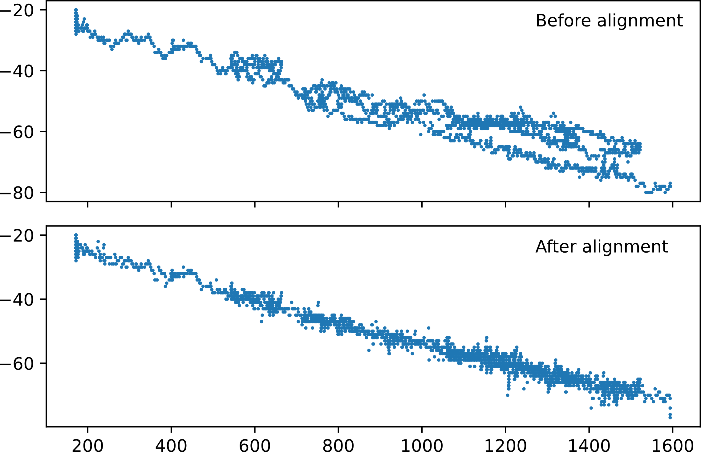

*******************
Data Considerations
*******************

* This chapter discusses the data needs for paraglider flight reconstruction.
  What data is easily available (IGC tracks), what data is required (for
  flight reconstruction), where and how it can be acquired, approximations you
  can utilize, etc. (It's tempting to put this as a subsection in a "Flight
  Reconstruction" chapter, but this whole document is dedicated to flight
  reconstruction.)

* The introduction to this chapter should provide a "first pass" survey of the
  data in an IGC file. The data will establish the subsections in this
  chapter.

* Should I discuss the error between the GNSS and pressure altitude to segue
  into atmospheric parameter estimation? I like the idea of surveying the data
  first: a "first pass" look at the data. Acknowledge the questions and issues
  in the introduction

Atmospheric Parameters
======================

The IGC files record altitude using two different measurements: one from the
GNSS device, one from barometric pressure. The GNSS altitude is an estimate of
the current geometric altitude. The pressure altitude is the altitude at which
the atmospheric pressure would match the currently observed conditions under
international standard atmospheric (:term:`ISA`) conditions.

You can use the relationship between pressure and altitude to estimate the
current atmospheric parameters:

.. math::
   :label: pressure_to_altitude

   h = \frac{T_0}{L} \cdot \left( 1 - {\left( \frac{p}{P_0} \right)}^\frac{LR}{Mg} \right)

Because the pressure altitude converts pressure to altitude while assuming ISA
conditions, non-ISA conditions will produce a variometer bias
:math:`\epsilon_v = z_\textrm{GNSS} - z_\textrm{vario}`. The bias can be
positive or negative, depending on atmospheric conditions. In general, if the
air temperatures are higher than 19°C (ISA temperature) the pressure altitude
will be lower than GNSS altitude, but alignment also depends on atmospheric
pressure and lapse rate.

.. figure:: figures/data/vario_gnss_bias.*

   GNSS versus pressure altitude.

Because the relationship between pressure and altitude in
:eq:`pressure_to_altitude` is non-linear, the bias is a function of altitude.
The relationship is an exponential (FIXME: I think this claim is valid?) so
fitting an exponential bias should work, but a more robust solution is to fit
the atmospheric parameters themselves.

The parameter estimation problem is more difficult because the GNSS and
variometer measurements are often out of alignment. GNSS tracks commonly
experience a time delay that depends on the device and atmospheric conditions.

   Variometer bias as a function of altitude.

First with the raw sequences, which exhibits variable bias depending on GNSS
delay (exacerbated in regions of rapid ascent or descent), and again after
performing sequence alignment.

Parameter Estimation
--------------------

.. FIXME: should I use the `align*` or `aligned` environment?

.. math::
   :label: stochastic_pressure_to_altitude

   \begin{aligned}
   h &\sim \mathcal{N}(\mu_h, 2)                                                          &\mathrm{m}\\[1.0ex]
   \mu_h &= \frac{T_0}{L} \cdot \left( 1 - {\left( \frac{p}{P_0} \right)}^{LR/Mg} \right) &\mathrm{m}\\[1.0ex]
   T_0 &\sim \mathcal{N}(288.15, 10)                                                      &\mathrm{K}\\[1.0ex]
   L &\sim \mathcal{N}(0.0065, 0.003)                                                     &\mathrm{K \cdot m^{-1}}\\[1.0ex]
   P_0 &\sim \mathcal{N}(1013.25, 15)                                                     &\mathrm{hPa}\\[1.0ex]
   R &\equiv 8.3144598                                                                    &\mathrm{J \cdot K^{-1} \cdot mol^{-1}} \\[1.0ex]
   M &\equiv 0.0289644                                                                    &\mathrm{kg \cdot mol^{-1}}\\[1.0ex]
   g &\equiv 9.80665                                                                      &\mathrm{kg \cdot m \cdot s^{-2}}
   \end{aligned}

In :eq:`pressure_to_altitude` I do stuff.

TODOs:

* Use the Turkey tracks to show how the bias is a function of altitude

* Plot the priors

* Plot the posterior for several of the Greece tracks and observe that
  although they are very precise (small posterior variance) they don't agree
  with each other (suggesting some devices may have systematic biases/errors?)
