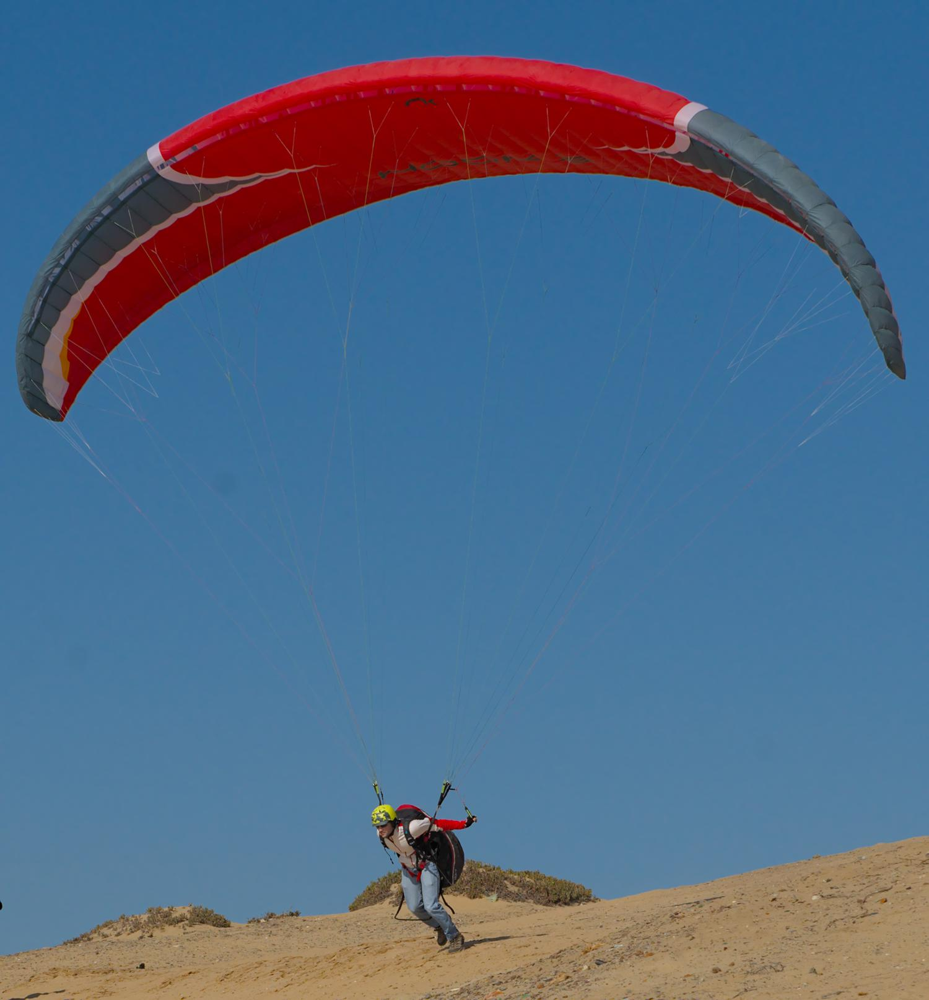
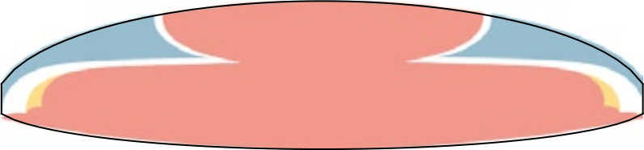
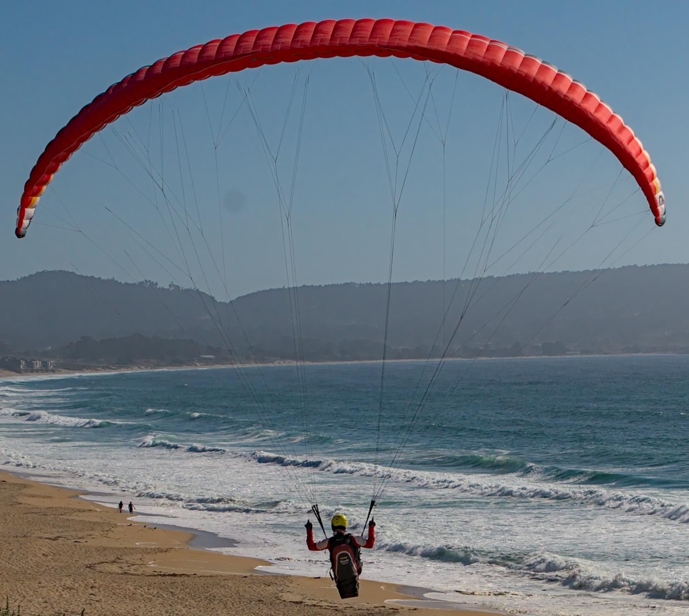

.. This chapter demonstrates how to use the component models to create
   complete paraglider system models and simulate their dynamics. The modeling
   process combines basic technical specs from a user manual with photographic
   information and reasonable assumptions about paraglider wing design. The
   simulations perform static and dynamic performance tests (polar plots and
   flight maneuvers, respectively) and compare them to expected behaviors.

*************
Demonstration
*************

Modeling a commercial paraglider wing is difficult because the technical data
is limited to basic summary measurements. A major task of the modeling process
is how to augment the missing information to create a complete model. [[To
address that problem, this paper started by creating a foil geometry with
enough flexibility to enable complex foil models to be defined using
parametric functions which encode the assumptions of the missing structure.]]
Modeling a canopy then becomes a problem of designing suitable parametric
functions and estimating the parameters that best describe the true geometry.

This chapter demonstrates one possible workflow to model a complete paraglider
system from basic technical specifications using the simplified
:doc:`component models <paraglider_components>` provided by the ``glidersim``
package. Once the model is defined, it is sanity checked by comparing
estimates of its longitudinal steady-state aerodynamics over the range of
control inputs against published performance data, such as minimal sink rate
and speed range. The chapter concludes with flight simulations using the model
in a variety of flight scenarios.

   *This chapter is in a very raw state.*

Model
=====

.. Introduce the wing

The paraglider wing used in this example is a Niviuk Hook 3, size 23. With
forgiving flight characteristics targeting advanced beginners (or veteran
pilots that are happy to forgo some performance in exchange for robust
handling), this wing is not intended for acrobatics. The limitations of the
:ref:`aerodynamics method <foil_aerodynamics:Phillips' numerical
lifting-line>` are not an issue when simulating the majority of flights
produced by this wing.

   Front-view of an inflated Niviuk Hook 3

Wing data is available from four primary sources:

1. Technical specifications and user manuals

2. Flight test data from certifications and reviews

3. Pictures and videos

4. Physical measurements

Technical specs
---------------

From the official `technical specifications manual
<https://niviuk.com/niviuk/customer_pdf/Descatalogado/Hook%203/Datos%20t%C3%A9cnicos/HOOK3_TECNIC_ENG.pdf>`_:

.. list-table:: Wing data
   :header-rows: 1

   * - Property
     - Value
     - Unit
   * - Root chord
     - 2.58
     - m
   * - Tip chord
     - 0.52
     - m
   * - Standard mean chord
     - 2.06
     - m
   * - Flat area
     - 23
     - m\ :sup:`2`
   * - Flat span
     - 11.15
     - m
   * - Flat aspect ratio
     - 5.40
     - --
   * - Projected area
     - 19.55
     - m\ :sup:`2`
   * - Projected span
     - 8.84
     - m
   * - Projected aspect ratio
     - 4.00
     - --
   * - Number of cells
     - 52
     - --
   * - Total line length
     - 218
     - m
   * - Central line length
     - 6.8
     - m
   * - Accelerator line length
     - 0.15
     - m
   * - Solid mass
     - 4.7
     - kg
   * - In-flight weight limit
     - 85
     - kg

Canopy
------

.. This section should highlight how a reasonable approximation can be
   produced from the minimal wing data like flat and inflated span, taper,
   etc. Show what data I had, what assumptions I used to fill in the blanks,
   and how well the result matched the target.

Developing a canopy model has four basic steps:

1. Design the foil layout (scale, position, and orientation)

2. Assign section profiles

3. Specify physical attributes of the manufactured canopy

[[The first two steps create the idealized foil geometry model; should they be
separate? I guess I like the fact that you can get really far just specifying
the chord surface using measurements; it's a high-confidence task.]]

Foil layout
^^^^^^^^^^^

.. Span (b_flat)

[[Start by defining :math:`b_\textrm{flat}`, which can be read directly from
the technical specs.]]

.. FIXME: discuss

   * The choice of :ref:`section index <foil_geometry:Section index>` makes this
     step simpler because you can use the `b_flat` instead of `b_proj`. Explain
     that?

   * In ``glidersim`` this is a scaling factor for the normalized
     ``FoilGeometry``; that's an implementation detail, but the point of this
     section is to demonstrate how it makes things easier to define foils, so
     it's not irrelevant.

.. Chord length (c)

[[Next up is the chord length distribution. The technical specifications only
list the root, tip, and mean chord lengths, but a reasonable guess is that the
wing uses a truncated elliptical distribution. (Paragliding wings commonly use
truncated elliptic functions because they encourage elliptic lift
distributions, thus reducing induced drag.) Fitting an elliptic function to
the root and tip lengths and computing the mean average chord length of the
resulting function confirms the elliptic assumption.

[[Check: fitting an elliptical produces a standard mean of 2.06m, which
matches the technical specs exactly.]]

.. FIXME: compare the specified vs computed flat areas

.. Fore-aft positioning (r_x, x)

[[The next step is to design the fore-aft positioning of the sections, which
are controlled by the :math:`r_x(s)` and :math:`x(s)` design curves. Although
the obvious choice is to choose :math:`r_x(s) = 0` and measure the
:math:`x`-offsets of each section, this choice often produces an unnecessarily
complicated :math:`x(s)` function. Instead, paragliders can often be described
with some constant :math:`r_x(s)` and :math:`x(s) = 0`. The constant reference
position can be estimated by considering pictures of the inflated wing, but
since flattened drawings are commonly available in technical manuals they are
typically more convenient. (Admittedly, such drawings are not always to scale,
and so should be used with caution.) For this wing, a small amount of trial
and error using a top-down view from the wing user manual suggests :math:`r_x
= 0.7`.]]

   Top-down outline of flattened canopy

   The black outline is the boundary of the model's flattened chord surface.
   The colored background is taken from the user manual for the wing.

As seen in :numref:`Hook3_topdown`, the elliptical chord assumption with
:math:`r_x = 0.7` gives a close match to the drawing in the manual.

.. Arc (y, z)

The next step is to model the *arc* (position curvature in the
:math:`yz`-plane). Photos of the wing suggest that a circular arc segment is
a reasonable starting point. There are several ways to estimate the circular
arc parameters of the physical wing, such as the width to height ratios, or
visual estimation of the arc angle, but since the specs included both the
flattened and projected spans, the simplest method is to increase the arc
angle until the projected span matches the expected value.

[[FIXME: finish writing. For example, checking the "naive" fit based on
a circular arc is pretty close, but the projected surface area doesn't match
the specs; the fit can be improved by replacing the circular arc with an
elliptical arc. Mention that ``glidersim`` provides helper functions to make
this process easier than it sounds. My final fit was `mean_anhedral = 32`,
`tip_anhedral = 75`; and yes, those parameter names use "anhedral"
inconsistently. ☹️ ]]

.. FIXME:

   * Explain how I adjusted `mean_anhedral` until the projected values are
     roughly correct?

   * Explain how I chose `r_yz`? Technically this would depend on the
     geometric torsion, but since I'm unsure the safe choice is `r_yz = 0.5`

   * Show the rear-view picture and the resulting model? I'd prefer
     a straight-on photo, it's hard to tell with angled photos.

   * Confirm the projected area and projected span

.. Geometric torsion (theta)

After the relatively straightforward process of positioning the section comes
the more difficult task of estimating their orientation. The section roll and
yaw are predetermined by the :ref:`simplified model <foil_geometry:Parametric
model>`, but the section pitch (or *geometric torsion*) can be difficult to
measure. Most parafoils benefit from a small amount of increasing geometric
torsion towards the wing tips (or *washin*), and a conservative guess of
4 degrees at the wingtip should be reasonably accurate.

.. FIXME: what's the DISTRIBUTION for the Hook 3? No way to confirm? The
   angles are small and difficult to measure from a wing on the ground.

Section profiles
^^^^^^^^^^^^^^^^

After the section layout (scale, position, and orientation) is complete, each
section must be assigned an airfoil.

[[FIXME: explain my choice. Belloc used the 23015, but
:cite:`lingard1995RamairParachuteDesign` says that many older designs used
a Clark-Y with 18% thickness. I chose the NACA 24018 as a sort of clumsy
compromise. He also mentions that newer gliders have "benefited from glider
technology and use a range of low-speed section" like the LS(1)-0417 (which
was also chosen by :cite:`becker2017ExperimentalStudyParaglider`).]]

.. figure:: figures/paraglider/demonstration/braking_NACA24018.*

   Set of NACA 24018 airfoils with trailing edge deflections.

[[FIXME: explain why this is an extremely optimistic model of how parafoil
sections deform with increasing brake inputs. I'd go as far as to say that
this is the number one source of error in the model.]]

[[FIXME: explain how I produced those profiles. Oof.]]

Physical attributes
^^^^^^^^^^^^^^^^^^^

[[Assigning the section profiles completes the (idealized) parametric
:doc:`foil geometry <foil_geometry>` model, and it can be used to define
a :ref:`canopy model <paraglider_components:Canopy>` for the paraglider wing
by assigning it physical attributes such as surface material densities (to
calculate its inertia) and air intake extents (to calculate the viscous drag
corrections).

.. Materials (rho_upper, rho_lower, rho_ribs)

In this case, the material densities can be read straight from the technical
specifications:

.. list-table:: Hook 3 material densities
   :header-rows: 1
   :align: center
   :name: hook3_material_densities

   * - Surface
     - Material
     - Density :math:`\left[ \frac{kg}{m^2} \right]`
   * - Upper
     - Porcher 9017 E77A
     - 0.039
   * - Lower
     - Dominico N20DMF
     - 0.035
   * - Internal ribs
     - Porcher 9017 E29
     - 0.041

.. FIXME: the specs list the total wing weight at 4.7kg, but the
   upper/lower/rib materials only account for 2.5kg or so. My mass
   calculations neglect the extra mass due to things like the lines, riser
   straps, carabiners, internal v-ribs, horizontal straps, tension rods, etc,
   so I'm underestimating that mass, but I'm also assuming the vertical ribs
   are solid (no ports) so that makes up for a bit of the missing mass

.. Air intakes (s_end, r_upper, r_lower)

For the air intakes, the user manual provides a flattened projection which
includes the air intakes (Fig:11.4, pg17); assuming the sections are uniform
width, the air intakes start at section 22 of 27 ribs, which would correspond
to :math:`s = 0.815`, so :math:`s_end = 0.8` is a reasonable guess for the
extent. The upper and lower profile extent is more difficult to determine just
by looking at pictures, but considering the viscous drag correction is
relatively minor a reasonable guess is :math:`r_\textrm{upper} = -0.04` and
:math:`r_\textrm{lower} = -0.09`.

.. FIXME: show a figure of the resulting profile

.. FIXME: this is a crappy way of measuring...

Suspension lines
----------------

The second basic component of paraglider model is for the suspension lines. It
is responsible for positioning the payload, adjusting the position as
a function of the accelerator input, and computing the trailing edge
deflection angles.

Riser position
^^^^^^^^^^^^^^

.. Design variables: kappa_x, kappa_z, kappa_A, kappa_C, kappa_a

[[This demonstration uses the simplified line geometry model. Instead of
modeling the complete set of lines, it focuses on producing the effects of the
bridle with as few parameters as possible.]]

.. kappa_A and kappa_C

* FIXME: how should I estimate :math:`\kappa_A` and :math:`\kappa_C`? Guess
  them from the line layout diagram from the user manual, or measure the
  physical wing?

.. kappa_x

* Line lengths from pg8 of the Hook 3 technical specifications:

  Neglecting the riser length of `0.470m`, the total lengths of the lines from
  the risers to the tabs:

  .. code-block::

    2A1   = 3.994
    A1    = 1.958
    a1    = 0.361
    Total = 6.313

    2C1   = 4.720
    C1    = 1.253
    c1    = 0.308
    Total = 6.281

  If you neglected the differences in the cascades for the As and Cs, the
  riser should be virtually centered between the two, which would mean if
  `kappa_A = 0.11` and `kappa_C = 0.59` then `kappa_x = 0.35`. However, the Cs
  first cascade is higher, thus larger angles, so the total length of the Cs
  will be "too long" (the more you deviate from a straight line, the longer
  the length to reach the destination).

  A few crude guesses suggest the `kappa_x = 0.5` isn't terrible.

  Using the lengths of the As and Cs is difficult, because `kappa_x` is very
  sensitive to small differences. For the Hook3, if they were the same length
  then `kappa_x = 0.35`, but if `kappa_x = 0.5` (a large difference in
  horizontal position) then the `C = 0.9898 * A`: scarcely more than 1%
  difference!

  Is using the nominal glide speed a better measure? I wonder how much
  `kappa_x/kappa_z` affects stability... Is `kappa_x` important?

  Maybe tune `kappa_x` to maximize the glide ratio? That happens at `kappa_x
  = 0.5c`. Of course it's common for the optimum glide ratio to occur when
  speedbar is applied, but whatever. Let's assume this wing was optimized for
  best glide at trim.

.. kappa_z

* FIXME: I think :math:`\kappa_z` is the "Central line length" from the specs
  (normalized by the root chord, IIRC), but what about :math:`\kappa_x`?
  I think I guessed that based on the maximum speed on the polar

.. kappa_a

[[From the specs, the accelerator line length :math:`\kappa_a = 0.15`]]

Brakes
^^^^^^

.. Design variables: s_delta_start0/1, s_delta_stop0/1, kappa_b

[[Tricky to explain how to define `kappa_b` since it depends on the set of
profiles, the chord distribution, and the brake deflection distribution. Refer
to `SimpleLineGeometry.maximize_kappa_b`]]

.. Deflection angle distribution and braking profiles

The true deflection angle distribution depends on the true line lengths and
cascade angles, but since the simple model does not include those the
deflection angles must be assumed/guessed.

[[Estimate the parameters of the quartic model in
:ref:`paraglider_components:Brakes` by looking at a rear-view photo of
a wing.]]

   Rear-view of an inflated Hook 3 with symmetric brake deflections

[[From this picture you can see that the brake deflection doesn't start until
some distance from the root. The brake lines are hard to see, but their
deflections are intuitive. The result is that instead of using a true line
geometry, you can get away with an approximate deflection distribution using
a simple cubic function with a few carefully chosen end points.]]

[[This method is admittedly weak. Probably not a major problem in practice,
but call it out when discussing reasons why I'm not comparing this to actual
flight data (goes together with the other uncertainties, like unknown
airfoil).]]

.. figure:: figures/paraglider/demonstration/Hook3_TE_0.25_0.50.*

   Quartic brake deflections, :math:`\delta_{bl} = 0.25` and :math:`\delta_{br}
   = 0.5`

.. figure:: figures/paraglider/demonstration/Hook3_TE_1.00_1.00.*

   Quartic brake deflections, :math:`\delta_{bl} = 1.00` and
   :math:`\delta_{br} = 1.0`

[[FIXME: explain how I generated some VERY idealized deformed profiles to
implement deflected trailing edges]]

[[FIXME: explain using XFOIL to get the section coefficients.]]

Line drag
^^^^^^^^^

.. Design variables: total line length, line diameter, r_L2LE (lumped
   positions for the line surface area), and Cd_lines

* FIXME: how should I specify the total line length and lumped position for
  the line drag? I really hate `r_L2LE`; should it just assume two points at
  `<0.5c, +/- 0.25 b/2, 0.25 z_RM>`? I haven't assigned these proper variable
  names yet; leave it that way?

  Also, the line drag coefficient assumes the lines are the same diameter
  everywhere, which is clearly wrong. The lines getter smaller as you go up
  the cascade.

Payload
-------

.. Design variables: m_p, z_riser, S_p, C_d,p, kappa_w

.. Total payload mass, spherical radius, drag coefficient, etc

The specs list maximum in-flight weight limit of 85kg. For the true solid mass
of the physical wing is 4.7kg, so 75kg payload is reasonable. To choose the
projected area and drag coefficient, review
:cite:`benedetti2012ParaglidersFlightDynamics` (p85) or
:cite:`babinsky1999AerodynamicPerformanceParagliders` (p422); given that 75kg
is on a lower-than-average payload (so smaller frontal area), and that this is
a beginner-grade wing (so a more aerodynamic "pod" harness is less likely),
a reasonable guess of the projected area would be :math:`S_\textrm{payload}
= 0.55 \left[\textrm{m}^2\right]` with an drag coefficient of
:math:`C_{d,\textrm{payload}} = 0.8`. With a frontal area of 0.55m^2 the
payload mass centroid should be roughly 0.5m below the risers (especially
since the uniform density assumption neglects that the legs shift the center
of mass below the volume centroid).

Static performance
==================

[[FIXME: should I include "360 turn radius" under "static" performance?]]

Equilibrium states
------------------

[[FIXME: what are they, and how do you compute them? These are the basis for
the polar curves.]]

Polar curves
------------

.. Steady-state, longitudinal-only analyses

* [[These curves summarize the equilibrium states over a range of control
  inputs.]]

* Show the polar curves and consider if they are reasonable. [[Using which
  model? 9a?]]

* [[Use this section to really highlight the limitations/assumptions of the
  model? Unknown airfoil, unknown true line positions, lack of a proper
  `LineGeometry` (so brake deflections and arc changes when accelerator is
  applied are both unknown), no cell billowing, etc etc.

  Seems like a good place to point out "this is overestimating lift and
  underestimating drag, as expected."]]

* `hook 3 perfils.pdf`:

  * min/min sink (50% brakes)/max glide (0% brakes)/max accelerator

    24/35/40/54 km/h

  * Best glide: 9.5 (with pod harness)

* `2013-01-23_hook3_23_en`:

  * Minimum speed `<25km/h`

  * Symmetric control travel `>60cm` (my model has `kappa_b = 0.46cm`)

    That means I'm modeling **at most** 77% of the travel they got during the
    test. No wonder their "steeply banked turn" is so extreme. What would my
    polar look like if you extrapolated it that far, I wonder?

  * Pitch stability upon exiting accelerated flight: dive forward angle on
    exit less than 30 degrees (my model pitches backwards about 20, then
    forward to -7, so I think this is good)

  * Sink rate after to steeply banked turns `>14m/s` (I think I'm WAY off
    here, possibly due to my very limited brake range. And man, that's
    `31mph`; that is a PLUMMET.)

    Holy cow, later in "Behavior exiting a steep spiral" they recorded
    a `19m/s` sink rate for the 85kg! Clearly I am unable to model a spiral.

Dynamic performance
===================

.. Informative flight scenarios

* Steady-state turn rate and radius size

  Apply 100% brake and observe steady state to really highlight how limited
  this model is for actual flight conditions.

  The roll and pitch angles for the 6a are 14.3 and 0.47; that's practically
  a flat turn! For the 9a it's more like 9.5 and 1.7, still nowhere CLOSE to
  a spiral or "steep bank angle".

* Control input impulses (on/off of symmetric brake, asymmetric brake,
  accelerator, weight shift)

* Sink rates during a hard turn. (See the DHV ratings guide)

* Response to "exiting accelerated flight".

  According to Sec:4.5.1 of the DHV ratings guide, it sounds like wings dive
  **forward** when the accelerator is abruptly released. For my current
  Hook3ish, the wing experiences **backwards** pitch. Is this because I'm
  neglecting changes to the canopy geometry? Or is it symptomatic of the fact
  that I assume the lines stay taught? Conceptually, when you quickly release
  the speedbar, the A lines will quickly extend; it takes some time for the
  harness to drop (or the wing to rise) enough to regain tension, so the wing
  is certainly going to behave in ways not modeled by my equations. Good to
  point out.

* Does it exhibit "roll steering" vs "skid steering"? Or maybe the arc is too
  round for that effect. See :cite:`slegers2003AspectsControlParafoil`.

* The importance of apparent mass. Start by comparing the real versus apparent
  mass matrices; consider the relative magnitudes and the likely effects from
  accounting for apparent inertia. Then show some scenarios where the effects
  are noticeable.

* For more ideas, see :cite:`wild2009AirworthinessRequirementsHanggliders`
  Sec:4.1 (pg28) for the DHV maneuvers for wing classification

  Also, :cite:`lingard1995RamairParachuteDesign` Sec:7 and Sec:8.]]

* Compare the apparent inertia to the real inertia.

  Under what conditions? It depends on the current velocity. Maybe compare the
  real mass, apparent mass at hands-up equilibrium, apparent mass during
  a turn, etc. The point is to **highlight the magnitude of the effect**.

* In `2013-01-23_hook3_23_en` they have the sink rate after two "steeply
  banked" turns is `>14m/s`. For my model, full brakes and weight shift only
  get it to `1.397m/s`. Wow, optimistic much? Granted, I'm severely limiting
  the brake travel and am using VERY optimistic airfoil data.

* They say the wing dives **forward** "less than 30deg" upon exiting
  accelerated flight? My model says that rapidly letting off accelerator
  should see a positive pitch (backwards), not forwards. Sure, after pitching
  backwards it then pitches forwards to `-7deg`, but still, odd.

* How does geometric torsion affect the off-center thermal scenario?

Discussion
==========

* Everything related to the airfoils is sketchy. The choice of airfoil,
  modeling their deflected geometries, modeling the deflection distribution,
  etc. Tons of uncertainty here. Just stick a big red flag in it and say "hey,
  if you want to solve this problem, here's a big sticking point."

This chapter suggests a simple workflow:

1. Fit the flattened chord surface (`c(s)`, `x(s)`, `r_x(s)`)

2. Fit the arc (`yz(s), r_yz(s)`)

3. Apply geometric twist (`theta(s)`)

4. Specify section profiles (airfoils) and their coefficients

   [[Introduce gridded coefficients]]

5. Specify material densities (upper, lower, ribs) for computing the inertia

6. Specify a suspension line model (harness position, accelerator function,
   brake deflection distribution, line drag)

7. Specify a harness model

