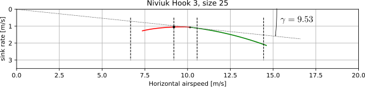
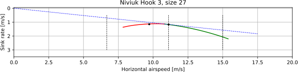

.. This chapter demonstrates how to use the component models to create
   paraglider system models and simulate their dynamics. The modeling process
   combines basic technical specs from a user manual with photographic
   information and reasonable assumptions about paraglider wing design. The
   simulations perform static and dynamic performance tests (polar plots and
   flight maneuvers, respectively) and compare them to expected behaviors.

*************
Demonstration
*************

The motivation for this project was a need for flight dynamics models of
commercial paraglider wings. The goal of this project was to create parametric
:doc:`component models <paraglider_components>` that can approximate those
flight dynamics by augmenting the [[limited available specifications with
assumptions of the unknown structure]].

.. This chapter demonstrates creating, validating and using models. Learning
   about paraglider behavior was one of the motivations (along with control
   modeling and statistical filtering), so "learning" is where I demonstrate
   the success of this project.

This chapter demonstrates one possible workflow to estimate the parameters of
the component models by combining publicly available technical specifications
and photographs with knowledge of typical paraglider wing design. Once the
components are combined into a :doc:`system model <system_dynamics>`, it is
validated by comparing its estimates of the glider's longitudinal steady-state
aerodynamics over the range of control inputs against published performance
data, such as minimum sink rate and speed range. The chapter concludes by
demonstrating how flight dynamics models can be used to study paraglider
behavior.

Model creation
==============

.. Introduce the wing

The paraglider wing used in this example is a Niviuk Hook 3. With forgiving
flight characteristics targeting advanced beginners, this wing is not intended
for acrobatics, so the :ref:`limitations <foil_aerodynamics:limitations>` of
the :ref:`aerodynamics method <foil_aerodynamics:Phillips' numerical
lifting-line>` are not an issue when simulating the majority of flights
produced by this wing.

.. figure:: figures/paraglider/demonstration/Hook3_front_view.jpg
   :name: Hook3_front_view

   Front-view of an inflated Niviuk Hook 3

Wing data for a commercial wing is typically limited to four sources:

1. Technical specifications and user manuals

2. Flight test data from certifications and reviews

3. Pictures and videos

4. Physical measurements

For this chapter, only the first three will be utilized. Although physical
measurements are ideal, they are frequently difficult to obtain (especially for
older wings). Instead, this demonstration is focused on showing that it is
feasible to create an approximate wing model even if physical measurements are
unavailable.

Technical specs
---------------

The following sections demonstrate how to estimate the parameters for a size
23 version of the wing. The same process is used (but not shown) to create
models of the size 25 and 27 wings for the discussion in
:ref:`demonstration:Model validation`.

The process begins with the primary technical data from the official `technical
specifications manual
<https://niviuk.com/niviuk/customer_pdf/Descatalogado/Hook%203/Datos%20t%C3%A9cnicos/HOOK3_TECNIC_ENG.pdf>`__:

.. FIXME: this link is now broken!

.. list-table:: Wing data
   :header-rows: 1
   :widths: auto

   * - Property [unit]
     - Size 23
     - Size 25
     - Size 27
   * - Flat area [m\ :sup:`2`]
     - 23
     - 25
     - 27
   * - Flat span [m]
     - 11.15
     - 11.62
     - 12.08
   * - Flat aspect ratio
     - 5.40
     - 5.40
     - 5.40
   * - Projected area [m\ :sup:`2`]
     - 19.55
     - 21.25
     - 22.95
   * - Projected span [m]
     - 8.84
     - 9.22
     - 9.58
   * - Projected aspect ratio
     - 4.00
     - 4.00
     - 4.00
   * - Root chord [m]
     - 2.58
     - 2.69
     - 2.8
   * - Tip chord [m]
     - 0.52
     - 0.54
     - 0.56
   * - Standard mean chord [m]
     - 2.06
     - 2.14
     - 2.23
   * - Number of cells
     - 52
     - 52
     - 52
   * - Total line length [m]
     - 218
     - 227
     - 236
   * - Central line length [m]
     - 6.8
     - 7.09
     - 7.36
   * - Accelerator line length [m]
     - 0.15
     - 0.15
     - 0.15
   * - Solid mass [kg]
     - 4.9
     - 5.3
     - 5.5
   * - In-flight weight range [kg]
     - 65-85
     - 80-100
     - 95-115

Recall that a "paraglider wing" includes both the canopy and the suspension
lines, so the technical data describes both components. It also includes the
weight range that the wing can safely carry while retaining control authority,
which will be used to define a suitable payload.

Canopy
------

.. This section should highlight how a reasonable approximation can be
   produced from the minimal wing data like flat and inflated span, taper,
   etc. Show what data I had, what assumptions I used to fill in the blanks,
   and how well the result matched the target.

The first component model of the paraglider system is for the :ref:`canopy
<paraglider_components:Canopy>`. The canopy model combines an (idealized)
:doc:`foil_geometry` model with physical details to estimate the aerodynamics
and inertial properties of the canopy. For the canopy model parameters, it's
easiest to think of them in two groups:

.. FIXME: awkward wording?

1. Parameters for the :ref:`design curves <derivations:Parametric design
   curves>` that define the variables :eq:`simplified foil geometry variables`
   of the :ref:`foil geometry model <foil_geometry:Simplified model>`.

2. Parameters for the physical details :eq:`canopy parameters`

.. FIXME: copy them here?

Foil geometry
^^^^^^^^^^^^^

.. _Layout:

.. rubric:: Layout

The first part of specifying a foil geometry is to layout the scale, position,
and orientation of its sections.

For a parafoil, it's easiest to start by describing the geometry of the
flattened (uninflated) canopy before dealing with the arc. This approach is
made much easier by the choice of the :ref:`foil_geometry:Simplified model` to
define the :ref:`section index <simplified model section index>` as the
normalized distance along the :math:`yz`-curve. When a parafoil is flattened
the section index corresponds to the normalized distance along each semispan,
which allows the :math:`x`-positions and chord lengths to be measured directly
without regard for the arc.

.. Chord length (c)

First, consider the chord length distribution :math:`c(s)`. The technical
specifications only list the root, tip, and mean chord lengths, so more
information is required. Thankfully, for parafoils a reasonable guess is that
the wing uses a truncated elliptical distribution. (Paragliding wings commonly
use truncated elliptic functions because they encourage elliptical lift
distributions, thus reducing induced drag.) Such a truncated elliptical
distribution can be easily parametrized by the wing root and wing tip section
chord lengths, as shown by the :ref:`derivations:Elliptical chord` design
curve. The technical specs list these two parameters as :math:`c_\textrm{root}
= 2.58` and :math:`c_\textrm{tip} = 0.52`, respectively. Using those values
produces a standard mean chord length of :math:`2.06`, which exactly matches
the value listed in the manufacturers specs, so the assumption was justified.
An additional check is to compare the area of the flattened chord surface
projected onto the :math:`xy`-plane; for these values the truncated elliptical
produces a flattened area of :math:`22.986` compared to the true specification
of :math:`23.0`, which further confirms the design. (The small discrepancy may
be explained by differences in measuring methodology or by the current absence
of any geometry twist, but in practice the effect is negligible.)

.. Fore-aft positioning (r_x, x)

Next is the fore-aft positioning of the sections, which are controlled by the
:math:`r_x(s)` and :math:`x(s)` design curves. Although traditional wing
geometry models would effectively choose :math:`r_x(s) = 0` and measure the
:math:`x`-offsets of each section's leading edge, that choice often produces an
unnecessarily complicated :math:`x(s)` function. Instead, paragliders can often
be described with constant :math:`r_x(s)` and :math:`x(s) = 0`. As with the
chord lengths, the value of :math:`r_x(s)` is easiest to estimate from the
flattened wing; in fact, flattened drawings are commonly available in technical
manuals, making them especially convenient. (Admittedly, such drawings do not
always maintain the true aspect ratio, and so should be used with caution.) For
this wing, a small amount of trial and error using a top-down view from the
wing user manual suggests a constant :math:`r_x(s) = 0.7` gives a strong
agreement with the drawing in the manual, as seen in :numref:`Hook3_topdown`.

.. figure:: figures/paraglider/demonstration/Hook3_topdown.jpg
   :name: Hook3_topdown

   Top-down outline of flattened canopy

   The black outline is the boundary of the model's flattened chord surface.
   The colored background is taken from the user manual for the wing.

.. Arc (yz-curve)

With the flattened chord surface completed, the next step is to define the
*arc* (position in the :math:`yz`-plane) to bend the flattened surface into its
characteristic shape. Photos of the wing suggest that an elliptical arc segment
is likely. The exact value of the arc reference points :math:`r_{yz}(s)` has
a minimal impact for typical parafoils (which have relatively small geometric
twist), but a reasonable guess is to use the quarter-chord position
:math:`r_{yz}(s) = 0.25`. For the arc positions :math:`yz(s)`, an
:ref:`derivations:Elliptical arc` can be defined using three parameters: two
for the normalized shape (:math:`\Gamma_\textrm{tip}` and
:math:`\phi_\textrm{tip}`) and one for the scale (:math:`b_\textrm{flat}`).
There are several ways to estimate the elliptical arc parameters of the
physical wing, such as the width to height ratios, or visual estimation of the
arc angle, but since the specs included both the flattened and projected spans,
the simplest method is to guess a value for :math:`\phi_\textrm{tip}` and
increase :math:`\Gamma_\textrm{tip}` until the projected span matches the
expected value. Starting with an initial guess of :math:`\phi_\textrm{tip}
= 75`, a few iterations shows good agreement with :math:`\Gamma_\textrm{tip}
= 32`. Checking the fit shows a projected span of :math:`b = 8.845` (versus the
true value of :math:`b = 8.840`) and a projected area of :math:`S = 19.405`
(versus the true value of :math:`S = 19.550`). As with the flattened values,
the small discrepancy may be explained by differences in measurement
methodology, and likely isn't worth optimizing further.

.. FIXME: show the rear-view picture and the resulting model? I'd prefer
   a straight-on photo, it's hard to tell with angled photos.

.. Geometric torsion (theta)

After the relatively straightforward process of positioning the sections is the
more difficult task of estimating their orientation. In the :ref:`simplified
model <foil_geometry:Simplified model>`, section roll :math:`\phi(s)` is
defined by the curvature of the :math:`yz`-curve and the section yaw
:math:`\gamma(s)` is defined as zero, but the section pitch :math:`\theta(s)`
(or *geometric torsion*) can be difficult to determine (even with a physical
wing in hand). Relying on the fact that parafoils commonly benefit from a small
amount of increasing geometric torsion towards the wing tips (or *washin*),
a conservative guess of 4° at the wingtip should be reasonably accurate
:cite:`casellasParagliderDesignHandbook`. For lack of better information, this
demonstration chose a piecewise :ref:`linear model <derivations:Polynomial
torsion>` that grows 0–4° degrees over the range :math:`0.05 \le |s| \le 1`.

.. Section profiles

.. _Profiles:

.. rubric:: Profiles

.. Choosing an airfoil for the undeflected sections

Having finished defining the section layout (scale, position, and orientation),
each section must be assigned an airfoil :cite:`abbott1959TheoryWingSections`.
The most accurate way to determine the section profiles would be to cut open
the wing and trace the outline of the internal ribs, but in this case that's
not an option. Another option would be to search an airfoil database, but the
simplest approach is to use a choice from literature. When using literature,
it's important to keep in mind that although papers discussing "parafoils" and
"ram-air parachutes" have much in common with paraglider canopies, those papers
are typically analyzing large canopies designed for heavy payloads.

From the ram-air category, :cite:`lingard1995RamairParachuteDesign` observes
that many "older designs" use a Clark-Y airfoil with 18% thickness; it also
mentions that "newer gliders" have been design with "low-speed sections", such
as the LS(1)-0417 (for example, see
:cite:`becker2017ExperimentalStudyParaglider`). For literature targeting
paragliders specifically, one option is the NACA 23015: a classic, general
purpose airfoil used in the wind tunnel :ref:`foil_geometry:Case study`
:cite:`belloc2015WindTunnelInvestigation`. Another paraglider-specific option
is the "Ascender": an 18% thickness airfoil developed for an open-design
paraglider :cite:`casellasParagliderDesignHandbook`; for an example of
literature using that airfoil, see
:cite:`boffadossi2016AnalysisAerodynamicCharacteristics`.

The criteria for selecting an airfoil is beyond the scope of this
demonstration, but a key observation is the tendency for paragliders to use
unusually thick airfoils. The reason for this is that thick airfoils tend to
have more gentle stall characteristics, since their low-curvature leading edges
encourage flow attachment as the angle of attack increases. Higher performance
wings may select thinner airfoils to reduce drag, because the Hook 3 is
a beginner-friendly wing this model uses a NACA 24018; it's similar to the
23015 used by the wind tunnel model but with 18% thickness. (For the curious
reader, using the Ascender airfoil barely changes the equilibrium conditions
for the wing; small changes to the equilibrium pitch angles and a small
increase in the range of airspeeds, but otherwise the change had a surprisingly
small effect.)

.. FIXME: explain "low-speed" airfoils?

.. Generating a set of deflected airfoils

After choosing an airfoil, the next step is to modify it support the brake
inputs. The unmodified airfoil defines the section profiles when no brakes are
applied, but a paraglider must deform those profiles in order to turn and slow
down. This poses a significant difficulty with modeling a paraglider, since the
deformation is a complex process. Unlike wings made from rigid materials with
fixed-hinge flaps, the brakes produce a continuous deformation along
variable-length sections of the profile. Instead of dealing with that
complexity, this project uses a strategy to simply guess the deflected
geometry.

To begin, observe that the trailing edge of a braking paraglider typically
exhibits a transition region followed by a gentle curve. In the interest of
practicality, model the transition and trailing regions as circular arc
segments. (This modeling choice is made with no theoretical justification
beyond the recognition that spherical shapes tend to appear as the
energy-minimizing state of a flexible surface under tension.) Because this is
not a theoretically well-justified model the algorithm will not be covered in
detail, but this "two-circle model" can be used to generate a set of deflected
airfoils.

.. figure:: figures/paraglider/demonstration/deflected_Ascender_airfoil.*
   :name: generating deflected airfoils

   Generating an airfoil with a smoothly-deflecting trailing edge.

For the upper surface, first choose a point (``a``) at some distance from the
trailing edge (``c``) and attach a circle ``C2`` tangent to the airfoil at
``a`` and replace the transition region of the airfoil with an arc from ``a``
to ``b``; then, place a second, larger, circle ``C1`` tangent at ``b`` and draw
another arc for the remaining length of the upper curve. For the lower surface,
choose a point ``d`` some distance roughly equal to the modified length of the
upper surface and use a Bézier curve to draw a deflected lower surface between
``d``, the new trailing edge ``c``, and the point where the deformed upper
surface curve crosses the original (undeformed) lower surface curve. The radius
of the smaller circle ``C2`` controls the sharpness of the transition, and the
radius of the larger circle ``C1`` controls the maximum steepness at the
trailing edge. This procedure maintains the length of the upper surface, but
neglects the wrinkling that normally occurs along the lower surface.

Using this procedure with the NACA 24018 as the baseline produces a set of
reasonable-looking curves:

.. figure:: figures/paraglider/demonstration/braking_NACA24018.*
   :name: airfoil set, braking NACA24018

   Set of NACA 24018 airfoils with trailing edge deflections.

At this point the reader should be highly skeptical of this airfoil set. The
choice of airfoil, and how the airfoil deforms in response to trailing edge
deflections, is full of assumptions. Nevertheless, these results will be used
for the remainder of this chapter as a means to demonstrate the working of the
model. As a result, an important thing to keep in mind when interpreting the
results of these choices is that choosing such a large radius for ``C2`` is
wildly optimistic, but was chosen anyway to reduce the curvature of the
transition region. For small brake inputs the transition curvature is
negligible, but becomes progressively sharper as deflection increases. High
curvature is a problem when using a theoretical aerodynamics model (such as
XFOIL) to estimate the section coefficients, since the high curvature inhibits
the method from converging on a solution when viscosity is taken into account.
Softening the curvature allows the estimate to converge, but at the cost of
hiding convergence failures that typically suggest flow separation. As
a result, this profile set is likely to overestimate lift and underestimate
drag.

Physical details
^^^^^^^^^^^^^^^^

In addition to a :doc:`foil geometry <foil_geometry>`, a canopy model requires
details of physical attributes such as surface material densities and air
intake extents in order to calculate inertial properties and viscous drag
corrections.

.. rubric:: Surface materials

.. Materials (rho_upper, rho_lower, rho_ribs, N_cells)

In this case, the surface material densities can be read directly from the
materials section of the user manual:

.. ref: HOOK3_MANUAL_ENG.pdf, Sec:11.2, p.15

.. list-table:: Hook 3 material densities
   :header-rows: 1
   :name: hook3_material_densities

   * - Surface
     - Material
     - Density :math:`\left[ \frac{kg}{m^2} \right]`
   * - Upper
     - Porcher 9017 E77A
     - 0.039
   * - Lower
     - Dominico N20DMF
     - 0.035
   * - Internal ribs
     - Porcher 9017 E29
     - 0.041

In addition to the material densities, the canopy model requires the number of
cells to determine the distribution of mass for the internal ribs. The specs
lists :math:`N_\textrm{cells} = 52`, which implies the wing has 53 ribs
(including the wing tips). In reality the ribs are *ported* (holes that allow
air to flow between cells) so assuming solid ribs is an overestimate, but since
the canopy model is neglecting the mass from the remainder of the internal
structure the discrepancy should (partially) balance out.

.. Air intakes (s_end, r_upper, r_lower)

For the air intakes, the model must know the spanwise extent (since sections
near the wing tips typically do not include air intakes). The user manual
provides a projected diagram (Fig. 11.4, p. 17) which shows that the air
intakes start at the 21st of 26 ribs (the 27th "rib" in the diagram is part of
the stabilizer panel) spreading out from the central rib; assuming a linear
spacing of the ribs this would correspond to :math:`s = 0.807`, so
:math:`s_\textrm{end} = 0.8` is a reasonable guess.

The other dimension of the air intakes is the size of their opening, which is
determined by the extent of the upper and lower surface for each section
profile. This value is difficult to determine precisely from photos, but
thankfully its effect on the solid mass inertia and viscous drag is relatively
minor; in the absence of physical measurements, a reasonable guess is
:math:`r_\textrm{upper} = -0.04` and :math:`r_\textrm{lower} = -0.09` for an
air intake length roughly 5% of the length of the chord. For a related
discussion, see :cite:`boffadossi2016AnalysisAerodynamicCharacteristics`.

.. Boffadossi, Sec:2.1 placed them at 1.2—5% along the chord

.. figure:: figures/paraglider/demonstration/air_intakes.*
   :name: NACA24018 with air intakes

   NACA 24018 with air intakes

At this point the canopy can compute the total mass, which is another
opportunity to sanity check the approximations. The technical specs list the
total wing weight at 4.9kg, but the canopy materials included in this model
only account for 2.95kg. This highlights the fact that the model neglects the
extra mass due to things like the lines, riser straps, carabiners, internal
v-ribs, horizontal straps, tension rods, etc. Fortunately, a significant amount
of that missing mass is near the system center of mass and does not impart
a major weight moment, so for the goals of this project the discrepancy is
assumed to have a negligible impact on the overall system behavior.

.. rubric:: Viscous drag corrections

.. Aerodynamic coefficients for viscous drag corrections

[[FIXME: add the viscous drag corrections

* :math:`C_{D,\textrm{intakes}}`
* :math:`C_{D,\textrm{surface}}`

]]

Suspension lines
----------------

The second component model of the paraglider system is for the :ref:`suspension
lines <paraglider_components:Suspension lines>`. The behavior of the lines is
deceptively complex, so the numerous parameters of the model were grouped by
related functionality to (hopefully) make their relationships more intuitive.

Riser position
^^^^^^^^^^^^^^

.. Design variables: kappa_x, kappa_z, kappa_A, kappa_C, kappa_a

The first group of parameters :eq:`suspension lines parameters, riser position`
for the suspension line model determine the position of the harness (and pilot)
underneath the canopy as a function of :math:`\delta_a`, the control input for
the :ref:`paraglider_components:Accelerator`.

.. kappa_z, kappa_a

Typically the most straightforward parameter to procure is :math:`\kappa_z`:
the vertical distance from the riser midpoint to the canopy as a ratio of the
central chord :math:`c_\textrm{root}`; for this wing, the technical specs
listed this value as the "Central line length" and can be used directly, so
:math:`\kappa_z = \frac{6.8 \, [m]}{2.58 \, [m]} = 2.64`. Similarly, the accelerator
line length (the maximum amount the accelerator can decrease the length of the
central A lines) can also be read directly from the technical specs as
:math:`\kappa_a = 0.15 \, [m]`.

.. kappa_A, kappa_C

Next, the canopy connection positions of the A and C lines as fractions of the
central chord, :math:`\kappa_A` and :math:`\kappa_C`, are frequently visible in
the line diagrams of the user manual; a quick measurement of the "Line plan"
diagram (Sec. 11.4, p. 17) suggests :math:`\kappa_A = 0.11` and :math:`\kappa_C
= 0.59`.

.. FIXME: show the diagram from the manual?

.. kappa_x

The remaining parameter, :math:`\kappa_x`, determines the fore-aft position of
the riser midpoint. At first glance, this value can seem elusive, since it is
difficult to determine precisely using any of the data in the technical manual;
in fact, this value is also difficult to measure accurately from the physical
wing, diagrams, or pictures. However, a useful strategy is to simply delay
fixing the value of this parameter until the glider model is complete. The key
insight is to recognize how the position of the harness impacts the equilibrium
pitch angle of the wing, which in turn affects the equilibrium glide ratio of
the complete glider. A simple rule of thumb is that modern paragliders are
designed to maximize their glide ratio at "trim" conditions (that is, when no
controls are being used), so choosing a value for :math:`\kappa_x` can be
accomplished iteratively by choosing the value that maximizes the glide ratio
with zero control inputs. If maximum glide requires braking, increase
:math:`kappa_x`; if maximum glide requires accelerating, decrease
:math:`kappa_x`. The exact value will depend on the type of harness and the
weight limit the designer was using as the optimization target, but
a reasonable starting point is :math:`\kappa_x = 0.5`.

.. You COULD attempt to figure it out from the data, but it'd be a pain. For
   example, consider the line lengths from pg8 of the Hook 3 technical specs.
   Neglecting the riser length of `0.470m`, the total lengths of the lines from
   the risers to the tabs:

  .. code-block::

    2A1   = 3.994
    A1    = 1.958
    a1    = 0.361
    Total = 6.313

    2C1   = 4.720
    C1    = 1.253
    c1    = 0.308
    Total = 6.281

  If you neglected the differences in the cascades for the As and Cs, the
  riser should be virtually centered between the two, which would mean if
  `kappa_A = 0.11` and `kappa_C = 0.59` then `kappa_x = 0.35`. However, the Cs
  first cascade is higher, thus larger angles, so the total length of the Cs
  will be "too long" (the more you deviate from a straight line, the longer
  the length to reach the destination).

  A few crude guesses suggest the `kappa_x = 0.5` isn't terrible.

  Using the lengths of the As and Cs is difficult, because `kappa_x` is very
  sensitive to small differences. For the Hook3, if they were the same length
  then `kappa_x = 0.35`, but if `kappa_x = 0.5` (a large difference in
  horizontal position) then the `C = 0.9898 * A`: scarcely more than 1%
  difference!

  Is using the nominal glide speed a better measure? I wonder how much
  `kappa_x/kappa_z` affects stability... Is `kappa_x` important?

  Maybe tune `kappa_x` to maximize the glide ratio? That happens at `kappa_x
  = 0.5c`. Of course it's common for the optimum glide ratio to occur when
  speedbar is applied, but whatever. Let's assume this wing was optimized for
  best glide at trim.

Brakes
^^^^^^

The second group of parameters :eq:`suspension lines parameters, brakes` for
the suspension line model determine how the trailing edge of the canopy is
deflected as a function of :math:`\left\{ \delta_{bl}, \delta_{br} \right\}`,
the control inputs for the :ref:`paraglider_components:Brakes`.

The first four parameters determine how the deflection distribution develops
along the trailing edge as the brake lines are pulled. (Recall that the brake
distribution is centered about :math:`s_\textrm{start}` and
:math:`s_\textrm{stop}`, which are interpolated between their zero- and
maximum-brake values.) Estimating these parameters starts by finding a view of
the trailing edge when brakes are being applied:

.. figure:: figures/paraglider/demonstration/Hook3_rear_view.jpg
   :name: Hook3_rear_view

   Rear-view of an inflated Hook 3 with symmetric brake deflections

First, the zero-brake values. From this picture the deflection appears to begin
near the middle of each semispan. Adding a symmetric margin softens the
distribution while keeping the starting point centered at :math:`s = 0.5`, so
:math:`s_{\textrm{start},0} = 0.3` and :math:`s_{\textrm{stop},0} = 0.7` look
about right.

The maximum-brake values are more difficult, since they must coordinate with
the value of :math:`\kappa_b`, but from [[FIXME: link to the youtube video]] it
can be seen that maximum brakes produce a deflection from roughly
:math:`s_{\textrm{start},1} = 0.08` to :math:`s_{\textrm{stop},1} = 1.05`
(where the stopping position exceeds the wing tip to indicate that the wing tip
itself experiences a small deflection).

.. Maximum trailing edge deflection (kappa_b)

Next, the model needs the maximum distance the brake lines can be pulled. On
a real wing the brake lines effectively don't have a well-defined limit, since
a pilot can literally wrap the brake lines around their hand to pull the
trailing edge all the way back to the risers, but in practice the airfoil set
:numref:`airfoil set, braking NACA24018` that defines the deflected profiles is
limited to some maximum deflection distance. For that reason, the
:ref:`paraglider_components:Suspension lines` model uses brake inputs on
a scale from 0 to 1, with a maximum brake deflection distance :math:`\kappa_b`.
The value of :math:`\kappa_b` should maximize the usable range of the brakes
without causing the normalized deflection distance :math:`\bar{\delta}_d`
:eq:`normalized deflection distance` of any section to exceed the distance
supported by the airfoil set. Written as an optimization in terms of :eq:`total
brake deflections`, the goal is to calculate the value of :math:`\kappa_b` such
that:

.. math::

   \max_s \frac {\delta_d(s, 1, 1)} {c(s)} = \bar{\delta}_{d,\textrm{max}}

Checking the airfoil set used for this model (:numref:`airfoil set, braking
NACA24018`), define :math:`\bar{\delta}_{d,\textrm{max}} = 0.203`. Solving the
optimization problem determines :math:`\kappa_b = 0.426 \, [m]`. This procedure
is unfortunately convoluted, but in summary: for this specific airfoil set, the
foil's chord distribution, and these brake position parameters, the model can
allow the brake lines to be pulled a maximum distance of :math:`42.6 \, [cm]`.

.. For convenience, this optimization method is :py:meth:`implemented
   <glidersim:pfh.glidersim.paraglider_wing.SimpleLineGeometry.maximize_kappa_b>`
   in ``glidersim``. 

.. Deflection distribution (s_delta_start0/1, s_delta_stop0/1)

   I'd prefer to keep this discussion after `kappa_b` since the stop variables
   should match when the maximum supported deflection occurs, but you need
   these to run the optimization.

   It's REALLY unfortunate that you need to define start/stop before running
   the optimizer. There's a strong coupling between the parameters with this
   design. It would be MUCH more convenient to specify start1/stop1/kappa_b
   using a photo, then let the optimizer reduce those values until they don't
   exceed the airfoil set.

.. Visualize the end result

To check the model fit, plot the undeflected and deflected trailing edge to
compare with the reference photos:

.. figure:: figures/paraglider/demonstration/Hook3_TE_0.25_0.50.*

   Quartic brake deflections, :math:`\delta_{bl} = 0.25` and :math:`\delta_{br}
   = 0.5`

.. raw:: html or singlehtml

    

.. figure:: figures/paraglider/demonstration/Hook3_TE_1.00_1.00.*

   Quartic brake deflections, :math:`\delta_{bl} = 1.00` and
   :math:`\delta_{br} = 1.0`

**FIXME: update these old examples with the true brake deflections!!!!**

Line drag
^^^^^^^^^

.. Design variables: total line length, line diameter, r_L2LE (lumped
   positions for the line surface area), and Cd_lines

The third group of parameters :eq:`suspension lines parameters, aerodynamics`
for the suspension line model determine the aerodynamic drag of the lines.
Because the model is focused on providing functionality instead of a detailed
(and tedious) layout of every line, it computes the drag by lumping the total
area of the lines into a small number of points. For this demonstration,
satisfactory results can be achieved with just two points (one for each
semispan) and crude estimates of the true line area distribution.

First, the total line length for this wing is listed directly in the technical
specs, :math:`\kappa_L = 218 \, [m]`. Next, :math:`\kappa_L` must be multiplied
by the average diameter of the lines :math:`\kappa_d` to get their total
surface area. Although a complete set of diameters for each line segment are
given in the "Lines Technical Data" section, computing an accurate distribution
would require their detailed layout; instead, with lower sections of the
cascade averaging :math:`2.8 \, [mm]` and upper sections using :math:`0.6 \,
[mm]` lines, a good starting point is to assume an average diameter of
:math:`\kappa_d = 1 \, [mm]`. Next, the area is divided into the two control
points, which must be positioned at the area centroids of their group of lines.
For an approximate model such as this, the positions of the points are easiest
to estimate visually; using :numref:`Hook3_rear_view` they appear to be around
:math:`\vec{r}_{CP/R} = \left< -0.5 c_\textrm{root}, ±1.75, 1.75 \right>`.
Lastly, each lumped line area is assigned a drag coefficient; because the lines
are essentially cylinders, a suitable drag coefficient is simply :math:`C_{d,l}
= 1` :cite:`kulhanek2019IdentificationDegradationAerodynamic`.

Payload
-------

.. Total payload mass, spherical radius, drag coefficient, etc

   Design variables: m_p, z_riser, S_p, C_d,p, kappa_w

The final component model of the paraglider system is for the :ref:`harness
<paraglider_components:Harness>`. This component is responsible for positioning
the mass of the payload (harness and pilot) as a function of weight-shift, and
computing the aerodynamic drag applied to the payload.

The parameters of the model are the total mass of the payload (:math:`m_p`),
the vertical distance of the mass centroid below the riser midpoint
(:math:`z_\textrm{riser}`), the cross-sectional area of the payload
(:math:`S_\textrm{payload}`), the aerodynamic drag coefficient
(:math:`C_{d,\textrm{payload}}`), and the maximum horizontal distance a pilot
can displace the centroid using weight-shift control (:math:`\kappa_w`).

For the total mass, the technical specs list the weight range for the size 23
wing as 65–85 [kg], so :math:`m_p = 75 \left[\textrm{kg}\right]` is
a conservative choice.

For the mass centroid, one option is to consider the DHV airworthiness
guidelines :cite:`wild2009AirworthinessRequirementsHanggliders`, which specify
that the riser attachment points must be "35–65cm above the seat board", which
suggests that :math:`z_\textrm{riser} = 0.5 \left[\textrm{m}\right]` is
a reasonable value in most cases. Alternatively, simply look up the technical
diagram of a suitable harness; for example, the wing certification flight tests
(published in the Hook 3 User Manual, p. 22) list the "harness to risers
distance" as 49cm.

For the surface area and its associated drag coefficient, consider
:cite:`benedetti2012ParaglidersFlightDynamics` (p. 85) or
:cite:`babinsky1999AerodynamicPerformanceParagliders` (p. 422); given that 75kg
is a lower-than-average payload (so smaller frontal area), and that this is
a beginner-grade wing (so a high performance "pod" harness is less likely),
a reasonable choice of the area would be :math:`S_\textrm{payload} = 0.55
\left[\textrm{m}^2\right]` with an drag coefficient of
:math:`C_{d,\textrm{payload}} = 0.8`.

Lastly, when choosing a weight shift limit, underestimates are preferable to
overestimates, since an underestimate merely limits the range of behavior the
model can produce, whereas an overestimate can produce fictitious behavior; in
the absence of a rigorous measurement, a conservative guess is :math:`\kappa_w
= 0.15 \left[\textrm{m}\right]`.

Model validation
================

.. How accurate is the model? This section involves **expected** outcomes,
   which means we already know what we expect to see. Validation is about
   *confirming*, not *learning*.

.. What is model validation? Why is it difficult for paragliders?

Having defined the parameters for the three component models, they are combined
into a composite :doc:`system_dynamics` model that provides the behavior of the
complete glider. Getting to this point with such little information required
many modeling assumptions, simplifications, approximations, and outright
guesswork. The natural next step is to question the validity of the model: how
accurately does it estimate the true behavior of the physical system? In any
modeling project it is vital to validate the model by comparing its estimates
to experimental data, and this case is no exception.

Unfortunately, experimental data is extremely scarce for commercial paraglider
wings. Unlike the aerodynamics :ref:`case study <foil_aerodynamics:Case
study>`, wind tunnel measurements are unavailable. What's worse, the dynamic
behavior of a wing in motion is significantly more complex than the static
behavior of a wing held fixedly in a wind tunnel. As a result, we must make do
with point data and general expectations gleaned from sources such as glider
certifications and consumer wing reviews. Clearly such sources lack the rigor
to "prove" model accuracy, a fact that may be disheartening after all the work
thus far. Nevertheless, when taken together they can at least provide
incremental confidence that a model is adequate to answer basic questions of
wing performance.

Polar curve
-----------

.. Plot and discuss the predicted polar curves.

   I don't have access to experimental polar curves, but I do have point
   estimates from certification and wing review flights.

   Use this section to really highlight the limitations/assumptions of the
   model? Unknown airfoil, unknown true line positions, lack of a proper
   `LineGeometry` (so brake deflections and arc changes when accelerator is
   applied are both unknown), no cell billowing, etc etc. Seems like a good
   place to point out "this is overestimating lift and underestimating drag, as
   expected."

.. Polar curves

The conventional way to summarize the performance of a gliding aircraft is with
a chart called the *polar curve*. These curves show the vertical and horizontal
speed of the aircraft at equilibrium over the range of brake and accelerator
inputs, providing information such as the speed range of the glider and its
glide ratio at different speeds. Given the wealth of information compactly
communicated by a polar curve, they are an excellent starting point for
critiquing the estimates of a flight dynamics model for a glider.

The previous section demonstrated the creation of a paraglider model for
a Niviuk Hook 3, size 23. Now, models for the larger sizes of the wing (created
using the same workflow) will be compared to experimental data by comparing
measurements from test flights to the predicted polar curves.

Size 25
^^^^^^^

For the experimental data, a size 25 version of the wing was reviewed for the
French magazine "Parapente Mag" [[FIXME: citation; see `Hook 3 Parapente Mag
148.pdf`]].

Unfortunately, reviews such as this cannot provide the entire polar curve;
because each point is laborious to measure accurately, reviews only provide
noteworthy values, such as the minimum and maximum speeds, or the horizontal
and vertical speeds that mark the "minimum sink" and "best glide" operating
points of the glider. Despite this ambiguity, by plotting the experimental
point data over the theoretical curve it is possible to get a sense of the
general accuracy of the model estimates.

   Polar curve for Niviuk Hook 3 size 25

   Colored markings are theoretical data from the model, black markings are
   experimental data from Parapente Mag. Red represents symmetric braking,
   green represents accelerating, and the blue diagonal line marks the
   predicted best glide ratio. The three black vertical lines mark the
   experimental values for minimum speed, trim speed, and maximum speed; the
   left black dot is the "minimum sink" operating point, and the right dot is
   the "best glide" operating point.

If the model is a good approximation of the glider that generated the data
— and assuming the data was collected accurately — then the experimental values
should match the predicted values:

* The minimum ground speed should align with the leftmost endpoint of the red
  curve

* Trim speed should align with the point where the red and green curves connect

* The maximum ground speed should align with the rightmost endpoint of the
  green curve

* The "minimum sink" operating point should lie on the point where the curve
  reaches its minimum

* The "best glide" operating point should lie on the point where the blue line
  touches the polar curve

Although the diagram is a convenient way to summarize so much information it
can be hard to distinguish specific values, so their numerical equivalents are
listed below.

.. list-table::
   :header-rows: 1

   * - Value
     - Theoretical
     - Experimental
   * - Minimum groundspeed
     - 7.4
     - 6.7
   * - Minimum sink <h, v>
     - <9.6, 1.06>
     - <9.22, 1.02>
   * - Trim speed
     - 10.2
     - 10.6
   * - Maximum speed
     - 14.7
     - 14.4
   * - Best glide <h, v>
     - <10.2, 1.08>
     - <10.4, 1.12>
   * - Best glide ratio
     - 9.44
     - 9.3

Observations:

* The minimum ground speed of the theoretical model is significantly higher
  than the experimental value. That may be explained by the conservative value
  of :math:`\kappa_b = 0.44 \, [m]` (the maximum distance the brakes can be
  pulled; see the earlier discussion when defining the parameters for the
  :ref:`demonstration:Brakes`). The review listed the maximum brake length as
  >60cm, which suggests that this model can only apply <73% of the full range
  of brakes, so this result in unsurprising.

* Minimum sink occurs at about 0.4 m/s slower ground speed. This may be related
  to the procedure to generate the deflected `Profiles`_, to the deflection
  distribution, or to the aerodynamic coefficient estimates from XFOIL.

* Minimum sink rate is remarkably close (1.06 versus 1.02 m/s), which I find
  surprising since I expected the "optimistic" airfoil set :numref:`airfoil
  set, braking NACA24018` to overestimate lift during braking.

* The theoretical model underestimates the ground speed at trim. Although this
  could be due to it overestimating the drag, it is far more likely that the
  model is overestimating the lift of the wing, so less speed is required to
  counteract the weight of the glider.

* This experimental data reported the best glide at 10.4 m/s when trim was 10.6
  m/s. This disagrees with our earlier assumption that best glide should occur
  at trim.

* The model overestimates the maximum ground speed. This may suggest it is
  underestimating drag, or it could suggest that the model parameters are wrong
  (:math:`\kappa_C` in particular has a large impact on maximum speed), or it
  could be because this rigid body model neglects foil deformations (it assumes
  the accelerator produces a perfect pitch-rotation of the foil) as well as the
  section profile deformations that increase with speed.

In truth, these observations are just a drop in the bucket of possible issues
with the theoretical model (not to mention issues with the experimental data
itself); there are so many simplifications at work, and point data cannot hope
to reveal all their flaws. These results suggest that the performance of the
model is excellent when predicting longitudinal equilibrium, but a wider
variety of wing models need to be examined to determine if this excellence
generalizes to other wings.

Size 27
^^^^^^^

For the experimental data, a size 27 model of the wing was reviewed for the
Spanish magazine "Parapente" [[FIXME: citation; see `hook 3 perfils.pdf`]]. As
with the size 25 model, plotting the experimental data on top of the
theoretical curves produces valuable reference data:

   Polar curve for Niviuk Hook 3 size 27

   Colored markings are theoretical data from the model, black markings are
   experimental data from Parapente. Red represents symmetric braking, green
   represents accelerating, and the blue diagonal line marks the predicted best
   glide ratio. The three black vertical lines mark the experimental values for
   minimum speed, trim speed, and maximum speed; the left black dot is the
   "minimum sink" operating point, and the right dot is the "best glide"
   operating point.

And as before, the numerical equivalents of the data in the figure above:

.. list-table::
   :header-rows: 1

   * - Value
     - Theoretical
     - Experimental
   * - Minimum groundspeed
     - 7.83
     - 6.7
   * - Minimum sink <h, v>
     - <10.2, 1.12>
     - <9.72, 1.15>
   * - Trim speed
     - 10.8
     - 11.1
   * - Maximum speed
     - 15.4
     - 15
   * - Best glide <h, v>
     - <10.8, 1.13>
     - <11.1, 1.17>
   * - Best glide ratio
     - 9.52
     - 9.5

The observations are similar to that for the size 25 model. Overall the fit is
excellent. This model was limited to :math:`\kappa_b = 0.46 \, [m]`, or <76% of
the usable ">60cm" brake length, so the minimum ground speed is still too high.
And again, the model underestimates the ground speed at trim. The best glide
ratio matches exactly, although the theoretical model still slightly
underestimates the ground speed where that occurs.

Pitch stability
---------------

Another simple sanity check is to verify the glider pitch stability by flying
on a straight course at maximum speed and abruptly releasing the accelerator
(:cite:`wild2009AirworthinessRequirementsHanggliders`, Sec. 4.1.5). Releasing
the accelerator shifts the payload to shift aft, causing the canopy to pitch
backwards; in the positive-pitch position the glider briefly ascends as it
converts the energy from its high airspeed into altitude, but because the wing
loses airspeed so quickly it will "overshoot" its equilibrium point and need to
dive forward as the glider attempts to reestablish equilibrium.

The danger of this pitch-forward behavior is that it may induced a frontal
collapse of the canopy. To estimate the safety margin of the wing, the test
assigns a grade based on the negative pitch angle as it dives forward. If the
wing pitches forward less than 30° it receives an "A"; if it pitches forward
30–60° it receives a "C", and for >60° it receives an "F". The Niviuk Hook 3 is
rated as an "B" wing, and should not pitch forward more than 30°. Using this
model to simulate the test protocol by releasing the accelerator in 0.3s
produces:

.. figure:: figures/paraglider/demonstration/accelerator_fast_release_path_sideview.*

   Flight test, rapidly exiting accelerated flight, side view

   Black lines are drawn from the riser to the point directly above the payload
   to help visualize the canopy pitch angle, and are added every 0.5 seconds.

.. figure:: figures/paraglider/demonstration/accelerator_fast_release_pitch_angle.*

   Flight test, rapidly exiting accelerated flight, pitch angle

The model predicts the wing configuration will pitch backwards 23° before
diving forwards to a pitch angle of -13° which satisfies the expected grading.
Although this test is not particularly informative, it's simplicity makes it
worthwhile.

Model investigation
===================

.. Validation was about CONFIRMATION; this section is about LEARNING. What can
   we learn by playing with the model?

   This section is the payoff for the paper! In the introduction to the paper
   I claimed that one of the applications of dynamic simulations is to study
   the behavior of a system. Having concluded the model is usably accurate,
   demonstrate how it can be used to learn about paraglider behavior.

[[Assuming the model has been successfully validated to within useful accuracy,
now we can use the model to learn about the behavior of the physical system.
Run demonstrative scenarios and consider the observed behavior. Useful to
discuss both the behavior of the (true) physical system and the model.]]

Drag breakdown
--------------

A common question for curious pilots is how to reduce the drag of their glider
so they can improve the glide ratio or top speed of their wing. The natural
progression of this curiosity is wonder where all the drag comes from in the
first place. One way to answer that question is to plot the drag contributions
from each component :cite:`babinsky1999AerodynamicImprovementsParaglider`.

.. figure:: figures/paraglider/demonstration/drag_breakdown.*

   Drag breakdown for Niviuk Hook 3 23 with a pod harness.

Viscous drag includes effects such as the sheer forces produced by the
viscosity of the air, and the pressure drag due to flow separation (the
"vacuum" that can occur on the downwind side of an object); these forms of drag
occur on every surface of the glider, including the lines and payload. Inviscid
drag is less intuitive: commonly referred to as "lift-induced drag", it is the
energy lost in the vorticity that the wing sheds into its wake as a side-effect
of producing lift.

This diagram provides a satisfying look into the behavior of a wing across the
range of speeds. At the low end, pilots understand that the "brakes" will slow
the wing by increasing its drag, but may be surprised to discover that the
increase in drag is dominated by how the wing produces lift. At the high end,
it can be surprising to learn what proportion of the total system drag is
produced by the seemingly-negligible suspension lines. Although drag is just
one piece of the lift/drag ratio, this sort of breakdown is valuable for
estimating how much improvement is possible by (for example) reducing the drag
of the payload.

This decomposition is also educational because it offers another perspective of
how each component of the wing affects the overall design. Consider the general
guideline that paraglider wings are designed to achieve their maximum glide
ratio at "trim" (zero controls), which usually coincides with the speed that
minimizes the total system drag (as seen here). Now suppose the design was
changed; for example, increasing the aspect ratio of the canopy will tend to
decrease its lift-induced drag, which in turn requires repositioning the
payload at trim. The complete system behavior is a complex interaction of
components, and having access to a parametric model such as this is an
excellent resource for quickly answering questions about glider efficiency by
developing an intuition of how their interactions affect the system behavior.

.. This diagram can also provide a useful to "sanity check".

   Compare the model to known results, such as
   :cite:`babinsky1999AerodynamicImprovementsParaglider`.

   * Accuracy of the :ref:`section profiles <Profiles>`

   * Accuracy of the 2D aerodynamic coefficients (XFOIL tends to overestimate
     CL and underestimate CD)

   Then again, are these really THAT different from the accuracy limitations of
   the 3D aerodynamics? Spanwise-flow violate the assumptions of the 2D
   coefficients, surface imperfections, etc. At maximum braking you'd expect
   the foil distortions (creasing, etc) to have a significant impact for a real
   wing. At high speed I'm ignoring deformations to the air intakes [[]]

Indirect thermal interaction
----------------------------

.. figure:: figures/paraglider/demonstration/indirect_thermal.*

   Indirect thermal interaction.

[[FIXME: explain. The wing is flying straight at equilibrium, when it enters
a thermal 15 meters to its right. The thermal strength has a squared distance
decay to 5% by the time it :math:`y = 0`, so only the right side of the wing
experiences a significant change to lift.  Etc etc.]]
