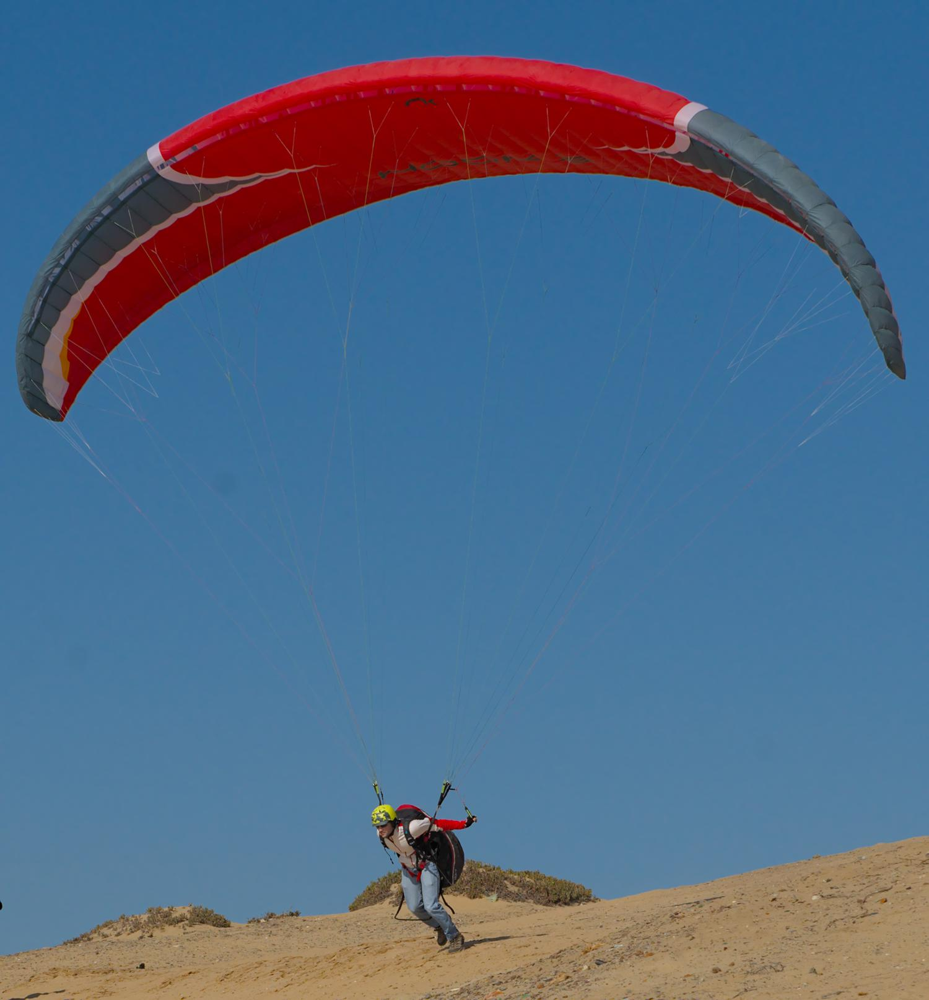

.. This chapter demonstrates how to use the component models to create
   complete paraglider system models and simulate their dynamics. The modeling
   process combines basic technical specs from a user manual with photographic
   information and reasonable assumptions about paraglider wing design. The
   simulations perform static and dynamic performance tests (polar plots and
   flight maneuvers, respectively) and compare them to expected behaviors.

*************
Demonstration
*************

Modeling a commercial paraglider wing is difficult because the technical data
is limited to basic summary measurements. A major task of the modeling process
is how to augment the missing information to create a complete model. To
address that problem, this paper started by creating a foil geometry with
enough flexibility to enable complex foil models to be defined using simple
parametric functions. The parametric functions encode the assumptions of the
missing structure. Modeling a canopy then becomes a problem of choosing
suitable parametric functions and estimating the parameters that best describe
the true geometry.

This chapter demonstrates one possible workflow to model a complete paraglider
system from basic technical specifications using the simplified
:doc:`component models <paraglider_components>` provided by the ``glidersim``
package. Once the model is complete, it is sanity checked by comparing
estimates of its longitudinal steady-state aerodynamics over the range of
control inputs against published performance data, such as minimal sink rate
and speed range. The chapter concludes with flight simulations using the model
in a variety of flight scenarios.

Model
=====

.. Introduce the wing

[[The wing is a Niviuk Hook 3, size 23.]]

   Front-view of an inflated Niviuk Hook 3

Wing data is available from three primary sources:

1. Technical specifications and user manuals

2. Pictures

3. Physical measurements

[[FIXME: the specs list the total wing weight at 4.7kg, but the
upper/lower/rib materials only account for 2.5kg or so. My mass calculations
neglect the extra mass due to things like the lines, riser straps, carabiners,
internal v-ribs, horizontal straps, tension rods, etc, so I'm underestimating
that mass, but I'm also assuming the vertical ribs are solid (no ports) so
that makes up for a bit of the missing mass]]

Technical specs
---------------

From the manual:

.. list-table:: Wing data
   :header-rows: 1

   * - Property
     - Value
     - Unit
   * - Root chord
     - 2.58
     - m
   * - Tip chord
     - 0.52
     - m
   * - Standard mean chord
     - 2.06
     - m
   * - Flat area
     - 23
     - m\ :sup:`2`
   * - Flat span
     - 11.15
     - m
   * - Flat aspect ratio
     - 5.40
     - --
   * - Projected area
     - 19.55
     - m\ :sup:`2`
   * - Projected span
     - 8.84
     - m
   * - Projected aspect ratio
     - 4.00
     - --
   * - Number of cells
     - 52
     - --
   * - Total line length
     - 218
     - m
   * - Central line length
     - 6.8
     - m
   * - Accelerator line length
     - 0.15
     - m
   * - Solid mass
     - 4.7
     - kg
   * - In-flight weight limit
     - 85
     - kg

Canopy
------

.. This section should highlight how a reasonable approximation can be
   produced from the minimal wing data like flat and inflated span, taper,
   etc. Show what data I had, what assumptions I used to fill in the blanks,
   and how well the result matched the target.

Developing a canopy model has four basic steps:

1. Design the section layout (scale, position, and orientation)

2. Assign section profiles

3. Specify the upper and lower surface extents to define air intakes

4. Specify the materials to enable computing the resulting real and air mass
   inertia matrices.

Foil layout
^^^^^^^^^^^

.. Design variables: c, x, r_x, yz, r_yz, and theta

Chord length
~~~~~~~~~~~~

[[The simplest place to start modeling the canopy is the chord length
distribution (the section scaling factor). The basic specs only give the root,
tip, and mean chord lengths, but a reasonable guess is that the wing uses
a truncated elliptical distribution. Paragliding wings commonly use truncated
elliptic functions because they encourage elliptic lift distributions (thus
reducing induced drag). Fitting an elliptic function to the root and tip
lengths and computing the mean average chord length of the resulting function
confirms the elliptic assumption.

[[Confirm the flat area]]

Fore-aft positioning
~~~~~~~~~~~~~~~~~~~~

[[The next step is to design the fore-aft positioning of the sections by
defining the :math:`r_x` parameter. Although this parameter can technically be
a function of the section index, many wings can be described with a constant
value. This value can be estimated by considering pictures of the inflated
wing, but since flattened drawings are commonly available in technical manuals
they are typically more convenient. (Admittedly, such drawings are not always
to scale, and so should be used with caution.) For this wing, a small amount
of trial and error using a top-down view from the wing user manual suggests
:math:`r_x = 0.7`.]]

.. figure:: figures/paraglider/simulations/Hook3_topdown.jpg
   :name: Hook3_topdown

   Top-down outline of flattened canopy

   The black outline is the boundary of the model's flattened chord surface.
   The colored background is taken from the user manual for the wing.

As seen in :numref:`Hook3_topdown`, the elliptical chord assumption with
:math:`r_x = 0.7` gives a close match to the drawing in the manual.

Arc
~~~

The next step is to model the arc. Photos of the wing suggest that a circular
arc segment is a reasonable starting point. There are several ways to fit an
arc segment, such as the width to height ratios, or visual estimation of the
arc angle, but since the specs included both the flattened and projected
areas, it can be easier to simply increase the arc angle until the projected
area of the model matches the expected value.

[[FIXME: explain how I adjusted `mean_anhedral` until the projected values are
roughly correct?]]

[[FIXME: explain how I chose `r_yz`? Technically this would depend on the
geometric torsion, but since I'm unsure the safe choice is `r_yz = 0.5`]]

[[FIXME: show the rear-view picture and the resulting model? I'd prefer
a straight-on photo, it's hard to tell with angled photos.]]

[[Confirm the projected area and projected span]]

Geometric torsion
~~~~~~~~~~~~~~~~~

[[This is a guess. Paragliders can be expected to have positive torsion, but
the distribution is unknown to me.]]

[[FIXME: no way to confirm? The angles are small, would be difficult to
measure from a wing on the ground.]]

Section profiles
^^^^^^^^^^^^^^^^

.. Design variables: r_P/LE (points on the airfoil)

After the section layout is complete, each section must be assigned an
airfoil.

[[Choose an airfoil]]

* Why did I choose the 24018? Belloc used the 23015, but
  :cite:`lingard1995RamairParachuteDesign` says that many older designs used
  a Clark-Y with 18% thickness. I chose the 24018 as a sort of clumsy
  compromise. He also mentions that newer gliders have "benefited from glider
  technology and use a range of low-speed section" like the LS(1)-0417 (which
  was also chosen by :cite:`becker2017ExperimentalStudyParaglider`). I should
  have probably used the LS(1)-0417 but oh well.

Air intakes
^^^^^^^^^^^

.. Design variables: s_end, r_upper, r_lower

[[How did I choose the variables for the Hook 3? I never measured them, so
I had to guess by looking at pictures..]]

Materials
^^^^^^^^^

.. Design variables: rho_upper, rho_lower, rho_ribs

[[FIXME: from the manual; see `extras/wings.py` for more

.. code-block:: python

   rho_upper=39 / 1000,  # [kg/m^2]  Porcher 9017 E77A
   rho_lower=35 / 1000,  # [kg/m^2]  Dominico N20DMF
   rho_ribs=41 / 1000,  # [kg/m^2] Porcher 9017 E29

]]

Suspension lines
----------------

.. Design variables: kappa_x, kappa_z, kappa_A, kappa_C

   Also: total line length, line diameter, r_L2LE (lumped positions for the
   line surface area), and Cd_lines

[[In a physically accurate model a complete specification of the line geometry
would define the accelerator function, brake deflections, line area
distribution (for drag), etc. Instead, this model uses approximations for
everything. Thankfully, the paraglider dynamics don't care HOW you define the
functions, just that they're available.]]

[[FIXME: I think :math:`\kappa_z` is the "Central line length" from the specs
(normalized by the root chord, IIRC), but what about :math:`\kappa_x`? I think
I guessed that based on the maximum speed on the polar]]

[[FIXME: how should I estimate :math:`\kappa_A` and :math:`\kappa_C`? Guess
them from the line layout diagram from the user manual, or measure the
physical wing?]]

[[FIXME: how should I specify the total line length and lumped position?
I really hate `r_L2LE`; should it just assume two points at `<0.5c, +/- 0.25
b/2, 0.25 z_RM>`? I haven't assigned these proper variable names yet; leave it
that way?

Also, the line drag coefficient assumes the lines are the same diameter
everywhere, which is clearly wrong. The lines getter smaller as you go up the
cascade.]]

Accelerator
^^^^^^^^^^^

.. Design variables: kappa_a

[[From the specs, the accelerator line length :math:`\kappa_a = 0.15`]]

Brakes
^^^^^^

.. Design variables: s_delta_start0/1, s_delta_stop0/1, s_delta_f_max

.. Deflection angle distribution and braking profiles

The true deflection angle distribution depends on the true line lengths and
cascade angles, but since the simple model does not include those the
deflection angles must be assumed/guessed.

[[In :ref:`paraglider_components:Brakes` I suggested a cubic polynomial. You
can guesstimate the parameters by looking at a rear-view photo of a wing.]]

.. figure:: figures/paraglider/simulations/Hook3_rear_view.jpg
   :name: Hook3_rear_view

   Rear-view of an inflated Hook 3 with symmetric brake deflections

[[From this picture you can see that the brake deflection doesn't start until
some distance from the root. The brake lines are hard to see, but their
deflections are intuitive. The result is that instead of using a true line
geometry, you can get away with an approximate deflection distribution using
a simple cubic function with a few carefully chosen end points.]]

[[This method is admittedly weak. Probably not a major problem in practice,
but call it out when discussing reasons why I'm not comparing this to actual
flight data (goes together with the other uncertainties, like unknown
airfoil).]]

[[FIXME: explain how I generated some VERY idealized deformed profiles to
implement deflected trailing edges]]

[[FIXME: explain using XFOIL to get the section coefficients.]]

Harness
-------

.. Design variables: m_p, z_riser, S_p, C_d,p, kappa_w

.. Total payload mass, spherical radius, drag coefficient, etc

The specs list maximum in-flight weight limit of 85kg. The wing is roughly
5kg, so a 75kg payload is reasonable.

[[Radius: how did I arrive at `0.55m`?]]

[[Drag coefficient for a standard upright (non-pod) harness is roughly `0.8`.
I think I got that from Virgilio?]]

Static performance
==================

[[FIXME: should I include "360 turn radius" under "static" performance?]]

Equilibrium states
------------------

[[FIXME: what are they, and how do you compute them? These are the basis for
the polar curves.]]

Polar curves
------------

.. Steady-state, longitudinal-only analyses

* [[These curves summarize the equilibrium states over a range of control
  inputs.]]

* Show the polar curves and consider if they are reasonable. [[Using which
  model? 9a?]]

* [[Use this section to really highlight the limitations/assumptions of the
  model? Unknown airfoil, unknown true line positions, lack of a proper
  `LineGeometry` (so brake deflections and arc changes when accelerator is
  applied are both unknown), no cell billowing, etc etc.

  Seems like a good place to point out "this is overestimating lift and
  underestimating drag, as expected."]]

Dynamic performance
===================

.. Informative flight scenarios

* Steady-state turn rate and radius size

* Control input impulses (on/off of symmetric brake, asymmetric brake,
  accelerator, weight shift)

* Sink rates during a hard turn. (See the DHV ratings guide)

* Response to "exiting accelerated flight".

  According to Sec:4.5.1 of the DHV ratings guide, it sounds like wings dive
  **forward** when the accelerator is abruptly released. For my current
  Hook3ish, the wing experiences **backwards** pitch. Is this because I'm
  neglecting changes to the canopy geometry? Or is it symptomatic of the fact
  that I assume the lines stay taught? Conceptually, when you quickly release
  the speedbar, the A lines will quickly extend; it takes some time for the
  harness to drop (or the wing to rise) enough to regain tension, so the wing
  is certainly going to behave in ways not modeled by my equations. Good to
  point out.

* Does it exhibit "roll steering" vs "skid steering"? Or maybe the arc is too
  round for that effect. See :cite:`slegers2003AspectsControlParafoil`.

* The importance of apparent mass. Start by comparing the real versus apparent
  mass matrices; consider the relative magnitudes and the likely effects from
  accounting for apparent inertia. Then show some scenarios where the effects
  are noticeable.

* For more ideas, see :cite:`wild2009AirworthinessRequirementsHanggliders`
  Sec:4.1 (pg28) for the DHV maneuvers for wing classification

  Also, :cite:`lingard1995RamairParachuteDesign` Sec:7 and Sec:8.]]

* Compare the apparent inertia to the real inertia

Discussion
==========

* Everything related to the airfoils is sketchy. The choice of airfoil,
  modeling their deflected geometries, modeling the deflection distribution,
  etc. Tons of uncertainty here. Just stick a big red flag in it and say "hey,
  if you want to solve this problem, here's a big sticking point."

This chapter suggests a simple workflow:

1. Fit the flattened chord surface (`c(s)`, `x(s)`, `r_x(s)`)

2. Fit the arc (`yz(s), r_yz(s)`)

3. Apply geometric twist (`theta(s)`)

4. Specify section profiles (airfoils) and their coefficients

   [[Introduce gridded coefficients]]

5. Specify material densities (upper, lower, ribs) for computing the inertia

6. Specify a suspension line model (harness position, accelerator function,
   brake deflection distribution, line drag)

7. Specify a harness model

