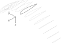

.. This chapter generalizes the typical foil geometry equation to allow
   arbitrary reference points for position, relaxing the constraint that the
   geometry is specified in terms of the leading edge. This additional
   flexibility allows complex geometries to be described using simple
   parametric design curves. The parametric design curves encode domain
   expertise (reasonable assumptions about typical foil design), thus enabling
   complete parafoil geometries to be specified using only summary technical
   specifications.

*************
Foil geometry
*************

.. What is a foil? Why does this project need to model the foil geometry?

The essential components of any flying object are the *lifting surfaces*. By
redirecting airflow downward, a lifting surface exchanges momentum with the
air and produces the lifting force that allows the object to fly. The dynamics
of a lifting surface depend on its inertial properties and its aerodynamics,
both of which can be estimated from its geometry. In this project, the lifting
surfaces are canopies of commercial paraglider wings, which poses a major
problem: manufacturers do not provide detailed geometry data. At best,
marketing materials and user manuals provide basic summary specifications,
which means the majority of the geometry is unknown. Generating a surface
model from summary information requires making educated guesses about the
missing structure in order to generate the complete geometry. The assumed
structure takes the form of domain expertise encoded in parametric *design
curves* which can extend the summary data to produce a fully specified model.

.. Why not use an existing foil geometry model? The geometry model chooses the
   variables, which in turn determines the structure of the functions that
   define those variables.

An important issue is that the form of the design curves is strongly
influenced by the variables used to define the geometry. A parafoil canopy has
some fundamental complexity that must be captured, either in the model
structure or in the design curves. Unfortunately, existing foil models are
inflexible, making strong assumptions about how foils are most naturally
defined, and that inflexibility forces the remaining complexity into the
design curves. This unnecessary complication makes it difficult to describe
a parafoil using simple parametric functions: they must not only encode the
fundamental structure, they must also encode that structure in terms of the
variables that define the model. Instead of the geometry model adapting to the
needs of the design curves, the design curves must adapt to the limitations of
the model.

The solution developed in this chapter is to reject the assumption that
predefined reference points are the most convenient way to position the
elements of a foil surface. The result is a novel foil geometry that fully
decouples the design curves, allowing each aspect of the foil to be designed
independently, plus a simplified geometry model that eliminates most of the
additional complexity of the expanded model. The simplified model is both
flexible and intuitive for designing highly nonlinear foil geometries (such as
paraglider canopies) using simple parametric functions.

.. Choose what geometry details to include and which to ignore

[[A detailed model of a paraglider wing would include all its structural
details. Materials structure models can be combined with aerodynamic models to
simulate the interactions between the canopy surface deformations and the
surrounding flow field :cite:`lolies2019NumericalMethodsEfficient`.
Unfortunately, as discussed earlier, such details are not available. Instead,
this project must be content to model only the basic structure that can be
approximate from the available data and record this imprecision as an extra
source of uncertainty during flight reconstruction. Instead, the models
presented in this chapter represent idealized design targets of the external
canopy surface. It will not model internal structures, in-flight deformations,
or surface deviations from the idealized shape (such as the creases where the
surfaces are stitched to the internal ribs).]]

.. Notes on notation

Before starting, a quick word on notation: in this chapter, the lifting
surface of an aircraft will be referred to as a *foil* instead of using the
conventional terms *wing* or *canopy* (for traditional aircraft or parafoils,
respectively). This unconventional term was chosen to avoid two generalization
issues. First, although *wing* is the conventional term for the primary
lifting surfaces of non-rotary aircraft, the paragliding community uses the
term *paraglider wing* to reference not only the lifting surface but also the
supporting structure connected to it, such as suspension lines, risers, etc.
Second, although this project is primarily concerned with parafoils, the
majority of the content in this chapter is not limited to parafoil canopies.

.. Roadmap

   1. Discuss the physical system being modeled and its important details

   2. Review the incomplete geometry information from the readily available
      sources like technical specs, physical wing measurements, and pictures

   3. Consider how to create a complete geometry from the incomplete
      information by encoding domain expertise in parametric functions.

   4. Introduce parametric modeling using *wing sections*.

   5. Develop the direct (basic) implementation of a foil geometry based on
      wing sections (that uses the leading edge as the fixed reference point),
      and review the limitations produced by fixed reference points.

   6. Expand the basic equation to allow arbitrary reference points.

   7. Simplify the expanded model to eliminate the extra complexity (make
      reasonable assumptions about typical foil structure, such as defining
      the reference points using positions on the section chords, assuming the
      sections are perpendicular to the yz-curve, etc)

   8. Show some examples using the new geometry model using *design curves*:
      parametric functions that encode the underlying structure of parafoil
      canopies using basic parameters that can be estimated from the available
      information (or from reasonable assumptions)

   9. Demonstrate using the model to recreate a parafoil from literature.

   10. Discussion

Parametric modeling with wing sections
======================================

.. Introduce designing a wing using "wing sections". They're the conventional
   starting point for parametrizing a wing geometry (airfoil curves capture
   the structure of the section profiles), and lead to the basic model.

.. Explicit vs parametric geometries

At its most basic, a foil geometry is a surface. The points on the surface can
be defined with explicit coordinates, or they can be generated using functions
that encode aspects of the surface's structure. Explicit geometries are
extremely flexible, but their extreme freedom means refining an explicit mesh
can be time consuming, and creating a model of an existing object requires
complete knowledge of its shape. [[Conversely, parametric geometries model the
surface mesh indirectly using parametric functions. The functions encode
structural knowledge of the shape which can be accessed through the model
parameters; the parameters effectively summarize the structure. A structural
parameter communicates more information than an explicit coordinate, which
means less work (and less data) is required to specify a design.]]

.. Advantages of parametric geometries

   FIXME?

.. Wing sections

The standard first step towards parametrizing a foil geometry is to define it
in terms of *wing sections* (:cite:`abbott1959TheoryWingSections`;
:cite:`bertin2014AerodynamicsEngineers`, Sec:5.2). The foil is modeled as
a sequence of *sections* (typically arranged spanwise, left to right) over
some continuous *section index* :math:`s`. Each section is assigned a 2D
cross-sectional profile, called an *airfoil*, which is perpendicular to the
local spanwise axis. Each airfoil is scaled, positioned, and oriented to
produce the *section profile*. Together, the section profiles produce
a continuous surface that defines the complete 3D volume.

[[The geometry can also be a combination of explicit and parametric. For
example, section profiles can be parametrized by choice of airfoil, but their
positions, scales, and orientations can be explicit.]]

.. Start with the airfoil, since it defines important terminology.

Airfoils
--------

.. Define airfoil terminology

The building block of each section is the airfoil. [[The choice of airfoil
depends on the application, blahblahblah.]]

.. figure:: figures/paraglider/geometry/airfoil/airfoil_examples.*

   Airfoils.

[[Airfoils can be conceptually divided into an upper and a lower surface. The
line created by the midpoints between the upper and lower surfaces is the
*mean camber line*.]]

[[Airfoils are typically defined by a mean camber line, a thickness
distribution, and a thickness convention. The exact value of the mean camber
line and thickness depends on the thickness convention, but in general the
mean camber line will lie halfway between an upper and lower surface whose
separation distance is specified by the thickness distribution.]]

.. figure:: figures/paraglider/geometry/airfoil/airfoil_diagram.*
   :name: airfoil_diagram

   Components of an airfoil.

There are two conventions for measuring the airfoil thickness: perpendicular
to the chord line (sometimes referred to as the "British" convention), or
perpendicular to the mean camber line (the "American" convention). The choice
of thickness convention also determines what point is designated the *leading
edge*. For the British convention the leading edge is the point where the
curve is perpendicular to a line from the trailing edge. For the American
convention, the leading edge is the "leftmost" point with the smallest radius
(greatest curvature).

.. The choice of convention is irrelevant. The only thing that matters is that
   you manufacture the wing with the sections scaled and oriented in exactly
   the same way as they were defined. For example, you could define the chord
   with any two points on the surface; it would be confusing, and you could
   end up with a usable range of alpha from, like, 53 to 70 degrees, but as
   long as you mount the section oriented correctly it's irrelevant. The
   convention does two things: (1) it disambiguates the orientation of the
   profile relative to freestream associated with the coefficients, and (2)
   standardizes the orientation so you can easily swap out different profile
   definitions.

.. figure:: figures/paraglider/geometry/airfoil/NACA-6412-thickness-conventions.*
   :name: airfoil_thickness

   Airfoil thickness conventions.

The line between the leading and trailing edge is the *chord*; the chord is
used to nondimensionalize the airfoil geometry and define the local *angle of
attack*.

The wing design process is thus decomposed into two steps:

1. Specify the scale, position, and orientation of each section

2. Specify the airfoils at each section to define the section profiles, which
   define the three surfaces: the *chord surface*, the *mean camber surface*,
   and the *profile surface*.

[[Gudmundsson says wing design is about designing two 2D components: the
*planform* and the *profile*, so his idea of "planform" matches my idea of
a chord surface, except that my "chord surface" is more like a 2D manifold in
3D (it's not restricted to a plane), plus it doesn't provide orientation.]]

   Wing section profiles.

   Note that section profiles are not the same thing as the ribs of a parafoil.
   Parafoil ribs are the internal structure that produce the desired section
   profile at specific points along the span.

Section index
-------------

[[The design curves are functions of some *section index* that uniquely
identifies each section. (This is true whether they are defined via linear
interpolation or as naturally continuous functions.)]]

* The position, scale, orientation, and choice of airfoil must be defined for
  each section.

* This requires a *section index* that uniquely identifies each section.

  Many aeronautics papers use the term *spanwise station*, but *spanwise* is
  ambiguous; some papers use it to refer to the absolute y-coordinate of the
  section, and others use it to refer to a linear distance along some curve
  tangent to the section y-axes (the "local spanwise axis", as it were).

  [[since it is unclear whether this refers to the flattened span, projected
  span, or some linear distance]]

  [[since it unclear whether the span is measured as the absolute
  :math:`y`-coordinate ("projected span"), or as some linear distance along
  the surface of the wing ("flattened span").]]

  Instead, this paper uses the term *section index* because it is an
  unambiguous reference to a unique identifier over the set of sections.

* Many modeling tools do not explicitly declare their choice of section index.
  (MachUpX refers to "span location", which I think is equivalent to distance
  along `xyz(s)`).

[[Section indices are mandatory for how we're generating the mesh from section
profiles.]]

Reference point
---------------

[[Positioning each section requires specifying the coordinate of some point in
the section's local coordinate system. The traditional choice is the origin of
the airfoil coordinate system, since it corresponds to the section leading
edge.]]

Orientation
-----------

* [[Section pitch/roll/yaw. Dihedral/anhedral. Geometric torsion.]]

Basic model
===========

.. Introduce the "basic equation" that uses `r_LE/O`

Choosing to model a foil using *wing sections* means that the wing surfaces
are defined by 2D airfoils. By convention, airfoil coordinates are defined in
an airfoil-local coordinate system where the origin is at the leading edge and
the airfoil x-axis lies on the chord line. To create the section profile, the
2D airfoil coordinates must be converted into a 3D section-local coordinate
system, scaled, positioned, and oriented. The natural choice is to share the
origin between the airfoil and section coordinate systems, and specify the
section position using the section leading edge. [[FIXME: now describe how
that setup allows you compute the positions of points in a section.]]

First, let :math:`\mathrm{P}` represent any point in a wing section (such as
points on the section chords, mean camber lines, or profiles), and
:math:`\mathrm{LE}` be the leading edge of that section. In the `notation
<_common_notation>`_ of this paper, a general equation for the position of
that point :math:`\mathrm{P}` with respect to the foil origin
:math:`\mathrm{O}`, written in terms of the foil coordinate system :math:`f`,
is:

.. Unparametrized (explicit geometry?) equation

.. math::

   \vec{r}_{\mathrm{P}/\mathrm{O}}^f = \vec{r}_{P/LE}^f + \vec{r}_{LE/O}^f

In this chapter, foil geometries are expected to be symmetric, with the
central section designated the foil *root*. The foil inherits the coordinate
system defined by the root section. Points in section (local) coordinate
systems :math:`s` must be rotated into the foil (global) coordinate system.
Given the *direction cosine matrix* :math:`\mat{C}_{f/s}` between the section
and foil coordinate systems, position vectors in foil coordinates can be
written in terms of section coordinates:

.. math::

   \vec{r}_{P/LE}^f = \mat{C}_{f/s} \vec{r}_{P/LE}^s

Because airfoil curves are defined in airfoil coordinates, another
transformation is required, from airfoil coordinates to section coordinates.
The convention for airfoil coordinates places the origin at the leading edge,
with the x-axis pointing from the leading edge to the trailing edge, and the
y-axis oriented towards the upper surface. This paper uses a front-right-down
convention for the 3D section coordinates, so the 2D airfoil coordinates can
be transformed into 3D section coordinates with a matrix transformation:

.. math::

   \mat{T}_{s/a} \defas \begin{bmatrix}
      -1 & 0 \\
      0 & 0\\
      0 & -1
   \end{bmatrix}

Next, the airfoil must be scaled. By convention, airfoil geometries are
normalized to a unit chord, so the section geometry defined by the airfoil
must be scaled by the section chord :math:`c`. Writing the points in terms of
scaled airfoil coordinates:

.. math::

   \vec{r}_{P/LE}^f = \mat{C}_{f/s} \mat{T}_{s/a} \, c \, \vec{r}_{P/LE}^a

.. This is the suboptimal "general" parametrization

The complete general equation for arbitrary points :math:`P` in each section
:math:`s` is then:

.. math::
   :label: basic-equation

   \vec{r}_{\mathrm{P}/\mathrm{O}}^f(s) =
     \mat{C}_{f/s}(s) \mat{T}_{s/a} \, c(s) \, \vec{r}_{P/LE}^a(s)
     + \vec{r}_{LE/O}^f(s)

In this form it is clear that a complete geometry definition requires
definitions of four variables:

1. Scale: :math:`c(s)`

2. Position: :math:`\vec{r}_{LE/O}^f(s)`

3. Orientation: :math:`\mat{C}_{f/s}(s)`

4. Profile: :math:`\vec{r}_{P/LE}^a(s)`

[[FIXME: the `P` is any point in the section. It could be on the chord, camber
line, or profile.]]

Expanded model
==============

.. Generalize the basic equation by decomposing `r_LE/O = r_LE/RP + r_RP/O`

[[Although the basic equation is enough to describe any wing composed of
continuous design curves (I think), its simplicity means the remaining
complexity is pushed into the design curves. A dramatic improvement is to
allow each section to be positioned using arbitrary reference points instead
of the section leading edges. This extra flexibility allows much simpler
parametric forms.]]

[[The "basic equation" is an explicit, mathematical representation of the
standard approach to wing modeling used by most tools. (Well, sort of: most
tools use a parametrized version of it; for example, you can usually specify
twist as an Euler angle.) It is general but unwieldy, since the model must be
specified in terms of the leading edge. The real magic happens when
:math:`\vec{r}_{LE/O}` is decomposed so it can be specified using an arbitrary
reference point; that's the part that introduces the flexibility that enables
simplified parametric functions.]]

[[Elaborate on why requiring the position to be specified in terms of the
leading edge is suboptimal. **The key problems are that 1) you can't specify
the geometry in the simplest way, and 2) it couples the design curves.**
(Coupled curves means they have to be designed simultaneously; redesigning one
requires redesigning the others.) This is where I make my stand that existing
tools are suboptimal, which is why it gets its own section.]]

Instead of requiring section positions to be specified in terms of section
leading edges, decompose them into two vectors: one from the section origin
(the section leading edge) to some arbitrary *reference point* :math:`RP`, and
one from the reference point to the foil origin:

.. math::
   :label: expanded-model-equation

   \vec{r}_{LE/O}^f = \vec{r}_{LE/RP}^f + \vec{r}_{RP/O}^f

Where :math:`RP` are as-yet nebulous "reference points" and
:math:`\vec{r}_{RP/O}^f` is defined by the *design curves* (:math:`x(s)` and
:math:`yz(s)`, in my case). This lets you choose reference points other than
the leading edges, and position those points explicitly in the wing coordinate
system. (Note that the leading edges remain the origin of the section
coordinate systems.)

[[What about the origin? I need a `-xyz(s = 0)` sort of term to translate the
canopy origin to the central leading edge. I'm not requiring that the design
curves satisfy `xyz(s = 0) = <0, 0, 0>`.]]

.. math::
   :label: expanded-model-equation2

   \vec{r}_{\mathrm{P}/\mathrm{O}}^f(s) =
     \mat{C}_{f/s}(s) \mat{T}_{s/a} \, c(s) \, \vec{r}_{P/LE}^a(s)
     + \vec{r}_{LE/RP}^f + \vec{r}_{RP/O}^f

1. Scale: :math:`c(s)`

2. :math:`\vec{r}_{LE/RP}^f(s)`

3. :math:`\vec{r}_{RP/O}^f(s)`

4. Orientation: :math:`\mat{C}_{f/s}(s)`

5. Profile: :math:`\vec{r}_{P/LE}^a(s)`

Simplified model
================

.. The expanded model has the necessary flexibility, but it's too difficult
   too use because it has too many parameters: scale (1), reference point (3),
   position (3), and orientation (3).

   This section applies some reasonable assumptions to simplify defining all
   those parameters. It goes from 10 free parameters (not counting choice of
   airfoil) down to 7. Equally as important, it provides a clever parametric
   reference point that decouples the design curves.

.. Chooses a definition of the section index; defines the reference points in
   terms of positions on the section chords; defines the section DCM using
   `dz/dy` and `\theta` (so you design `theta(s)` and `yz(s)` instead of
   specifying the section DCM directly).

[[The final step to making a foil geometry model that is both flexible and
convenient is to simplify the equation by making reasonable assumptions about
the foil structure.]]

[[Remember, the goal of designing this model was to enable simple parametric
design curves to complete the model from basic technical specs. The airfoil
curves parametrize the surface points, now I need to parametrize the layout
(scale, position, and orientation).]]

[[FIXME: should I explicitly acknowledge that this "simplified" model was
tailored for specifying parafoils? The "perpendicular to yz" constraint does
make it incompatible with stuff with sheared sections like fighter jet delta
wings, etc. Earlier in the chapter I claimed that nothing in this chapter is
specific to parafoil canopies, but this chapter violates that claim.]]

Section index
-------------

[[Choosing :math:`s = \frac{y_{flat}}{(b_{flat} / 2)}` is convenient because
you can flatten a wing and use its width to determine `s`, without knowing
:math:`yz(s)`. The **result** is that `s` corresponds to the linear distance
along :math:`yz(s)`. Choosing :math:`r_y = r_z` was something that allows you
to maintain proportional scaling of :math:`yz(s)` in case you want to define
them together (like with a single parametric ellipse, for example).]]

* A traditional choice is to use the spanwise coordinate :math:`y`. Although
  simple and intuitive for flat wings, defining a nonlinear geometry in terms
  of :math:`y` quickly becomes unwieldy.

* Another common choice is the linear distance along :math:`r_RP/O` (if the
  distance is explicit it is commonly normalized such that a section index of
  `1` refers to a wing tip). This choice is common among foil modeling tools
  that expect the variables to be defined pointwise, relying on linear
  interpolation for the intermediate values.

  If the variables are defined pointwise (no explicit section index), with
  linear interpolation between each point, then section index is implicit, and
  equivalent to the linear distance along the section positions.

  Wait: what about variable definitions like :math:`x = sqrt(1 - y^2)`, in
  which case I guess :math:`s = y`? Ah, not necessarily: **don't confuse the
  difference between defining the variable functions versus querying the
  geometry**

* This "simplified model" uses the normalized linear distances of only the
  :math:`y` and :math:`z` components of :math:`r_RP/O`. Specifically, `s
  = y_flat/(b_flat/2)`.

  Advantages:

  * This choice is particularly useful when working with flattened geometry
    specs.

  * The section indices don't depend on `x`, which means changes to `x` do not
    change the section index.

  * When the wing is flattened, you lose `y` and `z`, yet you can still
    determine `s`, which makes it easier to use the specs for a flattened
    wing. This means you can define `x(s)`, `r_x(s)`, `c(s)`, etc, in
    parametric forms independently of information about about `yz(s)`.

  * You don't need to know the total length of `r_RP/O` to determine the
    section indices.

* This definition does have some peculiar behavior. In particular, unless `x
  = constant`, linear spacing along `yz` will not produce linear spacing along
  `xyz`.

  Also, it assumes the foil is symmetric?

Reference point
---------------

.. Define `r_LE/RP` relative to points on section chords using `R`

The basic model positions each section using the section origins (the leading
edges). The expanded model allows the sections to be positioned using
arbitrary reference points anywhere in the 3-dimensional section coordinate
systems. Although flexible, the freedom of the expanded model does not address
the problem of choosing good reference points.

One intuitive choice is to use points on the section chords, in which case the
reference point is a function of a chord ratio :math:`0 \le r \le 1`. The
chord lies on the negative section x-axis, so a reference point at some
fraction :math:`r` along the chord is given by :math:`\vec{r}_{RP/LE}^s = -r\,
c\, \hat{x}^s_s` (where :math:`\hat{x}^s_s = \begin{bmatrix}1
& 0 & 0\end{bmatrix}^T`, the section x-axis in the section coordinate system).

Substituting :math:`\vec{r}_{LE/RP} = -\vec{r}_{RP/LE}` into
:eq:`expanded-model-equation` produces:

.. math::

   \vec{r}_{\mathrm{LE}/\mathrm{O}}^f =
         \mat{C}_{f/s}\, r\, c\, \hat{x}^s_s
         + \vec{r}_{\mathrm{RP}/\mathrm{O}}^f

Simple and intuitive, this parametrization is used by every foil modelling
tool reviewed for this project. Models that position sections by their leading
edge are equivalent to setting :math:`r = 0`. Another, less common, choice is
to use the quarter-chord positions, in which case :math:`r = 0.25`.

.. Using a fixed scalar `r` is equivalent to requiring that the reference
   point is **ON** the chord. What I'm going to do now is define it **RELATIVE
   TO** points at (potentially different) positions along the chord, but
   without the constraint that it's on the chord.

The problem with the constraint that reference points lie on the section
chords is that it couples the position functions for all three dimensions. For
many foil geometries it can be significantly more convenient to use different
chord positions for each dimension.

For example, suppose an engineer is designing an elliptical foil with
geometric twist, and they wish to place the leading edge along the line
:math:`x = 0` and the trailing edge along the line :math:`z = 0`. Although the
intuitive specification of this foil is simply :math:`{x(s) = 0, z(s) = 0}`,
these position curves cannot be used because they are trying to position
different points on the section chords: the simple form of :math:`x(s) = 0`
requires :math:`r = 0`, and :math:`z(s) = 0` requires :math:`r = 1`. One of
the position curves must be changed, introducing unnecessary complexity to
make up for this inflexibility.

For another example, a foil designer may want to curve an elliptical planform
such that the :math:`y` and :math:`z` coordinates of the quarter-chord
(:math:`r = 0.25`) follow a circular arc and the :math:`x` coordinate of the
trailing edge (:math:`r = 1`) is constant. Because of the elliptical chord
distribution, the :math:`x` coordinates of the quarter-chord what would
produce a straight trailing edge are distinctly non-constant; if geometric
twist is present the issue becomes even more severe. What should be a simple
:math:`x(s) = 0` to specify the straight trailing edge must become
a significantly complex function with no simple analytical representation.

The underlying problem is that the designer cannot specify their design
directly using a shared reference point. Instead, they must translate their
design into an alternative specification into positions that would produce
their target design using that shared reference point. A good geometry model
should allow a designer to express their intent directly, without
modification; instead, the simplicity of a scalar :math:`r` forces unnecessary
complexity onto the designer.

The solution is that instead of the geometry model requiring the designer to
specify their entire design in terms of a single position along the chord, it
should allow each of the three coordinates of the reference point to be
defined relative to independent positions along the chord.

Fortunately, this flexibility is easier to implement and use than it is to
describe. Instead of a single :math:`r` for all three dimension, allow each
dimension of the reference point to choose a different :math:`r`:

.. math::

   \mat{R} \defas \begin{bmatrix}
      r_x & 0 & 0\\
      0 & r_y & 0\\
      0 & 0 & r_z
   \end{bmatrix}

* :math:`0 <= r_x, r_y, r_z <= 1` (proportions of the chord)

The coordinates of the leading edge relative to the reference point is simply
the relative displacement of the section origin relative to the :math:`x`,
:math:`y`, and :math:`z` components of the :math:`r_x`, :math:`r_y`, and
:math:`r_z` positions along the chord. The resulting equation, which allows
completely decoupled positioning for each dimension, is surprisingly simple:

.. math::

   \vec{r}_{\mathrm{LE}/\mathrm{O}}^f =
     \mat{R} \mat{C}_{f/s} c\, \hat{x}^s_s
     + \vec{r}_{\mathrm{RP}/\mathrm{O}}^f

This choice of reference point makes the earlier examples trivial to
implement. For the first, which was struggling with the fact that geometric
twist has coupled the :math:`x` and :math:`z` positions is solved with
:math:`\{r_x = 0, r_z = 1\}` (because the foil is flat, :math:`r_y` is a free
parameter). The second example, which was struggling to define an `x(s)` to
achieve a straight trailing edge, the answer is simply :math:`\{ r_x = 1, r_y
= 0.25, r_z = 0.25 \}`. In both cases, the designer is able to specify their
target directly, using simple design curves, with no translation necessary.

[[Now discuss how to simplify the choice for parafoils by making `r_y = r_z`.
Notably, setting `r_y = r_z` maintains proportional scaling of the `yz` curve;
you can curve and it won't get distorted on the final foil.]]

.. math::

   \vec{r}_{LE/RP}^f = \mat{R} \mat{C}_{f/s} c\, \hat{x}^s_s

.. math::

   \mat{R} \defas \begin{bmatrix}
      r_x & 0 & 0\\
      0 & r_{yz} & 0\\
      0 & 0 & r_{yz}
   \end{bmatrix}

Where:

* :math:`\hat{\vec{x}} = [1, 0, 0]^T` (the chord lies along
  :math:`\hat{\vec{x}}`)

* **Oh hey, I just figured out how my choice of reference point works!** Think
  of `c * \mat{C}_{f/s} @ \hat{\vec{x}}` as a vector of derivatives: how much
  you would change in x, y, and z as you moved one chord length from the LE to
  the TE. The vector `c * C_f/s @ xhat` is essentially `<dx/dr, dy/dr, dz/dr>`
  (where `0 <= r <= 1` is the parameter for choosing points along the chord).
  Applying `diag(r_x, r_y, r_z)` just scales them.

  Another way to get the intuition: imagine the trailing edge. You know that
  by definition it is `c * xhat` from the leading edge. Now imagine a point at
  `0.5 * c * xhat`. It's some delta-x, delta-y, delta-z away from the LE.
  These `r_x` etc are just scaling those deltas.

Orientation
-----------

Parametrize :math:`\mat{C}_{f/s}` using intrinsic Euler angles:

* `\phi = arctan \left( \frac{dz}{dy} \right)`

  Section roll: defined "automatically via `arctan(dz/dy)` (where `dz/dy`
  comes from `r_RP/O`)

* `\theta`: *geometric torsion*, the relative pitch angle of a section

  .. figure:: figures/paraglider/geometry/airfoil/geometric_torsion.*

     Geometric torsion.

     Note that this refers to the angle, and is the same regardless of any
     particular rotation point.

* :math:`\gamma = 0`

  [[FIXME: I remember that maintaining zero-yaw was significant, but why? The
  section y-axes are all parallel to the yz-plane, so forward motion does not
  produce spanwise flow?]]

[[Defend these choices]]

[[Now you only have one free parameter instead of three.]]

[[FIXME: define `C_f/s` using these Euler angles.]]

Simplified equation
-------------------

[[Repeat the expanded equation, but now include variable definitions in terms
of the section index. This summary should be complete and standalone, matching
my implementation.]]

[[The simplified equation given these choices is then:

.. math::

   \begin{aligned}
   \vec{r}_{P/O}^f
     &= \vec{r}_{P/LE}^f
        + \vec{r}_{LE/RP}^f
        + \vec{r}_{RP/O}^f \\
     &= \mat{C}_{f/s} \mat{T}_{s/a} \vec{r}_{P/LE}^a
        + \mat{R} \mat{C}_{f/s} c\, \hat{\vec{x}}^s_s
        + \vec{r}_{RP/O}^f
   \end{aligned}

To design a wing, specify: :math:`c`, :math:`\mat{C}_{f/s}`,
:math:`\vec{r}_{P/LE}`, :math:`\mat{R}`, and :math:`\vec{r}_{RP/O}`. **This is
almost exactly the same amount of work as before, you only need to add `R`.**
Minimal extra effort for a lot of convenience.]]

Designing a chord surface with these equations requires five steps:

1. Define a *section index* :math:`s` [[FIXME: I did this earlier]]

2. Define a scalar-valued function for the section scaling factors
   :math:`c(s)`

3. Choose the reference point positions on the chords :math:`\left\{ r_x(s),
   r_y(s), r_z(s) \right\}`.

4. Define a 3-vector valued function for the section reference point positions
   in wing coordinates :math:`\vec{r}_{RP/O}^f(s) = \left\langle x(s), y(s),
   z(s) \right\rangle`

5. Define the section orientation matrices :math:`\mat{C}_{f/s}(s)`

To specify a parafoil you just need to design: `c`, `r_x`, `r_yz`, `r_RP/O`,
`theta`, and the section airfoils.

**FIXME**: write the final version using the actual functions (of section
index, fractions of the chord, etc) instead of this generalized notation ("any
point P" is not particularly clear)]]

Some advantages of this parametrization:

1. It makes it particularly easy to capture the important details of a foil

2. It makes it easier to design in mixed flat and inflated geometries

3. It's compatible with aerodynamic analysis via section coefficient data
   (partly by keeping the y-axes in the yz-plane).

Design curves
=============

.. This section must introduce summary specifications (span, flat span, area,
   etc) and consider the structure that can be inferred from that data
   (elliptical chord, elliptical arc, etc). Must also consider reasonable
   guesses for unknowns such as airfoils, geometric torsion, etc.

   Then, provide some parametric design curves that define the variables using
   the data and assumptions.

.. Describe the quantitative information we can reasonably attain

Unfortunately for individuals that wish to create computer models of
commercial wings, most of these details are proprietary information and are
not made publicly available. Instead, manufacturers summarize their designs
using terminology from classical wing design literature. [[Explain surface
area, span, and aspect ratio, etc. Define the difference between *flat* and
*projected* values. They also include non-geometric data, such as total mass
of the wing, areal densities of the materials, etc, but not the mass and
volume distributions.]]

.. Discuss the difficulty of modeling a parafoil from such limited data

* [[These specifications are structural summaries, and are not sufficient to
  create a wing model. Creating a model from such sparse information will rely
  on assumptions and simplifications. Explain which details are important to
  this paper, and which will be ignored. **The rest of this chapter is
  interested in using what little we know to build the approximate model.**

  Related: "General aviation aircraft design" (Gudmundsson; 2013), chapter 9:
  "Anatomy of a wing"]]

Examples
========

.. This section highlights the elegance of the "simplified" parametrization.

These examples demonstrate how the simplified model makes it easy to represent
nonlinear foil geometries using simple parametric functions, such as
constants, ellipticals, and polynomials. All examples use a NACA
23015 airfoil for the section profiles. For a discussion of the elliptical
chord length and arc functions, see :ref:`derivations:Parametric design
curves`; for their implementations, see the `glidersim` documentation, such as
:py:class:`documentation <glidersim:pfh.glidersim.foil.EllipticalArc>`. The
source code to generate each example is available at [[FIXME: link to
source]], making them useful starting points for working with the model.

[[**FIXME**: need to explain the diagrams. The dashed green and red lines in
particular.]]

[[**FIXME**: embed the video in the HTML build]]

Delta wing
----------

Straight wing with a linear chord distribution and no twist.

.. figure:: figures/paraglider/geometry/canopy/examples/build/flat2_curves.*

.. figure:: figures/paraglider/geometry/canopy/examples/build/flat2_canopy_chords.*

   Chord surface of a delta wing planform.

Elliptical wing
---------------

Straight wing with an elliptical chord distribution and no twist.

.. figure:: figures/paraglider/geometry/canopy/examples/build/flat3_curves.*

.. figure:: figures/paraglider/geometry/canopy/examples/build/flat3_canopy_chords.*

   Chord surface of an elliptical wing planform.

Twisted wing
------------

Wings with geometric torsion (or "twist") typically use relatively small
angles that can be difficult to visualize. Exaggerating the angles with
extreme torsion makes it easier to see the relationship.

.. figure:: figures/paraglider/geometry/canopy/examples/build/flat4_curves.*

.. figure:: figures/paraglider/geometry/canopy/examples/build/flat4_canopy_chords.*

   Chord surface of a wing with geometric twist.

Manta ray
----------

The effect of changing the reference positions can be surprising. A great
example is a "manta ray" inspired design that changes nothing but the constant
value of :math:`r_x`.

.. figure:: figures/paraglider/geometry/canopy/examples/build/manta1_curves.*

.. figure:: figures/paraglider/geometry/canopy/examples/build/manta1_canopy_chords.*

   "Manta ray" with :math:`r_x = 0`

.. figure:: figures/paraglider/geometry/canopy/examples/build/manta2_curves.*

.. figure:: figures/paraglider/geometry/canopy/examples/build/manta2_canopy_chords.*

   "Manta ray" with :math:`r_x = 0.5`

.. figure:: figures/paraglider/geometry/canopy/examples/build/manta3_curves.*

.. figure:: figures/paraglider/geometry/canopy/examples/build/manta3_canopy_chords.*

   "Manta ray" with :math:`r_x = 1.0`

These examples clearly demonstrate the power of wing design using extremely
simple parametric curves. Four of the six design "curves" are merely constants,
and yet they enable significantly nonlinear designs in an intuitive way.

Parafoil
--------

[[This example should be a complete description, explaining the design curves
and the plots. The other examples can be less detailed; the curves and result
should suffice.]]

[[FIXME: describe the "anhedral" correctly]]

An elliptical arc with a mean anhedral of 30 degrees and a wingtip anhedral of
89 degrees:

.. math::

   \begin{aligned}
   c(s) &= \mathrm{elliptical\_chord}(root=0.5, tip=0.2)\\
   \theta(s) &= 0\\
   r_x(s) &= 0.75\\
   x(s) &= 0\\
   r_{yz}(s) &= 1\\
   yz(s) &= \mathrm{elliptical\_arc}(mean\_anhedral=30, tip\_roll=89)\\
   \end{aligned}

.. figure:: figures/paraglider/geometry/canopy/examples/build/elliptical3_curves.*

.. figure:: figures/paraglider/geometry/canopy/examples/build/elliptical3_canopy_chords.*

   Chord surface of a simple parafoil.

.. figure:: figures/paraglider/geometry/canopy/examples/build/elliptical3_canopy_airfoils.*

   Profile surface of a simple parafoil.

[[**FIXME**: good time to explain that if `x` is constant then it's irrelevant.
One of the more confusing aspects of this geometry is that no matter what you
define, the central leading edge is always at the origin. Is it accurate to say
that the `x` and `yz` curves are all about **RELATIVE** positioning? They're
not exactly displacement vectors, because the final positions depend on all the
other variables. On the bright side, you don't have to care.]]

The code does have the option of letting the design curves use absolute
positioning, but I'm not sure I want to discuss that here.]]

Case study
==========

.. Introduce Belloc's reference wing geometry. There are two points here:

   1. Show how easy it is to implement specs from actual papers

   2. Prepare for the wind tunnel test in the next chapter

The purpose of the `Expanded model`_ is to increase the freedom of how a foil
is specified. The examples demonstrated how this freedom can be used to design
complex foil geometries using simple design curves. Another benefit of this
freedom is that it is more adaptable to the variety of foil specifications
used in literature.

Parafoil canopies in particular are not convenient to design using the leading
edge. The geometry from a 2015 parafoil wind tunnel test
:cite:`belloc2015WindTunnelInvestigation` makes an excellent case study of
a foil specification from literature that positions the sections using
alternative reference points on the section chords. Moreover, the geometry
satisfies the assumptions of the `Simplified model`_, making an implementation
of the geometry almost trivial.

First, the paper describes the geometry of the full-scale canopy they wish to
study:

.. list-table:: Full-scale wing dimensions
   :header-rows: 1

   * - Property
     - Value
     - Unit
   * - Arch height
     - 3.00
     - m
   * - Central chord
     - 2.80
     - m
   * - Projected area
     - 25.08
     - m\ :sup:`2`
   * - Projected span
     - 11.00
     - m
   * - Projected aspect ratio
     - 4.82
     - --
   * - Flat area
     - 28.56
     - m\ :sup:`2`
   * - Flat span
     - 13.64
     - m
   * - Flat aspect ratio
     - 6.52
     - --

For the wind tunnel test, a physical model was built at a quarter-scale.
Physical dimensions and positions were provided for the physical model as
pointwise data with linear interpolation between each point.

.. FIXME: Should I use these tables or just give the explicit equations?
   They're messy, but I do like the fact that they highlight the fact that you
   **can** use pointwise data in a linear interpolator just as easily.

.. csv-table:: Model wing geometry data at panel’s ends
   :header: :math:`i`, :math:`y` [m], :math:`z` [m], :math:`c` [m], :math:`r_x`, :math:`r_{yz}`, :math:`\\theta` [deg]

   0, -0.688,  0.000, 0.107, 0.6, 0.6, 3
   1, -0.664, -0.097, 0.137, 0.6, 0.6, 3
   2, -0.595, -0.188, 0.198, 0.6, 0.6, 0
   3, -0.486, -0.265, 0.259, 0.6, 0.6, 0
   4, -0.344, -0.325, 0.308, 0.6, 0.6, 0
   5, -0.178, -0.362, 0.339, 0.6, 0.6, 0
   6,  0.000, -0.375, 0.350, 0.6, 0.6, 0
   7,  0.178, -0.362, 0.339, 0.6, 0.6, 0
   8,  0.344, -0.325, 0.308, 0.6, 0.6, 0
   9,  0.486, -0.265, 0.259, 0.6, 0.6, 0
   10, 0.595, -0.188, 0.198, 0.6, 0.6, 0
   11,  0.664, -0.097, 0.137, 0.6, 0.6, 3
   12,  0.688,  0.000, 0.107, 0.6, 0.6, 3

It is important to notice the difference between the section numbers :math:`i`
used in the paper and the section indices :math:`s` used in the simplified
model. The section indices are easily calculated using the normalized linear
distance along the :math:`\left< y, z \right>` points.

Another important point is that the reference data is defined with the wing
tips at :math:`z = 0`, whereas the convention of this paper places the canopy
origin at the leading edge of the central section. This is easily accommodated
by subtracting the central :math:`z = -0.375` from all :math:`z`-coordinates.
(The implementation of the simplified model in ``glidersim`` shifts the origin
automatically.) [[This is the same issue as for normal parametric functions;
the origin of the parametric functions is arbitrary; the origin of the canopy
is a predetermined point.]]

For the section profiles, the model uses a NACA 23015 airfoil.

.. figure:: figures/paraglider/geometry/airfoil/NACA-23015.*

   NACA 23015

Calculating the section indices for each point and building a linear
interpolator for each component as a function of the section index produces
a set of piecewise-linear design curves:

.. raw:: latex

   \newpage

.. figure:: figures/paraglider/geometry/canopy/examples/build/belloc_curves.*

.. figure:: figures/paraglider/geometry/canopy/examples/build/belloc_canopy_chords.*

   Chord surface for Belloc's reference paraglider wing.

.. figure:: figures/paraglider/geometry/canopy/examples/build/belloc_canopy_airfoils.*

   Profile surface for Belloc's reference paraglider wing.

[[FIXME: compute the summary specs and compare; area, span, etc]]

Discussion
==========

* This project requires a parametric geometry that could model complex wing
  shapes using simple, parametric design functions. The parametrization must
  make it convenient to model existing paraglider canopies using the limited
  available data.

* There are two aspects to a geometry model:

  1. The choice of variables that combine to describe the wing. The choice of
     variables is the language the designer must use to describe the wing.

  2. Assigning values to those variables

* This chapter started with *wing sections* to derive a general equation
  typical of existing geometry models. It decomposed the position variable to
  allow positioning via an arbitrary reference point. The decomposition
  allowed each design variable to be decoupled, making it easier to design
  them using simple parametric functions. I concluded with a simplified model
  that eliminated most of the extra complexity of the expanded model, and
  showed some examples of canopies using that parametrization.

* Reference the :ref:`foil_aerodynamics:Case study` (Belloc's wing) and
  :doc:`demonstration` (my Hook3ish)

Advantages
----------

* Using arbitrary reference points is great because (1) they decouple the
  parameters (so you can change one without needing to modify the others) and
  (2) they allow the designer to directly target the aspects of the design
  they're interested in (eg, you don't have to specify rotation points)

* The equations are simple, so implementation is simple.

* Parametric design functions have significant advantages over explicit
  functions (ie, specifying a set of points and using linear interpolation):

  * Parametric functions are amenable to mathematical optimization routines,
    such as exploring performance behaviors or performing statistical parameter
    estimation (fitting a model to flight data).

  * Explicit (as opposed to parametric) representations make it difficult to
    incorporate deformations. There are a variety of interesting situations that
    deform a paraglider wing: trailing edge deflections due to braking, C-riser
    piloting, accelerator flattening, weight shift, cell billowing, etc.

  * [[These statements are true, but again: not unique to this
    parametrization?]]

* Parametric design parameters can be parametrized to produce cells,
  billowing, weight shift deformations, etc? [[Again: not unique.]]

Limitations
-----------

* Problems with the general surface equation

  * It's too flexible: it doesn't impose any restrictions on the values of the
    variables, meaning it allows design layouts that can't be (reasonably)
    analyzed using section coefficient data. It forces all the responsibility
    on the designer to produce a useable foil definition. [[This isn't a valid
    criticism; if someone abused it like that then that's their fault.]]

    It also doesn't impose any constraints on self-intersections.
    Self-intersections can occur if the chord surface is excessively curved
    (so the surface intersects itself), or if the thickness of an airfoil
    causes the inner surface of a radius to overlap. [[These are limitations
    of the general equation that are inherited by this parametrization. If
    I allowed section yaw then you'd have this issue for that too.]] I've
    accepted this limitation with the understanding that the equations are
    intended to be as simple as possible, and reasonable wing designs are
    unlikely to be impacted. If these geometric constraints are important for
    a design then the geometry can be validated as an additional
    post-processing step instead of polluting these equations.

  * It's not flexible enough: it requires the designer to use the section
    leading edges to position the sections. In many cases it is more
    convenient to position with other points, such as the quarter-chord,
    trailing edge, etc. [[If a designer wants to define a foil using some
    other reference point they cannot do it directly; they must specify the
    shape indirectly by manually calculating the corresponding leading edge
    position.]]

* I'm explicitly disallowing section-yaw (so no wedge-shaped segments), and
  assume that the section y-axes are all parallel to the body y-axis when the
  wing is flat. I'm not sure how accurate that is.

* Doesn't model internal structure (ribs, straps), and thus cannot model
  cells, cell distortions, and cannot account for the mass of the internal
  structure.

  Conceptually the abstracted section indices should enable a relatively
  simple mapping between inflated and deflated sections, but I never developed
  a suitable transformation to the section profiles.

* My choice of section index assumes a symmetric foil.
