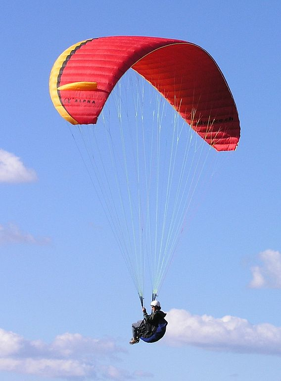
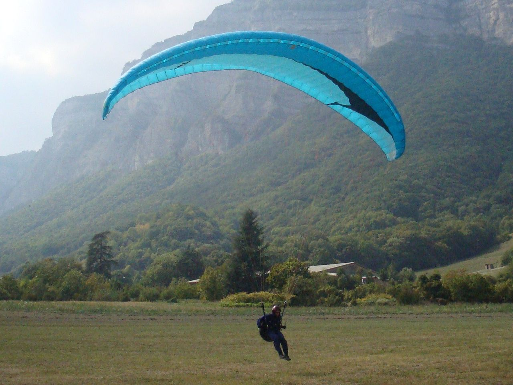

.. This chapter describes the components of a paraglider and provides simple
   mathematical models of each component. These models favor simplicity over
   accuracy; they are intended to be "good enough" examples of how to model
   each component.

***************************
Paraglider component models
***************************

A paraglider is a system of three components: a canopy, a harness, and
suspension lines that connect the canopy to the harness. A paraglider dynamics
model is assembled from the models of its components. Each component model
must define any inertial properties, relevant control inputs, and forces and
moments necessary to determine its behavior during a flight.

This chapter presents basic models for each component, favoring simplicity
whenever possible. It defines all the variables required by a paraglider
dynamics model using the minimum complexity necessary to achieve satisfactory
performance (excluding the reference point used to compute the system
dynamics).

.. Roadmap

* Establish the modeling requirements in the context of flight reconstruction

* Define the aerodynamic *control points*. (They're part of my "design
  language" for the components.)

* Component geometries, inertias, control points, and dynamics (including any
  control inputs)

Modeling requirements
=====================

* The introduction of this paper established the
  :ref:`introduction:Functionality` requirements for a paraglider system model
  to be suitable for flight reconstruction of typical flight scenarios.
  A system model that meets those requirements must be assembled from equally
  functional component models.

  [[For example, I declared that I wanted to model scenarios that included
  weight shift, so at least one of the component models must include a weight
  shift control in its dynamics.]]

* [[This section is about what I'm **not** choosing to model as much as it is
  about what I am. The physical components are complicated, but it's not
  necessary to model all that complexity to satisfy the model requirements.]]

* [[I'm not sure if this section is warranted or not. Do the components
  interact in a way that influences their requirements?

  For example, I'm making a rigid body assumption for the canopy. Does that
  affect the suspension line model? (I don't have to model how weight shift
  deformations affect the accelerator.) How does it affect weight shift? (I
  think it means the effect of weight shift doesn't depend on chest strap
  width.)

  Hm, it might be a good place to declare the aerodynamic control points.]]

* Rigid body assumptions

  * [[A paraglider is a system composed of canopy, lines, harness, and pilot.
    Although nearly every component are made from highly flexible materials,
    they tend to remain relatively rigid during typical flight conditions. The
    flight dynamics can be greatly simplified by assuming a rigid body
    model.]]

* [[I put a lot of work into non-uniform wind, etc, in the aerodynamics. The
  dynamics model should be capable of leveraging that flexibility.]]

* [[Weight shift control is in, riser controls are out]]

* Topics:

  * Paraglider wing

    * How the connecting lines produce the designed canopy shape

    * Braking

    * Accelerator

    * Air intakes

    * Ribs (profiles, v-ribs, etc)

    * Surface materials

  * Harness

  * Composite system

    * Reference point `R` (I chose the riser midpoint `RM`)

    * Degrees of freedom

  * More? (This is a scratch outline.)

* [[Should this go below related work? Makes sense if I specify my
  requirements up front so I can point out when existing literature fails to
  satisfy them.]]

* Closely related to :ref:`foil_geometry:Modeling requirements`; review that.

  Phillips method doesn't explicitly make a rigid body assumption. It uses the
  instantaneous lifting-line and section coefficients, but doesn't mandate
  that they are constant over time. You could theoretically model the
  aerodynamics of a non-rigid canopy using Phillips, but that would require
  a ton of work to determine the profile deformations and their resulting
  coefficients, so I'm going to declare a rigid body assumption for the
  canopy, with the exception of trailing edge deflections. (Note that I'm
  using a steady-state method for unsteady scenarios.)

Related work
============

* This paper is specifically about paragliding wings, but in terms of the
  aerodynamics it is closely related to *parafoil-payload systems* (primarily
  of interest to the military and aerospace organizations) and *kites* (kite
  boarding, airborne wind energy systems, etc)

* Canopy Aerodynamics

  * Gonzalez 1993, :cite:`gonzalez1993PrandtlTheoryApplied`

  * Belloc, :cite:`belloc2015WindTunnelInvestigation`

  * :cite:`kulhanek2019IdentificationDegradationAerodynamic`

  * :cite:`belloc2015WindTunnelInvestigation`

  * :cite:`belloc2016InfluenceAirInlet`

  * :cite:`babinsky1999AerodynamicPerformanceParagliders`

  * Cells (distortions, etc):

    * :cite:`kulhanek2019IdentificationDegradationAerodynamic`

    * :cite:`lolies2019NumericalMethodsEfficient`

* Paraglider Dynamics

  * Babinsky 1999, :cite:`babinsky1999AerodynamicPerformanceParagliders`

  * Slegers, :cite:`gorman2012EvaluationMultibodyParafoil`

  * :cite:`ward2014ParafoilControlUsing`

  * Apparent mass

    * :cite:`lissaman1993ApparentMassEffects`

    * :cite:`thomasson2000EquationsMotionVehicle`

    * :cite:`barrows2002ApparentMassParafoils`

Canopy
======

[[This section describes what goes into the dynamics function: velocities,
gravity, control inputs, inertia, air density, etc.]]

Surfaces
--------

[[In order to compute the inertia and additional viscous drag due to the air
intakes, I need to specify the extents of the upper and lower surfaces.]]

Inertia
-------

[[For a parafoil, there are three masses: the *solid mass*, from the
structural materials, the *air mass*, from the air enclosed in the wing, and
the *apparent mass*, from the acceleration of the wing relative to the
surrounding air.]]

[[The "canopy geometry" was only describing the pure geometric shape, not the
physical implementation of that shape. Now that I'm considering the physical
model, I need to extend that geometry with physical attributes. I'm not crazy
about defining the surfaces, etc, here, but if I'm doing the apparent mass
here then I might as well do the solid and air masses as well.]]

The canopy dynamics depend on two things:

1. The canopy forces and moments due to the air and gravity

2. The canopy inertia

The forces and moments were provided by the model in :doc:`foil_aerodynamics`.
The inertia can be calculated using the geometry in :doc:`foil_geometry`.

The canopy geometry in :doc:`foil_geometry` is a purely geometric description
of the idealized design target of a physical parafoil canopy, and must be
combined with density information to calculate the system inertia matrices.

The canopy inertia depends on contribution from the *solid mass* (surface
materials), *air mass*, and the *apparent mass*.

.. Define the surfaces and internal volume

The extent of the upper and lower surfaces depends on the design of the air
intakes. Typically the upper surface of the paraglider wing wraps beyond the
leading edge of the airfoil until the start of the air intakes. The lower
surface covers the region from the downstream edge of the air intakes until
the trailing edge of the sections.

Solid mass
^^^^^^^^^^

[[Total mass and inertia matrix of the upper and lower surface materials]]

[[What about the mass of the ribs?]]

Ref: :ref:`derivations:Area and Volume of a Mesh`

Upper and lower surface masses:

.. math::
   :label: surface_masses

   \begin{aligned}
     m_{\mathrm{u}} &= \rho_{\mathrm{u}} a_{\mathrm{u}} \\
     m_{\mathrm{l}} &= \rho_{\mathrm{l}} a_{\mathrm{l}}
   \end{aligned}

Upper and lower surface inertias:

.. math::
   :label: surface_inertias

   \begin{aligned}
     \mat{J}_{\mathrm{u}/\mathrm{O}} &= \rho_{\mathrm{u}} \mat{J}_{a_u/\mathrm{O}} \\
     \mat{J}_{\mathrm{l}/\mathrm{O}} &= \rho_{\mathrm{l}} \mat{J}_{a_l/\mathrm{O}}
   \end{aligned}

Where the :math:`a` and :math:`\mat{J}` are the areas and areal inertias for
the canopy surfaces (from :ref:`derivations:Area`).

Air mass
^^^^^^^^

Ref: :ref:`derivations:Area and Volume of a Mesh`

[[As the canopy accelerates, the air inside must accelerate at the same rate,
and so must be included in the inertial calculations of the canopy. (This
assumes the air is incompressible, which is reasonable at these speeds, and
neglects surface porosity, so the enclosed air travels with the wing.)
Although the canopy is porous, and thus constantly receiving an inflow of air
through the intakes, the leakage is slow enough that the volume of air can be
treated as constant.]]

Mass of the enclosed air:

.. math::
   :label: air_mass

   m_{\mathrm{air}} = \rho_{\mathrm{air}} v

Inertia matrix of the enclosed air:

.. math::
   :label: air_inertia

   \mat{J}_{\mathrm{air}/O} = \rho_{\mathrm{air}} \mat{J}_{\mathrm{v}/\mathrm{O}}

Where :math:`v` and :math:`\mat{J}_\mathrm{v}` are the volume and volume
inertia for the inside the canopy (from :ref:`derivations:Volume`).

Apparent Mass
^^^^^^^^^^^^^

Newton's second law states that the acceleration of an isolated object is
proportional to the net force applied to that object:

.. math::

   a = \frac{\sum{F}}{m}

This simple rule is sufficient and effective for determining the behavior of
isolated objects, but when an object is immersed in a fluid it is longer
isolated. When an object moves through a fluid there is an exchange of
momentum, and so the momentum of the fluid must be taken into account as well.
[[FIXME: poor explanation. The "exchange of momentum" is what produces the
fluid dynamics, after all. The problem is using aerodynamics coefficients that
were produced under steady-state conditions to estimate accelerated (unsteady)
motion.]]

In static scenarios, where the vehicle is not accelerating relative to the
fluid (ie, changing speed and/or direction), this exchange of momentum is
traditionally summarized by coefficients that describe how the forces and
moments on the wing change with the air velocity. But for unsteady flows, where
the vehicle is accelerating relative to the fluid, the net force on the vehicle
can no longer be equated to the product of the vehicle's mass and acceleration.
Instead, when a net force is applied to an object in a fluid, it will
accelerate more slowly than the object would have in isolation; it is as if the
vehicle has increased its mass:

.. math::

   a = \frac{\sum{F}}{m + m_a}

This *apparent mass* :math:`m_a` tends to become more significant as the
density of the vehicle approaches the density of the fluid. If the density of
the vehicle is much greater than the density of the fluid then the effect is
often ignored, but for lightweight aircraft the effect can be significant.

[[Note to self: it's not correct to say that the effect becomes greater as the
density of the vehicle decreases. Whether it is **significant** depends only
on the ratio `m / m_a`. If :math:`m \gg m_a` then no worries. However, `m`
does depend on the density of the vehicle, and `m_a` does depend on the
density of the fluid. But `m_a` also depends on the **shape** of the object
and the relative velocity of the fluid. It's not a big deal, but careful how
you word it.]]

Because apparent mass effects are the result of a volume in motion relative to
a fluid, its magnitude depends on the direction of the motion relative to the
volume. Unlike the inertia due to real mass, apparent inertia is anisotropic,
and the diagonal terms of the apparent mass matrix are independent. [[FIXME:
it's related to this projected surface area; that's probably not obvious.]]

An exact calculation of the apparent mass for an arbitrary geometry with
respect to an arbitrary reference point is not trivial. For a classic
discussion of the topic, see :cite:`lamb1945Hydrodynamics`. A more recent
reference discussing apparent mass in the context of parafoils is
:cite:`lissaman1993ApparentMassEffects`, which used an ellipsoid model to
establish a parametric form commonly used in parafoil-payload literature. An
updated derivation in :cite:`barrows2002ApparentMassParafoils` added
corrections to the ellipsoid model.

This paper uses the method from :cite:`barrows2002ApparentMassParafoils`. For
a replication of that method for estimating the apparent mass matrix of
a parafoil, but given in the notation of this paper, see
:ref:`derivations:Apparent Mass of a Parafoil`. For the purpose of defining
a dynamics model incorporating apparent mass, the relevant detail from that
derivation is that the reference point for the dynamics must lie in the
xz-plane of the canopy.

Controls
--------

[[Define the control scheme expected by the dynamics model equations.
Specifically, :math:`\delta_{bl}` and :math:`\delta_{br}`. I'm not going to
define the brake deflection model here; leave that up to the model designer,
such as in :doc:`demonstration`.]]

Aerodynamics
------------

[[The foil geometry is an idealized "design target". The actual canopy has air
intakes and brake deflections. I need to explain how those are accounted for
in the section coefficients. (I can defer showing examples of deflected
section profiles until :ref:`demonstration:Section profiles`).]]

Suspension lines
================

* Primary functions: positioning the harness relative to the canopy, adjusting
  the harness position in response to accelerator inputs, and determining the
  brake deflection distribution in response to brake inputs.

* :cite:`kulhanek2019IdentificationDegradationAerodynamic`: mentions some
  papers on line drag coefficients, start here

* I'm not including explicit models for the bridle. The canopy geometry
  assumes the existence of a bridle that will produce the specified shape. At
  most, I've added control points and drag coefficients for the lines. Turns
  out it has a significant (ie, not massive but still noticeable) impact on
  sensitive things like the glide ratio.

* I'm lumping all the line drag into a single point for each half of the wing.
  I'm assuming isotropic drag because drag due to lines naturally becomes
  insignificant as alpha increases (when aerodynamic resistance in the
  z-direction becomes dominated by the canopy anyway), and the wing can't
  operate at a particularly high angle of attack anyway.

* :cite:`iosilevskii1995CenterGravityMinimal`

* :cite:`altmann2015FluidStructureInteractionAnalysis` discusses using
  *fluid-structure interaction* to optimize the line cascading to optimize
  wing performance

* :cite:`lolies2019NumericalMethodsEfficient` discusses the "effect of line
  split joint angles on sail deformation"

* Rigging angle:

  * *rigging*: "the system of ropes, chains, and tackle used to support and
    control the masts, sails, and yards of a sailing vessel"

  * Lingard 1995: uses a *rigging angle* for positioning the payload, which is
    related to the assumption "that the system can be induced to fly at the
    angle of attack corresponding to optimum L/D". I don't like coupling those
    two concepts this closely; if you want to compute the angle that would
    induce the optimum L/D you can then specify the `kappa_x, kappa_z` just
    the same without muddying the definition.

  * Benedetti :cite:`benedetti2012ParaglidersFlightDynamics` uses the same
    idea for positioning the harness as I do, except he uses relative `x` and
    absolute `z` whereas I use relative for both.

For real wings, the line geometry is a major factor in wing performance, but
the subject is complex. [[Why? It adds mass, line drag, shapes the wing,
effects wing distortions, trailing edge deflections, enables riser control,
etc.]] For this project I'm not modeling the entire bridle. Instead, I'm using
explicit placements of the riser midpoint :math:`RM` and aggregated values for
the line drag. [[The mass distribution of the lines would depend on the bridle
geometry and the masses of the lines; I don't know the bridle geometry, and
the lines themselves are of variable weights. However, the lines get thinner
as you approach the canopy, so their center of mass is probably relatively
close to the paraglider center of mass, so they're contribution is assumed to
be negligible to the overall dynamics.]]

Also, because I'm not modeling the entire geometry, I must also approximate
the brake deflection angles. The end effect is that this implementation only
models the final position of the risers as a function of accelerator, and the
deflection angles of the trailing edges as a function of left and right
brakes.

[[One of the advantages of a parametric canopy geometry is that the parameters
can themselves be functions. The reference curves discussed so far have been
fixed values, but for a real wing many of the curves are better represented as
functions of the line geometry. For example, the arc anhedral and chord
lengths might be affected by the accelerator input.]]

Riser position
--------------

[[Discuss riser position `RM` as a function of the accelerator.]]

Controls
--------

[[FIXME]]

Brakes
^^^^^^

A paraglider is equipped with two handles at the ends of sections of the
*bridle* (line geometry) that are connected to the trailing edges of the
canopy. The pilot can use these controls to deflect the trailing edge
downward, increasing drag. Symmetric deflections slow the wing down, and
asymmetric deflections cause the wing to turn.

Topics:

* The deflection geometry of individual airfoils

* Deflection distribution as a function of section index.

* The geometry of the bridle dictates the deflection distribution.

* Simulating a braking wing requires the geometry for the deflected airfoils.
  The geometry can either be used directly, as would be done by *vortex
  lattice* or *computational fluid dynamics* methods, or it can be used
  indirectly, as is done with lifting-line methods. Lifting-line methods use
  the section coefficients, which means solving for the 2D section
  coefficients before estimating the 3D section forces and moments.

Good reference images for brake deflections:

   Brake deflection, example 1.

   `Photograph <https://commons.wikimedia.org/wiki/File:Paragliding.jpg>`__  by
   Frédéric Bonifas, distributed under a CC-BY-SA 3.0 license.

   Brake deflection, example 2.

   `Photograph <https://commons.wikimedia.org/wiki/File:ApcoAllegra.jpg>`__ by
   Wikimedia contributor "PiRK" under a CC-BY-SA 3.0 license.

Mathematical model
~~~~~~~~~~~~~~~~~~

It is computationally prohibitive to solve for the aerodynamic coefficients at
each timestep. Instead, a set of coefficients can be produced for a set of
deflection angles, and then the aerodynamics method can use linear
interpolation between the individual coefficient solutions.

Interpolating between coefficient solutions requires an index; the most
natural is the deflection angle, :math:`\delta_f`. This means a standard
definition must be chosen for the *deflection angle*.

Classic airfoil software, such as XFOIL, are primarily designed for rigid
wings, and so it is common to define flaps using a fixed hinge point at some
point along the chord:

.. figure:: figures/paraglider/geometry/airfoil/airfoil_deflected_hinge.*

   Deflection angle relative to a fixed hinge point.

This definition is troublesome for a flexible wing, since there is no fixed
hinge point; the deflection occurs as a variable arc between the trailing edge
to some point on the chord. A more convenient definition is the total
deflection angle produced by the trailing edge:

.. figure:: figures/paraglider/geometry/airfoil/airfoil_deflected_arc.*

   Deflection angle relative to the leading edge.

This definition moves some of the complexity out of the implementation and
into how the set of coefficients are defined. Without recording a fixed
hinge point, the paraglider model is oblivious to how the deflection was
achieved. On the plus side, this constraint greatly simplifies the model,
and sets of coefficients can easily be generated for different deflection
geometries without requiring changes to the code.

To lookup the coefficients using the interpolator, the simulator requires
the deflection angles. That is, it needs a function to produce the
deflection angle distribution across the wing sections :math:`s` as
a function of the brakes:

.. math::

   \delta_f = f \left( s, \delta_{Bl}, \delta_{Br} \right)

Where :math:`s` is the *section index*, :math:`\delta_{Bl}` is the
percentage of left brake, and :math:`\delta_{Br}` is the percentage of right
brake.

A physically accurate deflection distribution requires a proper line
geometry for the wing, but because the line geometry was not a focus for
this project, an approximation is used instead.

For the moment, I've been using a cubic polynomial for the distribution. You
choose a starting section (where brake deflections begin), a peak section
(where the deflection is greatest), and a peak value (the magnitude of the
maximum deflection angle under maximum control input). The
applicability/accuracy of this crude model depends on the arc anhedral:

.. figure:: figures/paraglider/geometry/brake_deflections_anhedral23_Bl025_Br1.*

   Cubic brake deflection, example 1.

   Parameters: :math:`\delta_{Bl} = 0.25` and :math:`\delta_{Br} = 1` for
   a wing with a mean anhedral angle of 23 degrees.

.. figure:: figures/paraglider/geometry/brake_deflections_anhedral33_Bl025_Br1.*

   Cubic brake deflection, example 2.

   Parameters: :math:`\delta_{Bl} = 0.25` and :math:`\delta_{Br} = 1` for
   a wing with a mean anhedral angle of 33 degrees.

**FIXME: these plots were made using the `plot_paraglider_wing` function that
assumed fixed hinges at 0.8c and the delta is the angle from 0.8c to the TE.
That visualization will be significantly wrong.**

Accelerator
^^^^^^^^^^^

* Need an informal description first.

* Discuss the assumption that the accelerator does not change the arc. Maybe
  design a test case to show how small amounts of "flattening" change the
  performance (better glide ratio, more sensitive to weight shift, etc; easy
  to do, just modify `mean_anhedral` for the Hook3ish and leave `max_anhedral`
  as-is).

  Just flattening the wing dramatically increases the glide ratio while
  slowing the wing (which isn't what you want from an accelerator). I'm
  guessing you could tune `kappa_x` and `kappa_C` to find a sweet balance.
  Makes sense to optimize for stability at `delta_a = 0` but optimize for
  performance/stability as accelerator is applied ("hands-up" goes for the
  accelerator as well as for the brakes).

* I'm using the chord lines as the connection points, but for the physical
  wing the tabs are connected to the lower surfaces of the ribs.

Mathematical model
~~~~~~~~~~~~~~~~~~

.. figure:: figures/paraglider/geometry/accelerator.*
   :name: accelerator_geometry

   Paraglider wing accelerator geometry.

For notational simplicity, define :math:`\overline{A}` and
:math:`\overline{C}` be the lengths of the lines connecting them to the riser
midpoint :math:`RM`:

.. math::

   \begin{aligned}
   \overline{A} &= \left\| \vec{r}_{A/RM} \right\|\\
   \overline{C} &= \left\| \vec{r}_{C/RM} \right\|\\
   \end{aligned}

The default lengths of the lines is defined by two pairs of design parameters.
First, the default position of the riser midpoint :math:`RM` is defined with
:math:`\kappa_x` and :math:`\kappa_z`; this is the position of :math:`RM` when
:math:`\delta_a = 0`. Second, two connection points on the canopy are defined
with :math:`\kappa_A` and :math:`\kappa_C`; connecting lines from these points
are the physical means by which :math:`RM` is positioned underneath the
canopy. The :math:`A` lines connect near the front of the wing, and are
variable length; the pilot can use the *accelerator* to shorten the lengths of
these lines. The :math:`C` lines connect towards the rear of the canopy, and
are fixed length. Geometrically, shortening :math:`\overline{A}` will move
:math:`RM` forward while rotating the :math:`C` lines. Aerodynamically,
shortening :math:`\overline{A}` effectively rotates the canopy pitch down,
decreasing the global angle of incidence of the canopy; decreasing the angle
of incidence decreases lift, and the wing must accelerate to reestablish
equilibrium.

A fifth design parameter, the *accelerator length* :math:`\kappa_a`, is
required to define the maximum length change produced by the accelerator; this
is the maximum length that :math:`\overline{A}` can be decreased. This value
is limited by the physical geometry of the pulleys that give the pilot the
leverage to pull the canopy into its new position. The pilot uses the
*accelerator control input* :math:`\delta_a`, a value between 0 and 1, to
specify the total decrease in :math:`\overline{A}`:

.. math::
   :label: accelerator_length_A

   \overline{A}(\delta_a) = \overline{A_0} - \delta_a \kappa_a

For deriving the basic geometric relations, it is convenient to normalize all
the design parameters by the central chord. This avoids the extra terms in the
derivation and allows a wing design to scale naturally with the canopy.

The goal is to use the physical geometry, where the risers position is
determined by :math:`\overline{A}` and :math:`\overline{C}`, to define the
position of :math:`RM` a function of :math:`\delta_a`. The first step is to
determine the default line lengths by setting :math:`\delta_a = 0` and
applying the Pythagorean theorem:

.. math::
   :label: accelerator_initial

   \begin{aligned}
   \overline{A_0} &= \sqrt{\kappa_z^2 + \left( \kappa_x - \kappa_A \right) ^2}\\
   \\
   \overline{C_0} &= \sqrt{\kappa_z^2 + \left( \kappa_C - \kappa_x \right) ^2}
   \end{aligned}

In the general case, the line lengths are functions of :math:`\delta_a`:

.. math::
   :label: accelerator_geometry_line_lengths

   \begin{aligned}
   \overline{A}(\delta_a)^2 &= {RM}_z^2 + \left( {RM}_x - \kappa_A \right) ^2\\
   \\
   \overline{C}(\delta_a)^2 &= {RM}_z^2 + \left( \kappa_C - {RM}_x \right) ^2 = \overline{C_0}^2
   \end{aligned}

Where :math:`\overline{C} \equiv \overline{C_0}` due to the physical
constraint that the length of the :math:`C` lines are constant.

Subtract the two equations in :eq:`accelerator_geometry_line_lengths`:

.. math::

   \overline{A}(\delta_a)^2 - \overline{C_0}^2 =
      \left( {RM}_x - \kappa_A \right) ^2 - \left( \kappa_C - {RM}_x \right) ^2

Finally, substitute :eq:`accelerator_length_A` and solve for :math:`{RM}_x`
and :math:`{RM}_z` as functions of :math:`\delta_a`:

.. math::
   :label: accelerator_R_xz

   \begin{aligned}
   {RM}_x(\delta_a) &=
      \frac
         {\left( \overline{A_0} - \delta_a \kappa_a \right) ^2
          - \overline{C_0}^2 - \kappa_A^2 + \kappa_C^2}
         {2 \left( \kappa_C - \kappa_A \right)}\\
   \\
   {RM}_z(\delta_a) &=
      \sqrt{\overline{C_0}^2 - \left( \kappa_C - {RM}_x(\delta_a) \right) ^2 }\\
   \end{aligned}

The final position of :math:`RM` with respect to the leading edge (which is
also the origin of the canopy coordinate system), scaled by the length of the
central chord :math:`c_0` of the wing, is then:

.. math::
   :label: accelerator_R

   \vec{r}_{RM/LE}^b(\delta_a) =
      c_0 \cdot \left\langle -{RM}_x(\delta_a), 0, {RM}_z(\delta_a) \right\rangle

Where :math:`{RM}_x` was negated since the wing x-axis is positive forward.

[[Maybe now is a good time to talk about how the wing/body coordinate system
is a simple translation of the canopy coordinate system, so
:math:`\vec{r}_{LE/RM}^b = - \vec{r}_{RM/LE}^c`, but are vectors in the two
coordinate systems actually the same values? As in :math:`\vec{r}_{A/B}^b
= \vec{r}_{A/B}^c` for all A and B?]]

Aerodynamics
------------

[[Although small, I can't reasonably neglect the line drag, so I've lumped it
into two aerodynamic control points.]]

Harness
=======

The harness is the seat for the pilot. The bridle suspends the harness and
pilot from the lines using attachments to two *risers*. A tensioning strap at
chest level between the two risers provides pilot safety during violent
maneuvers, but it also allows the pilot to choose a balance between stability
and wing responsiveness to weight shift control.

[[In my case, I'm not modeling the chest width. Probably not a big deal
because turbulence is such a high frequency signal I'd never be able to
estimate it from IGC data anyway.]]

* This model includes the mass of the pilot. Moving the mass of the pilot is
  a function of *weight shift* control.

* An accurate geometry of the harness and pilot combination would be complex
  model accurately, but a simple spherical model can be used to estimate the
  inertia and dynamics without significant loss of accuracy.

* See :cite:`wild2009AirworthinessRequirementsHanggliders`, pg26 for
  a discussion of harness dimensions

* :cite:`kulhanek2019IdentificationDegradationAerodynamic`: uses Virgilio's
  presentation; I guess I'll do the same. That model treats the harness as
  a sphere with an isotropic drag coefficient normalized by cross-sectional
  area. Also, to support weight shift I'm making the y-coordinate of the
  center of mass be a function of :math:`\delta_w`.

  Review the docstring for `harness.py:Spherical`.

Inertia
-------

The harness is modeled as a solid sphere of uniform density. With a total mass
:math:`m_p`, center of mass :math:`P`, and projected surface area :math:`S_p`,
the moment of inertia is:

.. math::

   \mat{J}_{p/P} =
     \begin{bmatrix}
      J_{xx} & 0 & 0 \\
      0 & J_{yy} & 0 \\
      0 & 0 & J_{zz}
     \end{bmatrix}

where

.. math::

   J_{xx} = J_{yy} = J_{zz} = \frac{2}{5} m_p r_p^2 = \frac{2}{5} \frac{m_p S_p}{\pi}

[[**FIXME**: use `p` subscript for payload? It's what I use in the code]]

Controls
--------

[[Discuss modeling weight shift as a displacement of the harness center of
mass :math:`P`]]

Aerodynamics
------------

FIXME

Discussion
==========

[[FIXME: these were here from before the refactor and obviously need review.]]

* [[In `glidersim` I'm combining the canopy and suspension lines into a single
  model, the `ParagliderWing`.]]

Limitations
-----------

* Inherits the limitations of the aerodynamics method:

  * Assumes section coefficients are representative of the entire wing segment
    (ignores inter-segment flow effects, etc)

* Rigid-body assumption (none of the canopy, connecting lines, or payload are
  actually rigid bodies)

* Violates conservation of momentum since it doesn't account for accelerations
  due to redistributions of mass (due weight shift and the accelerator).

* Quasi-steady-state assumption (I'm using steady-state aerodynamics to
  simulate non-steady conditions by assuming the conditions are changing
  "slowly enough.") I've included adjustments for apparent mass, but I'm still
  assuming the steady-state solution is representative of the unsteady
  solution. Also, my equations for the apparent mass themselves are under
  a steady-state assumption; see :cite:`thomasson2000EquationsMotionVehicle`
  for a discussion of apparent mass in unsteady flows.

  Consider the fact that the canopy is interacting with the "underlying" wind
  field, so that the motion of the canopy changes the local wind vectors. This
  effect should propagate through time, but for my simulator I'm only using
  the "global" wind field, neglecting any effects of the previous timestep. (I
  am trying to account for apparent mass, but I don't think that's really the
  same thing, since that doesn't change the local aerodynamics.)

* Barrow's method has several assumptions (circular arc anhedral, spanwise
  uniform thickness, etc) that are wrong for real wings.
