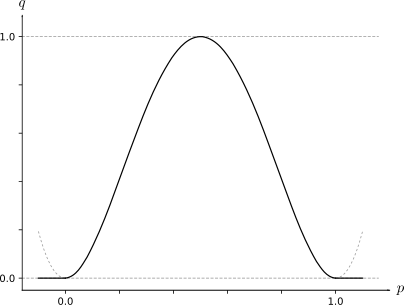

.. This chapter describes the three basic components of a paraglider (canopy,
   lines, and payload), defines the component inputs, and provides simple
   mathematical models of each component.

* FIXME: where do I define the aerodynamic *control points*? (They're part of
  my "design language" for the components.)

* Every paraglider component should probably summarize:

  1. The parameters that define it

  2. The control inputs it provides to the system model

***************************
Paraglider component models
***************************

A paraglider is a system of three components: a canopy, a harness, and
suspension lines that connect the canopy to the harness. A paraglider dynamics
model is assembled from the models of its components. Each component model
must define any inertial properties, relevant control inputs, and forces
necessary to determine its behavior during a flight.

This chapter presents basic models for each component, favoring simplicity
whenever possible. [[The biggest simplifications result from the fact that
:ref:`introduction:Functionality` explicitly stated that the model does not
need to cover scenarios that involve wing deformations, which allow these
component models to use rigid body assumptions.]]

Modeling requirements
=====================

The introduction of this paper established the
:ref:`introduction:Functionality` that a paraglider system model must provide
in order for it to enable flight reconstruction of typical flight scenarios.
A system model that meets those requirements must be assembled from equally
functional component models.

[[This section is about what I'm **not** choosing to model as much as it is
about what I am; the physical components are complicated, but it's not
necessary to model all that complexity to satisfy the model requirements. For
example, I declared that I wanted to model scenarios that included weight
shift, so at least one of the component models must include a weight shift
control in its dynamics, but because I'm assuming a rigid canopy I will be
neglecting deformations due to weight shift; thus, weight shift is modeled
entirely via the harness model. I do want to account for the accelerator, but
the "rigid canopy" means I will be neglecting "flattening" of the profiles;
accelerator is modeled entirely via the suspension lines model.]]

Misc thoughts:

* Rigid body assumptions

  * [[A paraglider is a system composed of canopy, lines, harness, and pilot.
    Although nearly every component are made from highly flexible materials,
    they tend to remain relatively rigid during typical flight conditions. The
    flight dynamics can be greatly simplified by assuming a rigid body
    model.]]

* [[I put a lot of work into non-uniform wind, etc, in the aerodynamics. The
  dynamics model should be capable of leveraging that flexibility.]]

* [[Weight shift control is in, riser controls are out]]

* [[Should this go below related work? Makes sense if I specify my
  requirements up front so I can point out when existing literature fails to
  satisfy them.]]

* Closely related to :ref:`foil_geometry:Modeling requirements`; review that.

  Phillips method doesn't explicitly make a rigid body assumption. It uses the
  instantaneous lifting-line and section coefficients, but doesn't mandate
  that they are constant over time. You could theoretically model the
  aerodynamics of a non-rigid canopy using Phillips, but that would require
  a ton of work to determine the profile deformations and their resulting
  coefficients, so I'm going to declare a rigid body assumption for the
  canopy, with the exception of trailing edge deflections. (Note that I'm
  using a steady-state method for unsteady scenarios.)

Canopy
======

.. This section describes what goes into the dynamics function: velocities,
   gravity, control inputs, inertia, air density, etc.

Surfaces
--------

.. Define the upper and lower surfaces. They are necessary for computing the
   surface mass, surface inertia, internal volume, and viscous drag due to air
   intakes.

[[FIXME: review/rewrite]]

The extents of the upper and lower surfaces depend on the design of the air
intakes. Typically the upper surface of a paraglider wing wraps beyond the
leading edge of the section profile, and the lower surface covers the region
from the downstream edge of the air intakes until the trailing edge of the
sections.

Inertia
-------

A dynamics model requires the inertia of an object in order to calculate its
acceleration. For a parafoil canopy in-flight, the effective inertia is
produced by a combination of three different masses: a *solid mass*, from the
structural materials, an *air mass*, from the air enclosed in the wing, and an
*apparent mass*, from the acceleration of the wing relative to the surrounding
air. Some texts refer to the combination of the solid and air masses as the
*real mass* :cite:`barrows2002ApparentMassParafoils`.

Solid mass
^^^^^^^^^^

The solid mass is the surface and structural materials that comprise the foil.
A rigorous model would include the upper and lower surfaces, ribs, half-ribs,
v-ribs, horizontal straps, tension rods, tabs (line attachment points),
stitching, etc, but for this section the calculation is restricted to the
upper and lower surface materials. (See :ref:`demonstration:Model` for
a discussion of this simplification.)

Assuming the surface materials are uniform, the inertias of the external
surface materials can be determined by first calculating the total area
:math:`a` and areal inertia matrix :math:`\mat{J}` for each surface (using the
method in :ref:`derivations:Area`), then scaling them by the areal densities
:math:`\rho` of each surface. The result is the total upper and lower surface
masses:

.. math::
   :label: surface_masses

   \begin{aligned}
     m_{\mathrm{u}} &= \rho_{\mathrm{u}} a_{\mathrm{u}} \\
     m_{\mathrm{l}} &= \rho_{\mathrm{l}} a_{\mathrm{l}}
   \end{aligned}

And the upper and lower surface inertias about the canopy origin :math:`O`:

.. math::
   :label: surface_inertias

   \begin{aligned}
     \mat{J}_{\mathrm{u}/\mathrm{O}} &= \rho_{\mathrm{u}} \mat{J}_{a_u/\mathrm{O}} \\
     \mat{J}_{\mathrm{l}/\mathrm{O}} &= \rho_{\mathrm{l}} \mat{J}_{a_l/\mathrm{O}}
   \end{aligned}

Air mass
^^^^^^^^

Although the weight of the air inside the canopy is cancelled by its buoyancy,
it still possesses significant mass. When the canopy is accelerated the
enclosed air is accelerated at the same rate, and must be included in the
inertial calculations. (This model neglects surface porosity; although the
canopy is porous, and thus constantly receiving an inflow of air through the
intakes, the leakage is slow enough that the volume of air can be treated as
constant.)

Similar to the surface masses, the internal volume and its unscaled inertia
about the canopy origin is easily computed from the :doc:`foil_geometry` using
the method in :ref:`derivations:Volume`. Given the internal volume :math:`v`
and the current air density :math:`\rho_{\mathrm{air}}`, the total mass of the
enclosed air :math:`m_{\mathrm{air}}` is simply:

.. math::
   :label: air_mass

   m_{\mathrm{air}} = \rho_{\mathrm{air}} v

Similarly, for the inertia matrix of the enclosed air about the canopy origin
:math:`O`:

.. math::
   :label: air_inertia

   \mat{J}_{\mathrm{air}/O} = \rho_{\mathrm{air}} \mat{J}_{\mathrm{v}/\mathrm{O}}

.. FIXME: explicitly note that rho is a function of time?

Apparent Mass
^^^^^^^^^^^^^

Newton's second law states that the acceleration of an isolated object is
proportional to the net force applied to that object:

.. math::

   a = \frac{\sum{F}}{m}

This simple rule is sufficient and effective for determining the behavior of
isolated objects, but when an object is immersed in a fluid it is longer
isolated. When an object moves through a fluid there is an exchange of
momentum, and so the momentum of the fluid must be taken into account as well.
[[FIXME: poor explanation. The "exchange of momentum" is what produces the
fluid dynamics, after all. The problem is using aerodynamics coefficients that
were produced under steady-state conditions to estimate accelerated (unsteady)
motion.]]

In static scenarios, where the vehicle is not changing speed or direction
relative to the fluid, this exchange of momentum can be summarized with
coefficients that describe how the forces and moments on the wing change with
the air velocity. But for unsteady flows, where the vehicle is accelerating
relative to the fluid, the net force on the vehicle is no longer simply the
product of the vehicle's "real" mass and acceleration. Instead, when a net
force is applied to an object in a fluid, it will accelerate more slowly than
the object would have in isolation, as if the vehicle has increased its mass:

.. math::

   a = \frac{\sum{F}}{m + m_a}

This *apparent mass* :math:`m_a` tends to become more significant as the
density of the vehicle approaches the density of the fluid. If the density of
the vehicle is much greater than the density of the fluid then the effect is
often ignored, but for lightweight aircraft the effect can be significant.

[[Note to self: it's not correct to say that the effect becomes greater as the
density of the vehicle decreases. Whether it is **significant** depends only
on the ratio `m / m_a`. If :math:`m \gg m_a` then no worries. However, `m`
does depend on the density of the vehicle, and `m_a` does depend on the
density of the fluid. But `m_a` also depends on the **shape** of the object
and the relative velocity of the fluid. It's not a big deal, but careful how
you word it.]]

Because apparent mass effects are the result of a volume in motion relative to
a fluid, its magnitude depends on the direction of the motion relative to the
volume. Unlike the inertia due to real mass, apparent inertia is anisotropic,
and the diagonal terms of the apparent mass matrix are independent. [[FIXME:
it's related to this projected surface area; that's probably not obvious.]]

Calculating the apparent mass of an arbitrary geometry is difficult. For
a classic discussion of the topic, see :cite:`lamb1945Hydrodynamics`. For
a more recent discussion of apparent mass in the context of parafoils, see
:cite:`lissaman1993ApparentMassEffects`, which used an ellipsoid model to
establish a parametric form commonly used in parafoil-payload literature

This paper uses an updated method from
:cite:`barrows2002ApparentMassParafoils` which added corrections to the
ellipsoid model of :cite:`lissaman1993ApparentMassEffects`. (For a replication
of the equations in that method but given in the notation of this paper, see
:ref:`derivations:Apparent mass of a parafoil`.) When using the method to
define a dynamics model that accounts for the apparent mass, the most
important detail from that derivation is that the reference point for the
dynamics must lie in the xz-plane of the canopy. [[FIXME: also, there are
limitations to the method, such as its strong assumptions that the foil has
circular arc, uniform thickness, uniform chord length, etc.]]

.. _Braking:

Controls
--------

* A parafoil is controlled by downward deflections of its section trailing
  edges. The aerodynamics of a canopy with brake inputs depends on the
  geometry of the deflected airfoils.

* This project uses an :ref:`aerodynamics method <foil_aerodynamics:Phillips'
  numerical lifting-line>` that uses the canopy geometry indirectly through
  precomputed section coefficients.

* The section profiles change with the brake input, so the section profiles and
  coefficients are a function of the deflections.

[[FIXME: this section needs work. Discuss the need for an *airfoil index*,
explain why the conventional choice for fixed-hinge flaps is `delta_f` is less
than ideal, and argue that a better choice for parafoils is the deflection
distance `delta_d`.

"Traditional wings control the flap angle directly, so the control is an
explicit angle. Parafoils don't use a fixed hinge, so some models use the
angle between the deflected and undeflected chord. The deflection angle is
problematic though, because it depends on the chord length; the brakes don't
set the deflection angle directly, they create it indirectly, so modeling it
as a direct effect is problematic. A more natural choice is to model the
vertical deflection distance and normalize it with the section chord to index
the deflected profile."

In other words, the points on the airfoil and the section aerodynamic
coefficients are a function of some *airfoil index*. I chose
:math:`\overline{\delta}_d = \frac{\delta_d}{c}`, so :math:`\vec{r}_{P/LE}^a
\left( \overline{\delta}_d, r \right)`, :math:`Cl \left( \overline{\delta}_d,
\alpha, Re \right)`, etc.]]

The deformable profiles mean the coefficients must not only be functions of
angle of attack :math:`\alpha`, they must also account for :ref:`trailing edge
deflections <paraglider_components:Brakes>` due to the left and right brakes.
A simplifying assumption is that braking produces a predictable change in the
profiles that can be described with a single "deflection index" that can be
computed from the brake inputs.

.. Defining the deflection angle for a section

* The simplest approach is to ignore any deformations to the geometry and
  model the deflection as a global rotation about some rotation point , with
  the deflection angle measured between the deflected and undeflected chords.
  [[The rotation point is often implicit; for example, lifting-line models
  that assume a fixed quarter-chord are implicitly rotating about the
  quarter-chord position.]]

.. figure:: figures/paraglider/geometry/airfoil/deflected_airfoil_rotation.*
   :name: deflected_airfoil_rotation

   Deflection as a rotation of the entire profile.

* By ignoring deformation to the profile geometry this model assumes the shape
  of the lift curve does not change with brake deflections; deflections
  effectively translate the lift coefficient. Often combined with a small
  angle constraint, such as aerodynamic models that assume a linear lift
  coefficient. The big advantage of this model is that, even if the model
  doesn't assume linear lift, it allows the model to function with just the
  coefficients data from the undeflected profile.

* Some models need to account for the physical deformations to the profile.

* Classic airfoil software, such as XFOIL, are primarily designed for rigid
  wings, and so it is common to define discrete *flaps* using a hinge point at
  some fixed position along the chord:

.. figure:: figures/paraglider/geometry/airfoil/deflected_airfoil_hinge.*
   :name: deflected_airfoil_hinge

   Deflection as a rotation of a rigid flap about a fixed hinge point.

* This definition is troublesome for a flexible wing, since there is no fixed
  hinge point; the deflection occurs as a variable arc between the trailing
  edge to some point on the chord.

* Another caveat for both models that generate deflection angles directly as
  a function of brake inputs is that it is unclear what the deflection
  distribution should be, since parafoil brake inputs cannot directly set the
  section deflection angles; they only control the downward deflection
  distance.

* For parafoils, a more natural definition is the vertical edge *deflection
  distance* :math:`\delta_d` of the trailing edge:

.. figure:: figures/paraglider/geometry/airfoil/deflected_airfoil_arc.*
   :name: deflected_airfoil_arc

   Deflection as a vertical displacement of the trailing edge.

.. FIXME: is it safe to say that because the brakes pull nearly perpendicular
   to the chord that the decrease in brake line length is almost exactly equal
   to the deflection distance delta_d?

[[Explain how this choice requires pre-defining airfoil geometries as
a function of `delta_d` only. It assumes that a given deflection distance
always produces a specific deflected profile.]]

The section profiles and aerodynamic coefficients are then indexed using the
*normalized deflection distance* :math:`\overline{\delta_d}`, a function of
the *deflection distance* :math:`\delta_d` (defined by the suspension line
model) and the *chord length* :math:`c` (defined by the canopy geometry):

.. math::
   :label: normalized deflection distance

   \overline{\delta_d} = \frac{\delta_d}{c}

The deflection distances are unusual in that, although they control the canopy
aerodynamics model, they are not inputs to the system model. Instead, the
paraglider model computes them internally from values provided by the canopy
and the suspension lines.

Discussion/misc:

* The model does not describe how the profiles change in response to the brake
  inputs; it requires that the deflected profiles are determined separately.
  This represents a significant extra step in the design process, but once
  a set of deformed profiles have been generated they can be reused for each
  canopy model.

* Trailing edge deformations due to braking are the only foil deformations
  supported by this model, but I'm only applying them to the aerodynamics, not
  the inertia. The way I'm incorporating them into the aerodynamics is through
  the section coefficients.

* Assumes that the deformed profiles always take the same shape for a given
  value of `delta_d`.

* To compute the aerodynamics of the canopy, first generate a set of profiles
  with deflected trailing edges. Then, generate a set of airfoil coefficients
  for each profile. During braking, the airfoil coefficients can be queried by
  interpolating over the set of coefficients.

* Computing the true deflected profile surface of a parafoil would require
  a significantly more complex model that can compute the 3D foil
  deformations; something like FSI. Instead, a much simpler approximation is
  to assume that the deformed profile can be predicted independent of the line
  geometry.

  Assuming some predetermined shape allows the section coefficients for that
  shape to be determined separately (either by measurement or something like
  XFOIL).

Aerodynamics
------------

[[An aerodynamic model was developed in :doc:`foil_aerodynamics`, but that was
for an idealized "design target". The actual canopy has air intakes and brake
deflections. I need to explain how those are accounted for in the section
coefficients. (I can defer showing examples of deflected section profiles
until :ref:`demonstration:Section profiles`).]]

Suspension lines
================

* Parameters:

  Brakes: start0, start1, stop0, stop1, kappa_b

  Accelerator: kappa_A, kappa_C, kappa_x, kappa_z, kappa_a

* Controls: delta_a, delta_b

The suspension lines are responsible for controlling the shape of the arc,
positioning the harness relative to the canopy (as well as adjusting the
harness position in response to accelerator inputs), and determining the brake
deflection distribution in response to brake inputs.

* The network of suspension lines is called the *bridle*.

* I'm not including an explicit model for the bridle. The canopy geometry
  assumes the existence of a bridle that will produce the specified shape, but
  since I'm assuming a rigid canopy the only thing that really matters is the
  harness position.

* :cite:`altmann2015FluidStructureInteractionAnalysis` discusses using
  *fluid-structure interaction* to optimize the line cascading to optimize
  wing performance

* :cite:`lolies2019NumericalMethodsEfficient` discusses the "effect of line
  split joint angles on sail deformation"

* Rigging angle:

  * *rigging*: "the system of ropes, chains, and tackle used to support and
    control the masts, sails, and yards of a sailing vessel"

  * Lingard 1995: uses a *rigging angle* for positioning the payload, which is
    related to the assumption "that the system can be induced to fly at the
    angle of attack corresponding to optimum L/D". I don't like coupling those
    two concepts this closely; if you want to compute the angle that would
    induce the optimum L/D you can then specify the `kappa_x, kappa_z` just
    the same without muddying the definition.

  * Benedetti :cite:`benedetti2012ParaglidersFlightDynamics` uses the same
    idea for positioning the harness as I do, except he uses relative `x` and
    absolute `z` whereas I use relative for both.

* The lines from the canopy attach together in a *cascade* that terminates at
  the *risers*.

* I'm not modeling the stabilo lines.

For real wings, the line geometry is a major factor in wing performance, but
the subject is complex. [[Why? It adds mass, line drag, shapes the wing,
effects wing distortions, trailing edge deflections, enables riser control,
etc.]] For this project I'm not modeling the entire bridle. Instead, I'm using
explicit placements of the riser midpoint :math:`RM` and aggregated values for
the line drag. [[The mass distribution of the lines would depend on the bridle
geometry and the masses of the lines; I don't know the bridle geometry, and
the lines themselves are of variable weights. However, the lines get thinner
as you approach the canopy, so their center of mass is probably relatively
close to the paraglider center of mass, so they're contribution is assumed to
be negligible to the overall dynamics.]]

Also, because I'm not modeling the entire geometry, I must also approximate
the brake deflection angles. The end effect is that this implementation only
models the final position of the risers as a function of accelerator, and the
deflection angles of the trailing edges as a function of left and right
brakes.

[[One of the advantages of a parametric canopy geometry is that the parameters
can themselves be functions. The reference curves discussed so far have been
fixed values, but for a real wing many of the curves are better represented as
functions of the line geometry. For example, the arc anhedral and chord
lengths might be affected by the accelerator input.]]

Riser position
--------------

* [[Does this need its own section? **Isn't this simply defining the riser
  midpoint `RM`?** The position is controlled by the `Accelerator`_.]]

* :cite:`iosilevskii1995CenterGravityMinimal` and
  :cite:`benedetti2012ParaglidersFlightDynamics` discuss how positioning the
  center of mass impacts glider trim and stability.

* [[FIXME: I think I should define :math:`\kappa_x`, :math:`\kappa_x`,
  :math:`\kappa_A`, and :math:`\kappa_C`, here. The accelerator works by
  **modifying** `\kappa_A`, it doesn't own it.

Controls
--------

The suspension lines provide two primary methods of controlling the paraglider
system: through brakes, which change the canopy aerodynamics, and the
accelerator, which repositions the payload underneath the canopy.

Brakes
^^^^^^

A parafoil canopy can be manipulated by pulling on any of its many suspension
lines, but two of the lines in particular are dedicated to slowing the wing or
controlling its turning motion. Known as the *brakes* or *toggles*, these
controls induce downward trailing edge deflections (see
:numref:`deflected_airfoil_arc`) along each half of the canopy, increasing
drag on that side of the wing. Symmetric deflections slow the wing down, and
asymmetric deflections cause the wing to turn.

.. figure:: figures/paraglider/geometry/Wikimedia_Paragliding.jpg

   Asymmetric brake deflection.

   `Photograph <https://commons.wikimedia.org/wiki/File:Paragliding.jpg>`__  by
   Frédéric Bonifas, distributed under a CC-BY-SA 3.0 license.

.. figure:: figures/paraglider/geometry/Wikimedia_ApcoAllegra.jpg

   Symmetric brake deflection.

   `Photograph <https://commons.wikimedia.org/wiki/File:ApcoAllegra.jpg>`__ by
   Wikimedia contributor "PiRK" under a CC-BY-SA 3.0 license.

A physically accurate model of the deflection distribution would need to model
the length and angle of every line in the bridle and how the angles deform
during braking maneuvers. Because the line geometry was not a focus for this
project, an approximation is used instead.

First, observe that for a typical elliptical arc, as brakes are progressively
applied the deflections will start near the middle and radiate towards the
wing root and tip as the brake magnitude is increased. For small brake inputs
the deflections are zero near the wing root and tip, but eventually even
those sections experience deflections.

To approximate this behavior, start by assuming the deflection distances from
each individual brake input are symmetric around some peak near the middle of
each semispan and vary as a quartic function :math:`q(p)`. Define the
polynomial coefficients such that the function value and slope are zero at
:math:`p = 0` and :math:`p = 1` and a peak at :math:`p = 0.5`. The result is
a quartic that is symmetric about :math:`p = 0.5` with a peak magnitude of
:math:`1`.

.. math::
   :label: quartic braking

   q(p) =
     \begin{cases}
       16p^4 - 32p^3 + 16p^2 &\mbox 0 \le p \le 1 \\
       0 & \mbox{else}
     \end{cases}

.. FIXME: compress the vertical scale of quartic.svg

   Truncated quartic distribution

Next define two variables for the section indices near the canopy root and tip
that control the start and stop points of the deflection. Representing the
start and stop positions as variables allows modeling how the deflection
distribution changes with the brake inputs. For both :math:`s_\textrm{start}`
and :math:`s_\textrm{stop}`, define their values when :math:`\delta_{br} = 0`
and :math:`\delta_{br} = 1`. Then, using linear interpolation as a function of
brake input:

.. math::
   :label: start stop indices

   \begin{aligned}
     s_\textrm{start} &=
       s_\textrm{start,0}
       + \left( s_\textrm{start,1} - s_\textrm{start,0} \right) \delta_b\\
     s_\textrm{stop} &=
       s_\textrm{stop,0}
       + \left( s_\textrm{stop,1} - s_\textrm{stop,0} \right) \delta_b
   \end{aligned}

The start and stop points can be used to map the section indices :math:`s` into
the domain of the quartic :math:`p`,  such that :math:`s = s_\textrm{start}
\rightarrow p = 0` and :math:`s = s_\textrm{stop} \rightarrow p = 1`:

.. math::
   :label: s2p

   p(s) = \frac{s - s_\textrm{start}}{s_\textrm{stop} - s_\textrm{start}}

The quartic output for each brake is unit magnitude, which should be scaled by
the brake input. Summing the two scaled outputs represent the fraction of
maximum brake deflection distance over the entire span. The maximum brake
deflection distance is a constraint set by the suspension line model parameter
:math:`\kappa_b`, the maximum length that the model will allow the pilot to
pull the brake line.

Finally, the total brake deflection distance is the sum of contributions from
left and right brake:

.. math::
   :label: total brake deflections

   \delta_d(s, \delta_{bl}, \delta_{br}) =
     \left(
       \delta_{bl} \cdot q(p(-s)) + \delta_{br} \cdot q(p(s))
     \right) \cdot \kappa_b

Discussion:

* FIXME: elaborate on the design parameter `kappa_b`. There's not really a true
  limit to how far you can pull the brakes on the physical wing, but for this
  model there needs to be a functional limit.]]

* The accuracy of this crude model depends on the arc anhedral.

* Assumes the deflection distance is symmetric.

* :math:`\delta_d = f(s, \delta_{bl}, \delta_{br})` as a function of
  independent left and right control inputs, :math:`0 \le \left\{ \delta_{bl},
  \delta_{br} \right\} \le 1`.

* Depending on the start and stop values, you might be able to create a model
  where a section's delta_d actually decreases?

* For an example of a wing using the quartic model, see
  :ref:`demonstration:Brakes`.

Accelerator
^^^^^^^^^^^

.. Informal description

Paragliders are not powered aircraft, but pilots can increase their airspeed
by adjusting how the payload is positioned relative to the canopy. The
*accelerator* or *speed bar* is positioned under the pilot's feet, and by
pushing out they can shift the riser position :math:`RM` forward and up. The
canopy pitching angle, angle of attack, and airspeed must adjust to the new
equilibrium, changing both the airspeed and the glide ratio.

The goal is to model how the riser position changes as a function of the
accelerator control input :math:`0 \le \delta_a \le 1`.

.. Mathematical model

.. figure:: figures/paraglider/geometry/accelerator.*
   :name: accelerator_geometry

   Paraglider wing accelerator geometry.

For notational simplicity, define :math:`\overline{A}` and
:math:`\overline{C}` as the lengths of the lines connecting them to the riser
midpoint :math:`RM`:

.. math::

   \begin{aligned}
   \overline{A} &= \left\| \vec{r}_{A/RM} \right\|\\
   \overline{C} &= \left\| \vec{r}_{C/RM} \right\|\\
   \end{aligned}

The default lengths of the lines are defined by two pairs of design
parameters. First, the default position of the riser midpoint :math:`RM` is
defined with :math:`\kappa_x` and :math:`\kappa_z`; this is the position of
:math:`RM` when :math:`\delta_a = 0`. Second, two connection points along the
canopy root chord are defined with :math:`\kappa_A` and :math:`\kappa_C`;
connecting lines from these points are the physical means by which :math:`RM`
is positioned underneath the canopy. The :math:`A` lines connect near the
front of the wing, and are variable length; the pilot can use the
*accelerator* to shorten the lengths of these lines. The :math:`C` lines
connect towards the rear of the canopy, and are fixed length.

Geometrically, shortening :math:`\overline{A}` will move :math:`RM` forward
while rotating the :math:`C` lines. Aerodynamically, shortening
:math:`\overline{A}` effectively rotates the canopy pitch down about the point
:math:`C`, decreasing the global angle of incidence of the canopy; decreasing
the angle of incidence decreases lift, and the wing must accelerate to
reestablish equilibrium.

A fifth design parameter, the *accelerator length* :math:`\kappa_a`, is
required to define the maximum length change produced by the accelerator; this
is the maximum length that :math:`\overline{A}` can be decreased. This value
is limited by the physical geometry of the pulleys that give the pilot the
leverage to pull the canopy into its new position. The pilot uses the
*accelerator control input* :math:`\delta_a`, a value between 0 and 1, to
specify the total decrease in :math:`\overline{A}`:

.. math::
   :label: accelerator_length_A

   \overline{A}(\delta_a) = \overline{A_0} - \delta_a \kappa_a

For deriving the basic geometric relations, it is convenient to normalize all
the design parameters by the central chord. This avoids the extra terms in the
derivation and allows a wing design to scale naturally with the canopy.

The goal is to use the physical geometry, where the risers position is
determined by :math:`\overline{A}` and :math:`\overline{C}`, to define the
position of :math:`RM` a function of :math:`\delta_a`. The first step is to
determine the default line lengths by setting :math:`\delta_a = 0` and
applying the Pythagorean theorem:

.. math::
   :label: accelerator_initial

   \begin{aligned}
   \overline{A_0} &= \sqrt{\kappa_z^2 + \left( \kappa_x - \kappa_A \right) ^2}\\
   \\
   \overline{C_0} &= \sqrt{\kappa_z^2 + \left( \kappa_C - \kappa_x \right) ^2}
   \end{aligned}

In the general case, the line lengths are functions of :math:`\delta_a`:

.. math::
   :label: accelerator_geometry_line_lengths

   \begin{aligned}
   \overline{A}(\delta_a)^2 &= {RM}_z^2 + \left( {RM}_x - \kappa_A \right) ^2\\
   \\
   \overline{C}(\delta_a)^2 &= {RM}_z^2 + \left( \kappa_C - {RM}_x \right) ^2 = \overline{C_0}^2
   \end{aligned}

Where :math:`\overline{C} \equiv \overline{C_0}` due to the physical
constraint that the length of the :math:`C` lines are constant.

Subtract the two equations in :eq:`accelerator_geometry_line_lengths`:

.. math::

   \overline{A}(\delta_a)^2 - \overline{C_0}^2 =
      \left( {RM}_x - \kappa_A \right) ^2 - \left( \kappa_C - {RM}_x \right) ^2

Finally, substitute :eq:`accelerator_length_A` and solve for :math:`{RM}_x`
and :math:`{RM}_z` as functions of :math:`\delta_a`:

.. math::
   :label: accelerator_R_xz

   \begin{aligned}
   {RM}_x(\delta_a) &=
      \frac
         {\left( \overline{A_0} - \delta_a \kappa_a \right) ^2
          - \overline{C_0}^2 - \kappa_A^2 + \kappa_C^2}
         {2 \left( \kappa_C - \kappa_A \right)}\\
   \\
   {RM}_z(\delta_a) &=
      \sqrt{\overline{C_0}^2 - \left( \kappa_C - {RM}_x(\delta_a) \right) ^2 }\\
   \end{aligned}

The final position of :math:`RM` with respect to the leading edge (which is
also the origin of the canopy coordinate system), scaled by the length of the
central chord :math:`c_0` of the wing, is then:

.. math::
   :label: accelerator_R

   \vec{r}_{RM/LE}^b(\delta_a) =
      c_0 \cdot \left\langle -{RM}_x(\delta_a), 0, {RM}_z(\delta_a) \right\rangle

Where :math:`{RM}_x` was negated since the wing x-axis is positive forward.

Discussion:

* This model assumes the accelerator does not change the arc or profiles.

* This model uses the chord lines as the connection points, but for the
  physical wing the tabs are connected to the lower surfaces of the ribs.

Aerodynamics
------------

* Although they are nearly invisible compared to the rest of the wing, line
  drag has a surprisingly significant impact on overall drag, which is
  especially important for sensitive characteristics such as glide ratio.

* This model does not model the complete line geometry, so it can't compute
  the true line area distribution. Instead, it lumps the entire length of the
  lines into two aerodynamic control points, one for each semispan.

* It assumes isotropic drag because the wing can't operate at a particularly
  high angle of attack anyway. In the small operating range of alpha and beta,
  the line drag is relatively constant.

* I'm using the line drag coefficients suggested in
  :cite:`kulhanek2019IdentificationDegradationAerodynamic`, which also
  mentions some papers on line drag coefficients.

Harness
=======

.. What is the harness?

* The harness is the seat for the pilot, suspended from the risers.

.. What does it do?

* Suspends the pilot from the risers

* Safety straps over the legs and chest ensure the pilot cannot fall from the
  harness in turbulent conditions.

* A tensioning strap at chest level between the two risers provides pilot
  safety during violent maneuvers. The chest strap also controls the
  horizontal riser separation distance, which allows the pilot to adjust the
  balance between stability (sensitivity to turbulence) and wing
  responsiveness to weight shift control.

* Provides places (flight deck, pockets) to store gear, devices, etc

* Holds the reserve chute

* Often includes padding or airbag protection in the event of a crash.

.. How am I modeling it?

Despite the geometrically chaotic nature of the payload, this project calls
upon a time-honored solution from physics: it considers the harness as
a sphere. For this model, the harness and pilot are not considered separately:
the pilot is accounted for by simply adding their mass to the mass of the
harness. The harness and pilot are collectively referred to as the *payload*.

Inertia
-------

The payload is modeled as a solid sphere of uniform density. With a total mass
:math:`m_p`, center of mass :math:`P`, and projected surface area :math:`S_p`,
the moment of inertia about the payload center of mass is:

.. math::

   \mat{J}_{p/P} =
     \begin{bmatrix}
       J_{xx} & 0 & 0 \\
       0 & J_{yy} & 0 \\
       0 & 0 & J_{zz}
     \end{bmatrix}

where

.. math::

   J_{xx} = J_{yy} = J_{zz} = \frac{2}{5} m_p r_p^2 = \frac{2}{5} \frac{m_p S_p}{\pi}

Controls
--------

Harnesses allow a pilot to shift their weight left and right, causing an
imbalanced load on each semispan. (For a real wing this maneuver also causes
a vertical shearing stress along the center of the foil, but due to the rigid
body assumption this deformation will be neglected.) The weight imbalance
causes the canopy to roll towards the shifted mass, causing a gentle turn in
the desired direction. Although the magnitude of the turn is less than can be
produced by the brakes, this maneuver is more aerodynamically efficient and is
commonly used.

For a spherical model, *weight shift* control can be modeled as a displacement
of the payload center of mass :math:`P`. The pilot can only shift a limited
distance :math:`\kappa_w` in either direction, so a simple choice of control
variable is :math:`-1 \le \delta_w \le 1`. Assuming the harness is initially
centered in the canopy xz-plane, the displacement is :math:`\Delta
y = \delta_w \kappa_w`. The displacement of the center of mass produces
a moment on the risers that rolls the wing and induces the turn.

Aerodynamics
------------

Harness drag coefficients were studied experimentally in
:cite:`virgilio2004StudyAerodynamicEfficiency`. The author measured several
harness models in a wind tunnel and converted the results into aerodynamic
coefficients normalized by the cross-sectional area of the sphere. The drag
coefficient can be used directly, treating it as a constant, or for a more
sophisticated approach the coefficient can be adjusted to account
(approximately) for angle of attack and Reynolds number
:cite:`kulhanek2019IdentificationDegradationAerodynamic`.

One oddity is that the spherical nature of the model implies isotropic drag.
Although this is clearly a poor assumption for significantly non-spherical
object, the fact that the wind is rarely more than 15 degrees of the x-axis
means the such a "naive" drag coefficient will remain fairly accurate over the
typical range of operation (regardless of the poor geometric accuracy). This
assumption also has the downside that it will never produce an aerodynamic
moment about the payload center of mass, but in the absence of experimental
data on the magnitude of the missing moment, this model continues to ignore
it.

Discussion
==========

Limitations
-----------

* Inherits the limitations of the aerodynamics method:

  * Assumes section coefficients are representative of the entire wing segment
    (ignores inter-segment flow effects, etc)

* Rigid-body assumption (none of the canopy, connecting lines, or payload are
  actually rigid bodies)

* Violates conservation of momentum since it doesn't account for accelerations
  due to redistributions of mass (due weight shift and the accelerator).

* Quasi-steady-state assumption (I'm using steady-state aerodynamics to
  simulate non-steady conditions by assuming the conditions are changing
  "slowly enough.") I've included adjustments for apparent mass, but I'm still
  assuming the steady-state solution is representative of the unsteady
  solution. Also, my equations for the apparent mass themselves are under
  a steady-state assumption; see :cite:`thomasson2000EquationsMotionVehicle`
  for a discussion of apparent mass in unsteady flows.

  Consider the fact that the canopy is interacting with the "underlying" wind
  field, so that the motion of the canopy changes the local wind vectors. This
  effect should propagate through time, but for my simulator I'm only using
  the "global" wind field, neglecting any effects of the previous timestep. (I
  am trying to account for apparent mass, but I don't think that's really the
  same thing, since that doesn't change the local aerodynamics.)

* Barrow's method has several assumptions (circular arc anhedral, spanwise
  uniform thickness, etc) that are wrong for real wings.

* Apparent inertial calculations are definitely wrong when brakes are being
  applied; they're effectively increasing the thickness in the fore-aft
  direction.
