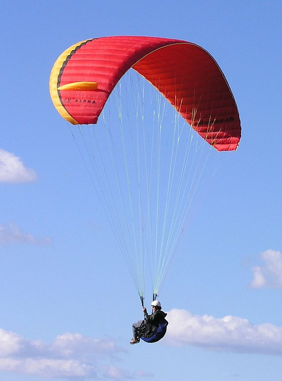

*******************
Paraglider Geometry
*******************

A paraglider is a system of two components: a wing, and a harness.

Canopy
======

* The canopy geometry in :doc:`canopy_geometry` is an idealized design target
  of the physical parafoil used for a paragliding wing.

* The foil surfaces is produced by stitching together nylon sheets, and the
  volume is produced by pressurizing the nylon surfaces through the air
  intakes.

* The physical wing needs some extra information beyond the abstract canopy
  geometry in order to use it to estimate the paraglider dynamics:

  1. Surface definitions (extent of the upper/lower surfaces, materials of the
     surfaces)

  2. Inertial properties.

Surfaces
--------

* The extent of the upper and lower surfaces depends on the design of the air
  intakes. Typically the upper surface of the paraglider wing wraps beyond the
  leading edge of the airfoil until the start of the air intakes. The lower
  surface covers the region from the downstream edge of the air intakes until
  the trailing edge of the sections.

Inertia
-------

[[This includes contribution from both the real mass (surface materials) and
the apparent mass. For the real mass calculations, see :ref:`derivations:Area
and Volume of a Mesh`, and for the apparent mass calculations see
:ref:`paraglider_dynamics:Apparent Mass`. Those methods are for the geometry,
and can be scaled by the surface material density and air density to produce
the final inertia tensors.]]

Line Geometry
=============

Related work:

* :cite:`iosilevskii1995CenterGravityMinimal`

For real wings, the line geometry is a major factor in wing performance, but
the subject is complex. For this project I'm not modeling the entire bridle.
Instead, I'm using explicit placements of the riser midpoint :math:`R` and
aggregated values for the line drag.

Also, because I'm not modeling the entire geometry, I must also approximate
the brake deflection angles. The end effect is that this implementation only
models the final position of the risers as a function of accelerator, and the
deflection angles of the trailing edges as a function of left and right
brakes.

Related work:

* :cite:`altmann2015FluidStructureInteractionAnalysis` discusses using
  *fluid-structure interaction* to optimize the line cascading to optimize
  wing performance

* :cite:`lolies2019NumericalMethodsEfficient` discusses the "effect of line
  split joint angles on sail deformation"

[[One of the advantages of a parametric canopy geometry is that the parameters
can themselves be functions. The reference curves discussed so far have been
fixed values, but for a real wing many of the curves are better represented as
functions of the line geometry. For example, the arc anhedral and chord
lengths might be affected by the accelerator input.]]

Riser Position
--------------

[[Discuss riser position `R` as a function of the accelerator.]]

Brakes
------

A paraglider is equipped with two handles at the ends of sections of the
bridle (line geometry) that are connected to the trailing edges of the canopy.
The pilot can use these controls to deflect the trailing edge downward,
increasing drag. Symmetric deflections slow the wing down, and asymmetric
deflections cause the wing to turn.

Topics:

* The deflection geometry of individual airfoils

* Deflection distribution as a function of section index.

* The geometry of the bridle dictates the deflection distribution.

* Simulating a braking wing requires the geometry for the deflected airfoils.
  The geometry can either be used directly, as would be done by *vortex
  lattice* or *computational fluid dynamics* methods, or it can be used
  indirectly, as is done with lifting-line methods. Lifting-line methods use
  the section coefficients, which means solving for the 2D section
  coefficients before estimating the 3D section forces and moments.

Good reference images for brake deflections:

   Brake deflection, example 1.

   `Photograph <https://commons.wikimedia.org/wiki/File:Paragliding.jpg>`_  by
   Frédéric Bonifas, distributed under a CC-BY-SA 3.0 license.

.. figure:: figures/paraglider/geometry/Wikimedia_ApcoAllegra.jpg

   Brake deflection, example 2.

   `Photograph <https://commons.wikimedia.org/wiki/File:ApcoAllegra.jpg>`_ by
   Wikimedia contributor "PiRK" under a CC-BY-SA 3.0 license.

Mathematical Model
^^^^^^^^^^^^^^^^^^

It is computationally prohibitive to solve for the aerodynamic coefficients at
each timestep. Instead, a set of coefficients can be produced for a set of
deflection angles, and then the aerodynamics method can use linear
interpolation between the individual coefficient solutions.

Interpolating between coefficient solutions requires an index; the most
natural is the deflection angle, :math:`\delta_f`. This means a standard
definition must be chosen for the *deflection angle*.

Classic airfoil software, such as XFOIL, are primarily designed for rigid
wings, and so it is common to define flaps using a fixed hinge point at some
point along the chord:

.. figure:: figures/paraglider/geometry/airfoil/airfoil_deflected_hinge.*

This definition is troublesome for a flexible wing, since there is no fixed
hinge point; the deflection occurs as a variable arc between the trailing edge
to some point on the chord. A more convenient definition is the total
deflection angle produced by the trailing edge:

.. figure:: figures/paraglider/geometry/airfoil/airfoil_deflected_arc.*

This definition moves some of the complexity out of the implementation and
into how the set of coefficients are defined. Without recording a fixed
hinge point, the paraglider model is oblivious to how the deflection was
achieved. On the plus side, this constraint greatly simplifies the model,
and sets of coefficients can easily be generated for different deflection
geometries without requiring changes to the code.

To lookup the coefficients using the interpolator, the simulator requires
the deflection angles. That is, it needs a function to produce the
deflection angle distribution across the wing sections :math:`s` as
a function of the brakes:

.. math::

   \delta_f = f \left( s, \delta_{Bl}, \delta_{Br} \right)

Where :math:`s` is the *section index*, :math:`\delta_{Bl}` is the
percentage of left brake, and :math:`\delta_{Br}` is the percentage of right
brake.

A physically accurate deflection distribution requires a proper line
geometry for the wing, but because the line geometry was not a focus for
this project, an approximation is used instead.

For the moment, I've been using a cubic polynomial for the distribution. You
choose a starting section (where brake deflections begin), a peak section
(where the deflection is greatest), and a peak value (the magnitude of the
maximum deflection angle under maximum control input). The
applicability/accuracy of this crude model depends on the arc anhedral:

.. figure:: figures/paraglider/geometry/brake_deflections_anhedral23_Bl025_Br1.*

   Cubic brake deflection angle distribution with :math:`\delta_{Bl} = 0.25` and
   :math:`\delta_{Br} = 1` for a wing with a mean anhedral angle of 23
   degrees.

.. figure:: figures/paraglider/geometry/brake_deflections_anhedral33_Bl025_Br1.*

   Cubic brake deflection angle distribution with :math:`\delta_{Bl} = 0.25` and
   :math:`\delta_{Br} = 1` for a wing with a mean anhedral angle of 33
   degrees.

**FIXME: these plots were made using the `plot_paraglider_wing` function that
assumed fixed hinges at 0.8c and the delta is the angle from 0.8c to the TE.
That visualization will be significantly wrong.**

Accelerator
-----------

* Need an informal description first.

* Discuss the assumption that the accelerator does not change the arc. Maybe
  design a test case to show how small amounts of "flattening" change the
  performance (better glide ratio, more sensitive to weight shift, etc; easy
  to do, just modify `mean_anhedral` for the Hook3ish and leave `max_anhedral`
  as-is).

  Just flattening the wing dramatically increases the glide ratio while
  slowing the wing (which isn't what you want from an accelerator). I'm
  guessing you could tune `kappa_x` and `kappa_C` to find a sweet balance.
  Makes sense to optimize for stability at `delta_a = 0` but optimize for
  performance/stability as accelerator is applied ("hands-up" goes for the
  accelerator as well as for the brakes).

* I'm using the chord lines as the connection points, but for the physical
  wing the tabs are connected to the lower surfaces of the ribs.

Mathematical Model
^^^^^^^^^^^^^^^^^^

.. figure:: figures/paraglider/geometry/accelerator.*
   :name: accelerator_geometry

   Paraglider wing accelerator geometry.

For notational simplicity, define :math:`\overline{A}` and
:math:`\overline{C}` be the lengths of the lines connecting them to the riser
midpoint :math:`R`:

.. math::

   \begin{aligned}
   \overline{A} &= \left\| \vec{r}_{A/R} \right\|\\
   \overline{C} &= \left\| \vec{r}_{C/R} \right\|\\
   \end{aligned}

The default lengths of the lines is defined by two pairs of design parameters.
First, the default position of the riser midpoint :math:`R` is defined with
:math:`\kappa_x` and :math:`\kappa_z`; this is the position of :math:`R` when
:math:`\delta_a = 0`. Second, two connection points on the canopy are defined
with :math:`\kappa_A` and :math:`\kappa_C`; connecting lines from these points
are the physical means by which :math:`R` is positioned underneath the canopy.
The :math:`A` lines connect near the front of the wing, and are variable
length; the pilot can use the *accelerator* to shorten the lengths of these
lines. The :math:`C` lines connect towards the rear of the canopy, and are
fixed length. Geometrically, shortening :math:`\overline{A}` will move
:math:`R` forward while rotating the :math:`C` lines. Aerodynamically,
shortening :math:`\overline{A}` effectively rotates the canopy pitch down,
decreasing the global angle of incidence of the canopy; decreasing the angle
of incidence decreases lift, and the wing must accelerate to reestablish
equilibrium.

A fifth design parameter, the *accelerator length* :math:`\kappa_a`, is
required to define the maximum length change produced by the accelerator; this
is the maximum length that :math:`\overline{A}` can be decreased. This value
is limited by the physical geometry of the pulleys that give the pilot the
leverage to pull the canopy into its new position. The pilot uses the
*accelerator control input* :math:`\delta_a`, a value between 0 and 1, to
specify the total decrease in :math:`\overline{A}`:

.. math::
   :label: accelerator_length_A

   \overline{A}(\delta_a) = \overline{A_0} - \delta_a \kappa_a

For deriving the basic geometric relations, it is convenient to normalize all
the design parameters by the central chord. This avoids the extra terms in the
derivation and allows a wing design to scale naturally with the canopy.

The goal is to use the physical geometry, where the risers position is
determined by :math:`\overline{A}` and :math:`\overline{C}`, to define the
position of :math:`R` a function of :math:`\delta_a`. The first step is to
determine the default line lengths by setting :math:`\delta_a = 0` and
applying the Pythagorean theorem:

.. math::
   :label: accelerator_initial

   \begin{aligned}
   \overline{A_0} &= \sqrt{\kappa_z^2 + \left( \kappa_x - \kappa_A \right) ^2}\\
   \\
   \overline{C_0} &= \sqrt{\kappa_z^2 + \left( \kappa_C - \kappa_x \right) ^2}
   \end{aligned}

In the general case, the line lengths are functions of :math:`\delta_a`:

.. math::
   :label: accelerator_geometry_line_lengths

   \begin{aligned}
   \overline{A}(\delta_a)^2 &= R_z^2 + \left( R_x - \kappa_A \right) ^2\\
   \\
   \overline{C}(\delta_a)^2 &= R_z^2 + \left( \kappa_C - R_x \right) ^2 = \overline{C_0}^2
   \end{aligned}

Where :math:`\overline{C} \equiv \overline{C_0}` due to the physical
constraint that the length of the :math:`C` lines are constant.

Subtract the two equations in :eq:`accelerator_geometry_line_lengths`:

.. math::

   \overline{A}(\delta_a)^2 - \overline{C_0}^2 =
      \left( R_x - \kappa_A \right) ^2 - \left( \kappa_C - R_x \right) ^2

Finally, substitute :eq:`accelerator_length_A` and solve for :math:`R_x` and
:math:`R_z` as functions of :math:`\delta_a`:

.. math::
   :label: accelerator_R_xz

   \begin{aligned}
   R_x(\delta_a) &=
      \frac
         {\left( \overline{A_0} - \delta_a \kappa_a \right) ^2
          - \overline{C_0}^2 - \kappa_A^2 + \kappa_C^2}
         {2 \left( \kappa_C - \kappa_A \right)}\\
   \\
   R_z(\delta_a) &=
      \sqrt{\overline{C_0}^2 - \left( \kappa_C - R_x(\delta_a) \right) ^2 }\\
   \end{aligned}

The final position of :math:`R` with respect to the leading edge (which is
also the origin of the canopy coordinate system), scaled by the length of the
central chord :math:`c_0` of the wing, is then:

.. math::
   :label: accelerator_R

   \vec{r}_{R/LE}^b(\delta_a) =
      c_0 \cdot \left\langle -R_x(\delta_a), 0, R_z(\delta_a) \right\rangle

Where :math:`R_x` was negated since the wing x-axis is positive forward.

[[Maybe now is a good time to talk about how the wing/body coordinate system
is a simple translation of the canopy coordinate system, so
:math:`\vec{r}_{LE/R}^b = - \vec{r}_{R/LE}^c`, but are vectors in the two
coordinate systems actually the same values? As in :math:`\vec{r}_{A/B}^b
= \vec{r}_{A/B}^c` for all A and B?]]

Harness
=======

The harness is the seat for the pilot. The bridle suspends the harness and
pilot from the lines using attachments to two *risers*. A tensioning strap at
chest level between the two risers provides pilot safety during violent
maneuvers, but it also allows the pilot to choose a balance between stability
and wing responsiveness to weight shift control.
