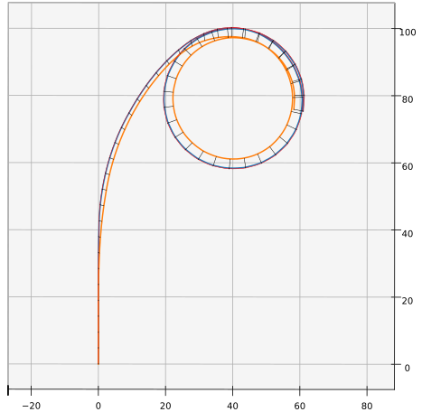

.. This chapter validates [[...]].

   The simulations perform static and dynamic performance tests (polar plots
   and flight maneuvers, respectively) and compare them to expected behaviors.

Validation
==========

.. Present results that validate the models.

   1. Create the Belloc canopy geometry and compare the wind tunnel data to
      simulated results.

      Provide tables that demonstrate that the NLLT performs as well or better
      than the VLM models. Add percent error when possible.

   2. Compare the Hook 3 polar curve data to simulated results

      Provide tables that show the percent error between the simulated and
      measured results.

Wind tunnel model
-----------------

This section does two things:

1. Constructs a model of the foil geometry

2. Compares the NLLT estimates to the wind tunnel measurements

.. Validate the performance of Phillips' method for analyzing a parafoil canopy
   in steady-state conditions.

[[FIXME: moved from foil aerodynamics chapter, edit if worth keeping]]

This section considers the ability of Phillips' NLLT to predict the
aerodynamics of a typical paraglider geometry. It continues the discussion from
the foil geometry :ref:`case study <foil_geometry:Case study>` by comparing the
theoretical predictions of several aerodynamics models against experimental
wind tunnel data.

Geometry
^^^^^^^^

.. Demonstrate and validate the foil geometry and aerodynamics using Belloc's
   reference wing. There are two points here:

   1. Show how easy it is to implement specs from actual papers

   2. Show the accuracy of the NLLT and its implementation (within the accuracy
      constraints of the section coefficient data)

The geometry from a 2015 parafoil wind tunnel test
:cite:`belloc2015WindTunnelInvestigation` makes an excellent case study of
a foil specification from literature that positions the sections using
alternative reference points on the section chords. Moreover, the geometry
satisfies the assumptions of the :ref:`foil_geometry:Simplified model`, making
an implementation of the geometry almost trivial.

First, the paper describes the geometry of the full-scale canopy they wish to
study:

.. list-table:: Full-scale wing dimensions
   :header-rows: 1

   * - Property
     - Value
     - Unit
   * - Arch height
     - 3.00
     - m
   * - Central chord
     - 2.80
     - m
   * - Projected area
     - 25.08
     - m\ :sup:`2`
   * - Projected span
     - 11.00
     - m
   * - Projected aspect ratio
     - 4.82
     - --
   * - Flat area
     - 28.56
     - m\ :sup:`2`
   * - Flat span
     - 13.64
     - m
   * - Flat aspect ratio
     - 6.52
     - --

For the wind tunnel test, a one-eighth scale physical model was constructed
from a wood-carbon frame with polyurethane foam sections covered in fiberglass.
Physical dimensions and positions were provided for the physical model as
pointwise data with linear interpolation between each point.

.. FIXME: Should I use these tables or just give the explicit equations?
   They're messy, but I do like the fact that they highlight the fact that you
   **can** use pointwise data in a linear interpolator just as easily.

.. csv-table:: Wind tunnel wing geometry data at panel’s ends
   :header: :math:`i`, :math:`y` [m], :math:`z` [m], :math:`c` [m], :math:`r_x`, :math:`r_{yz}`, :math:`\\theta` [deg]

   0, -0.688,  0.000, 0.107, 0.6, 0.6, 3
   1, -0.664, -0.097, 0.137, 0.6, 0.6, 3
   2, -0.595, -0.188, 0.198, 0.6, 0.6, 0
   3, -0.486, -0.265, 0.259, 0.6, 0.6, 0
   4, -0.344, -0.325, 0.308, 0.6, 0.6, 0
   5, -0.178, -0.362, 0.339, 0.6, 0.6, 0
   6,  0.000, -0.375, 0.350, 0.6, 0.6, 0
   7,  0.178, -0.362, 0.339, 0.6, 0.6, 0
   8,  0.344, -0.325, 0.308, 0.6, 0.6, 0
   9,  0.486, -0.265, 0.259, 0.6, 0.6, 0
   10, 0.595, -0.188, 0.198, 0.6, 0.6, 0
   11,  0.664, -0.097, 0.137, 0.6, 0.6, 3
   12,  0.688,  0.000, 0.107, 0.6, 0.6, 3

It is important to notice the difference between the section numbers :math:`i`
used in the paper and the section indices :math:`s` used in the simplified
model. The section indices are easily calculated using the normalized linear
distance along the :math:`\left< y, z \right>` points.

Another important point is that the reference data is defined with the wing
tips at :math:`z = 0`, whereas the convention of this paper places the canopy
origin at the leading edge of the central section. This is easily accommodated
by subtracting the central :math:`z = -0.375` from all :math:`z`-coordinates.
(The implementation of the simplified model in ``glidersim`` shifts the origin
automatically.) [[This is the same issue as for normal parametric functions;
the origin of the parametric functions is arbitrary; the origin of the canopy
is a predetermined point.]]

For the section profiles, the model uses a NACA 23015 airfoil.

.. figure:: figures/paraglider/geometry/airfoil/NACA-23015.*

   NACA 23015

Calculating the section indices for each point and building a linear
interpolator for each component as a function of the section index produces
a set of piecewise-linear design curves:

.. raw:: latex

   \newpage

.. figure:: figures/paraglider/geometry/canopy/examples/build/belloc_curves.*

.. figure:: figures/paraglider/geometry/canopy/examples/build/belloc_canopy_chords.*

   Chord surface for Belloc's reference paraglider wing.

.. figure:: figures/paraglider/geometry/canopy/examples/build/belloc_canopy_airfoils.*

   Profile surface for Belloc's reference paraglider wing.

[[FIXME: compute the summary specs and compare; area, span, etc]]

Wind tunnel setup
^^^^^^^^^^^^^^^^^

.. Describe the test setup and the data

As explained in :cite:`belloc2015WindTunnelInvestigation`, a 1/8th-scale model
was fabricated from wood and [[material]], mounted on a 1 meter rod connected
to force sensors, and placed in a wind tunnel configured for 40 m/s airspeed.
Measurements were taken with the angle of attack and sideslip ranging over
:math:`-5 < \alpha < 22` and :math:`-15 < \beta < 15`.

.. This range of alpha is suitable for capturing longitudinal performance
   post-stall.

For better accuracy, wind tunnel measurements should be corrected for wall
interactions with the flow (:cite:`barlow1999LowSpeedWindTunnel`;
:cite:`drela2014FlightVehicleAerodynamics`, Sec. 10.3). However, because
classical wind tunnel wall corrections assume a flat wing, the data for the
arched parafoil are uncorrected for wall effects.

Aerodynamics models
^^^^^^^^^^^^^^^^^^^

[[FIXME: Introduce the aerodynamic models I'll be comparing against the NLLT:
a traditional *vortex lattice method* (VLM) in `AVL
<https://web.mit.edu/drela/Public/web/avl/>`__ , and an experimental VLM in
`XFLR5 <https://www.xflr5.tech/xflr5.htm>`__ (which tilts the geometry to
mitigate the "small angles" approximation for alpha and beta).]]

Results
^^^^^^^

.. FIXME: I removed the VLM results from XFLR5 for the moment coefficients
   because they were VERY wrong; looks like they were using the wrong reference
   point somehow, but it's not clear from the documentation what's wrong.

Coefficients vs angle of attack
"""""""""""""""""""""""""""""""

[[Coefficients versus angle of attack :math:`\alpha`, measured at four
different angles of sideslip :math:`\beta`]]

.. figure:: figures/paraglider/belloc/CL_vs_alpha.*
   :name: Belloc_CL_vs_alpha

   Lift coefficient vs angle of attack.

.. figure:: figures/paraglider/belloc/CD_vs_alpha.*
   :name: Belloc_CD_vs_alpha

   Drag coefficient vs angle of attack.

.. figure:: figures/paraglider/belloc/Cm_vs_alpha.*
   :name: Belloc_Cm_vs_alpha

   Pitching coefficient vs angle of attack.

[[This is the global pitching coefficient, which includes contributions from
both the section pitching coefficients and the aerodynamic forces. These
coefficients are computed using the riser midpoint `RM`.]]

Coefficients vs sideslip
""""""""""""""""""""""""

[[Coefficients versus angle of sideslip :math:`\beta`, measured at four
different angles of attack :math:`\alpha`]]

.. figure:: figures/paraglider/belloc/CY_vs_beta.*
   :name: Belloc_CY_vs_beta

   Lateral force coefficient vs sideslip.

.. figure:: figures/paraglider/belloc/Cl_vs_beta.*
   :name: Belloc_Cl_vs_beta

   Rolling coefficient vs sideslip.

.. figure:: figures/paraglider/belloc/Cn_vs_beta.*
   :name: Belloc_Cn_vs_beta

   Yawing coefficient vs sideslip.

Coefficients vs each other
""""""""""""""""""""""""""

[[This is the classic way to consider the overall performance of a wing.]]

.. Pseudo-inviscid results; requires setting `Cd = 0`

   .. figure:: figures/paraglider/belloc/CL_vs_CD_pseudoinviscid.*
      :name: Belloc_CL_vs_CD_pseudoinviscid

      Pseudo-inviscid lift coefficient vs drag coefficient.

   [[Demonstrates how well the NLLT lift matches XLFR5's "Tilted Geometry"
   method over the lower range of alpha. Once alpha approaches stall, the NLLT
   diverges since it's not a true inviscid method; it's using the viscous lift
   coefficients to determine the circulation distribution.]]

.. figure:: figures/paraglider/belloc/CL_vs_CD.*
   :name: Belloc_CL_vs_CD

   Lift coefficient vs drag coefficient.

.. figure:: figures/paraglider/belloc/CL_vs_Cm.*
   :name: Belloc_CL_vs_Cm

   Lift coefficient vs global pitching coefficient.

Discussion
^^^^^^^^^^

.. FIXME: create an outline. There are two aspects to this discussion:

   1. Performance in general (does the model agree with the wind tunnel data?)

   2. Performance relative to the *model selection* criteria (how well do
      I expect the model to work for dynamic paraglider simulations?)

* Does the NLLT include the empirical viscous drag corrections?

* The inviscid solutions agree with the NLLT quite well for small angles of
  attack. I think the deviation occurs when the "thin boundary layer"
  assumption starts to break down; for the 2D lift coefficient, the BL really
  starts to thicken around alpha=12, so when you consider the **effective**
  angle of attack it happens around alpha=9? Seems about right. I'm not sure if
  flow separation is involved, but I don't think that tends to happen until
  after a section exceeds `Cl_max`?

* The VLM and NLLT disagree on the zero-lift angle of attack? Hm. That seems to
  suggest bad airfoil coefficients, doesn't it? I would think you'd have the
  least amount of flow separation at that alpha; is that intuition correct? Or
  maybe BL thickness is already significant at that angle; I should check the
  overall spanwise alphas.

* The wind tunnel data is only testing the **uniform** flow-field case. In my
  simulations I'm using this method for **asymmetric** flows (spanwise
  variation in speed and/or direction). That's definitely questionable (similar
  to what I mention about assuming the trailing wake is aligned to the central
  freestream: highly questionable).

  Not a big deal though; I just need to be clear that the point isn't to claim
  this is a great model; I just need something useful for testing the geometry
  and "good enough" for simulations.

  **This was always meant to be used in an uncertain environment (stochastic
  simulations). As long as the choice of aerodynamic method is not the dominant
  source of error, I'm fine with it.**

* Did Belloc account for hysteresis? In
  :cite:`anderson1980NumericalLiftingLine` they plots how both the experimental
  and numerical data were strongly affected by increasing vs decreasing alpha.

  TODO: run the numerical solutions forward and backwards in alpha!

* I'm frustrated that the lift curve for all methods is so high compared to the
  wind tunnel data, but at least the NLLT matches AVL, XFLR5, and MachUpX, so
  I'm pretty confident I've implemented it correctly. I need to make a list of
  explanations for the discrepancies though: unmodeled viscous effects in
  particular, but there's still the chance of an issues with the `CZa` or
  `Alphac` values in the wind tunnel data.

  Also, maybe it's not such a terrible result overall? It is a pretty low
  aspect ratio wing, after all. See Fig:7.22 of
  :cite:`bertin2014AerodynamicsEngineers` shows theoretical vs experimental CL
  for a wing with AR=5.3; the theoretical estimate significantly overestimates
  (IMHO) the lift coefficient, but the author calls it a "reasonable" estimate.

  Possibly related to the lift discrepancy:

  * "Aerodynamics for Engineers", p. 326, he discusses the effects of
    a "separated wake", although that's in the context of airfoils. Still it
    does have the same look as my data.

  * In https://www.xflr5.tech/docs/Part%20IV:%20Limitations.pdf, p. 29, he
    mentions that the "flat wake" assumption (no wake roll-up) causes an
    overestimation of the vortex strengths (and thus the lift), and that the
    error can be in the order of 1% to 10% for the lift and induced drag.

* Why is this a good/useful test?

  * The range of angle of attack is suitable for capturing the longitudinal
    performance of the wing post-stall

  * The range of sideslip angles is useful for considering the impact of the
    ref:`foil_aerodynamics:Straight-wake assumption` for a non-rotating wing.

    FIXME: how is the straight-wake assumption under question for
    a non-rotating wing? It's important for aerodynamic models that assume the
    wind is head on, I think; isn't that the issue that the experimental VLM2
    in XFLR5 is meant to address? Like, doesn't AVL "assume" the wind is head
    on then make corrections instead of modeling the wind directly?

  * In terms of aerodynamics: good representation of the unusual geometry of
    a paraglider; completely known geometry (including airfoil); extensive data
    for a range of wind conditions; internal wood structure maintains the
    shape, eliminating uncertainty due to distortions

  * It also provides a good demonstration of how to use my geometry.

Hook 3 model
------------

[[Move the polar curve, 360 turn, etc, content here]]

.. How accurate is the model? This section involves **expected** outcomes,
   which means we already know what we expect to see. Validation is about
   *confirming*, not *learning*.

.. What is model validation? Why is it difficult for paragliders?

Having defined the parameters for the three component models, they are combined
into a composite :doc:`system_dynamics` model that provides the behavior of the
complete glider. Getting to this point with such little information required
many modeling assumptions, simplifications, approximations, and outright
guesswork. The natural next step is to question the validity of the model: how
accurately does it estimate the true behavior of the physical system? In any
modeling project it is vital to validate the model by comparing its estimates
to experimental data, and this case is no exception.

Unfortunately, experimental data is extremely scarce for commercial paraglider
wings. Unlike the previous section, wind tunnel measurements are unavailable.
What's worse, the dynamic behavior of a wing in motion is significantly more
complex than the static behavior of a wing held fixedly in a wind tunnel. As
a result, validation is limited to point data and general expectations gleaned
from sources such as glider certifications and consumer wing reviews. Clearly
such sources lack the rigor to "prove" model accuracy, but — when taken
together — they can still provide incremental confidence that a model is
adequate to answer basic questions of wing performance.

.. FIXME: focus on establishing that I'm at least getting close! And yeah, The
   absence of detailed performance information clearly limits the suitability
   of these models to different applications, but at least I've got this far.
   "More work is needed" is a satisfactory conclusion to this project, in my
   opinion. The component models leave a lot of room for improvement. But
   that's part of the point: it was designed for flexibility from the get go,
   and it succeeded at that.]]

Polar curve
^^^^^^^^^^^

.. Compare model estimates of the glider's longitudinal steady-state
   aerodynamics over the range of control inputs against published performance
   data, such as minimum sink rate and speed range.

.. Plot and discuss the predicted polar curves.

   I don't have access to experimental polar curves, but I do have point
   estimates from certification and wing review flights.

   Use this section to really highlight the limitations/assumptions of the
   model? Unknown airfoil, unknown true line positions, lack of a proper
   `LineGeometry` (so brake deflections and arc changes when accelerator is
   applied are both unknown), no cell billowing, etc etc. Seems like a good
   place to point out "this is overestimating lift and underestimating drag, as
   expected."

.. Polar curves

The conventional way to summarize the performance of a gliding aircraft is with
a chart called the *polar curve*. These curves show the vertical and horizontal
speed of the aircraft at equilibrium over the range of brake and accelerator
inputs, providing information such as the speed range of the glider and its
glide ratio at different speeds. Given the wealth of information compactly
communicated by a polar curve, they are an excellent starting point for
critiquing the estimates of a flight dynamics model for a glider.

The previous section demonstrated the creation of a paraglider model for
a Niviuk Hook 3, size 23. Now, models for the larger sizes of the wing (created
using the same workflow) will be compared to experimental data by comparing
measurements from test flights to the predicted polar curves.

Size 25
"""""""

For the experimental data, a size 25 version of the wing was reviewed for the
French magazine "Parapente Mag" [[FIXME: citation; see `Hook 3 Parapente Mag
148.pdf`]].

Unfortunately, reviews such as this cannot provide the entire polar curve;
because each point is laborious to measure accurately, reviews only provide
noteworthy values, such as the minimum and maximum speeds, or the horizontal
and vertical speeds that mark the "minimum sink" and "best glide" operating
points of the glider. Despite this ambiguity, by plotting the experimental
point data over the theoretical curve it is possible to get a sense of the
general accuracy of the model estimates.

.. figure:: figures/paraglider/demonstration/polar_25.svg

   Polar curve for Niviuk Hook 3 size 25

   Colored markings are theoretical data from the model, black markings are
   experimental data from Parapente Mag. Red represents symmetric braking,
   green represents accelerating, and the blue diagonal line marks the
   predicted best glide ratio. The three black vertical lines mark the
   experimental values for minimum speed, trim speed, and maximum speed; the
   left black dot is the "minimum sink" operating point, and the right dot is
   the "best glide" operating point.

If the model is a good approximation of the glider that generated the data
— and assuming the data was collected accurately — then the experimental values
should match the predicted values:

* The minimum ground speed should align with the leftmost endpoint of the red
  curve

* Trim speed should align with the point where the red and green curves connect

* The maximum ground speed should align with the rightmost endpoint of the
  green curve

* The "minimum sink" operating point should lie on the point where the curve
  reaches its minimum

* The "best glide" operating point should lie on the point where the blue line
  touches the polar curve

Although the diagram is a convenient way to summarize so much information it
can be hard to distinguish specific values, so their numerical equivalents are
listed below.

.. list-table::
   :header-rows: 1

   * - Value
     - Theoretical
     - Experimental
   * - Minimum groundspeed
     - 7.4
     - 6.7
   * - Minimum sink <h, v>
     - <9.6, 1.06>
     - <9.22, 1.02>
   * - Trim speed
     - 10.2
     - 10.6
   * - Maximum speed
     - 14.7
     - 14.4
   * - Best glide <h, v>
     - <10.2, 1.08>
     - <10.4, 1.12>
   * - Best glide ratio
     - 9.44
     - 9.3

Observations:

* The minimum ground speed of the theoretical model is significantly higher
  than the experimental value. That may be explained by the conservative value
  of :math:`\kappa_b = 0.44 \, [m]` (the maximum distance the brakes can be
  pulled; see the earlier discussion when defining the parameters for the
  :ref:`demonstration:Brakes`). The review listed the maximum brake length as
  >60cm, which suggests that this model can only apply <73% of the full range
  of brakes, so this result in unsurprising.

* Minimum sink occurs at about 0.4 m/s slower ground speed. This may be related
  to the procedure to generate the deflected :ref:`Profiles`, to the deflection
  distribution, or to the aerodynamic coefficient estimates from XFOIL.

* Minimum sink rate is remarkably close (1.06 versus 1.02 m/s), which I find
  surprising since I expected the "optimistic" airfoil set :numref:`airfoil
  set, braking NACA24018` to overestimate lift during braking.

* The theoretical model underestimates the ground speed at trim. Although this
  could be due to it overestimating the drag, it is far more likely that the
  model is overestimating the lift of the wing, so less speed is required to
  counteract the weight of the glider.

* This experimental data reported the best glide at 10.4 m/s when trim was 10.6
  m/s. This disagrees with our earlier assumption that best glide should occur
  at trim.

* The model overestimates the maximum ground speed. This may suggest it is
  underestimating drag, or it could suggest that the model parameters are wrong
  (:math:`\kappa_C` in particular has a large impact on maximum speed), or it
  could be because this rigid body model neglects foil deformations (it assumes
  the accelerator produces a perfect pitch-rotation of the foil) as well as the
  section profile deformations that increase with speed.

In truth, these observations are just a drop in the bucket of possible issues
with the theoretical model (not to mention issues with the experimental data
itself); there are so many simplifications at work, and point data cannot hope
to reveal all their flaws. These results suggest that the performance of the
model is excellent when predicting longitudinal equilibrium, but a wider
variety of wing models need to be examined to determine if this excellence
generalizes to other wings.

Size 27
"""""""

For the experimental data, a size 27 model of the wing was reviewed for the
Spanish magazine "Parapente" [[FIXME: citation; see `hook 3 perfils.pdf`]]. As
with the size 25 model, plotting the experimental data on top of the
theoretical curves produces valuable reference data:

.. figure:: figures/paraglider/demonstration/polar_27.svg

   Polar curve for Niviuk Hook 3 size 27

   Colored markings are theoretical data from the model, black markings are
   experimental data from Parapente. Red represents symmetric braking, green
   represents accelerating, and the blue diagonal line marks the predicted best
   glide ratio. The three black vertical lines mark the experimental values for
   minimum speed, trim speed, and maximum speed; the left black dot is the
   "minimum sink" operating point, and the right dot is the "best glide"
   operating point.

And as before, the numerical equivalents of the data in the figure above:

.. list-table::
   :header-rows: 1

   * - Value
     - Theoretical
     - Experimental
   * - Minimum groundspeed
     - 7.83
     - 6.7
   * - Minimum sink <h, v>
     - <10.2, 1.12>
     - <9.72, 1.15>
   * - Trim speed
     - 10.8
     - 11.1
   * - Maximum speed
     - 15.4
     - 15
   * - Best glide <h, v>
     - <10.8, 1.13>
     - <11.1, 1.17>
   * - Best glide ratio
     - 9.52
     - 9.5

The observations are similar to that for the size 25 model. Overall the fit is
excellent. This model was limited to :math:`\kappa_b = 0.46 \, [m]`, or <76% of
the usable ">60cm" brake length, so the minimum ground speed is still too high.
And again, the model underestimates the ground speed at trim. The best glide
ratio matches exactly, although the theoretical model still slightly
underestimates the ground speed where that occurs.

Pitch stability
^^^^^^^^^^^^^^^

Another simple sanity check is to verify the glider pitch stability by flying
on a straight course at maximum speed and abruptly releasing the accelerator
(:cite:`wild2009AirworthinessRequirementsHanggliders`, Sec. 4.1.5). Releasing
the accelerator shifts the payload to shift aft, causing the canopy to pitch
backwards; in the positive-pitch position the glider briefly ascends as it
converts the energy from its high airspeed into altitude, but because the wing
loses airspeed so quickly it will "overshoot" its equilibrium point and need to
dive forward as the glider attempts to reestablish equilibrium.

The danger of this pitch-forward behavior is that it may induced a frontal
collapse of the canopy. To estimate the safety margin of the wing, the test
assigns a grade based on the negative pitch angle as it dives forward. If the
wing pitches forward less than 30° it receives an "A"; if it pitches forward
30–60° it receives a "C", and for >60° it receives an "F". The Niviuk Hook 3 is
rated as an "B" wing, and should not pitch forward more than 30°. Using this
model to simulate the test protocol by releasing the accelerator in 0.3s
produces:

.. figure:: figures/paraglider/demonstration/accelerator_fast_release_path_sideview.*

   Flight test, rapidly exiting accelerated flight, side view

   Black lines are drawn from the riser to the point directly above the payload
   to help visualize the canopy pitch angle, and are added every 0.5 seconds.

.. figure:: figures/paraglider/demonstration/accelerator_fast_release_pitch_angle.*

   Flight test, rapidly exiting accelerated flight, pitch angle

The model predicts the wing configuration will pitch backwards 23° before
diving forwards to a pitch angle of -13° which satisfies the expected grading.
Although this test is not particularly informative, it's simplicity makes it
worthwhile.

.. FIXME: Compare 6a and 9a?

Steady-state turn
^^^^^^^^^^^^^^^^^

.. 360° turn at 20° bank angle. Compare to Pagen's ballpark figures

Although longitudinal are the best place to start testing a model, the more
difficult tests are for the dynamic behavior.

.. list-table::
   :header-rows: 1

   * - Value
     - Expected
     - Simulated
   * - Turn radius [m]
     - ~12
     - 20
   * - Sink rate [m/s]
     - ~1.1
     - 1.5
   * - 360° turn rate [sec]
     - ~11.5
     - 16
